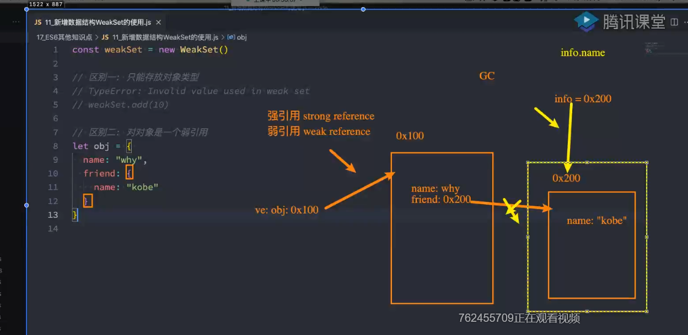
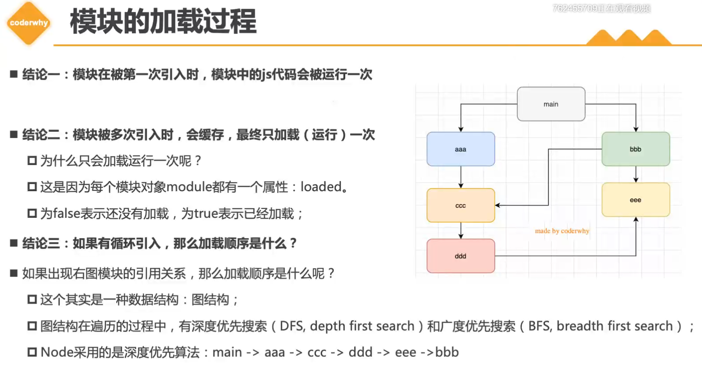

 

#### 第一章: let和const 

##### 第1节:let声明变量特性

- 不能重复声明变量
-  只在其所在的块级作用域内有效(if/else/for/while的“{}”内都是块级作用域)
-  不存在变量提升(即必须先声明再调用)
-  不影响作用域链(即像全局声明那样只能由内部向外查找) 
-  不可直接在函数“{}”重新声明形参 但可再嵌套一级“{}”在此内声明形参
-  ES5时if/for是无块级作用域的

##### 第2节:const声明常量特性

- 声明时就要赋初值且不可重复声明
-  一般常量使用大写
-  常量的值不可修改
-  块级作用域(即在块内定义的常量只在块内有效)
-  对于数组的值及对象的属性的修改不算对常量的修改,因为其指向的地址仍未变(即const保证的是变量指向的内存地址不得改动)

##### 第3节:其他

-  块级作用域使得立即执行匿名函数不再必要
-  ES6声明变量的方法:var/function/let/const/import/class共6种
-  let/const/class声明的全局变量(即不写在块级作用域内)不再属于顶层对象的属性,即不可通过“window”获取

- 暂时性死区(temporal dead zone TDZ)

    - 只要块级作用域内存在let/const命令,它所声明的变量就绑定这个区域不再受外部影响，即在此区块中未用let声明变量之前，这个变量都是不可用的

    - ```javascript
        var tmp = 123;
        {
          //TDZ开始
          tmp = 'abc'; //错误
          let tmp; //TDZ结束
          tmp = 456; 
          console.log(tmp) //456
        } 
        ```

    - 变量提升:变量可以在声明之前进行调用,但调用时其值为“undefined”

    - for循环特别之处:“()”内设置循环变量的那部分是父作用域,“{}”内是单独的子作用域,二者互不影响

        ```javascript
        for (let i = 0; i < 2; i++) {
          let i='abc';
          console.log(i)
        }
        // abc 连输出2次
        ```


------


#### 第二章: 解构赋值

解构赋值:按照一定模式从数组和对象中提取值,然后对变量进行赋值

##### 第1节:数组的解构赋值

- 模式一定要匹配 如:let [a,[b,c]]=[1,[2,3]]

- 解构不成功变量值为undefined,如:let [a,b]=[1] 

- 可指定默认值 若数组等号右边有对应值则默认值无效(即右边为“undefined”则默认值才有效),如:let [x=1,y=x]=[2]

##### 第2节:对象的解构赋值

- 变量名必须和属性名一样才可取值,取值时属性名顺序随意
- 解构赋值时是将属性值赋给了变量而非属性

- 可指定默认值

- 大括号不可写在行首,否则会将其理解为代码块

    ```javascript
    let x; {x}={x:1} // 错误
    let x; ({x}={x:1}) // 写法1 
    let {x}={x:1} // 写法2
    // 大括号前至少有其他符号
    ```

##### 第3节:字符串的解构赋值

- 字符串会被转化为类似数组的对象 `let [a,b,c]="hel"`

- 类似数组的对象都有length属性 `let {length:len}="hello"  console.log(len) //5`

##### 第4节:其他

- 函数参数的解构赋值:形参和实参的形式一样即可

- 用途:交换变量的值;提取JSON数据

    ```javascript
    // 如从函数返回多个值
    function f() {
      return {foo:1,bar:2};
    } 
    let {foo,bar} = f() 
    ```


------


#### 第三章:字符串的扩展

##### 第1节: charAt() 返回字符串给定位置的字符

- string.charAt(num) 返回string第num个位置的字符

##### 第2节: 确定字符串中是否包含另一个字符串

- includes(str,[num])

    - 返回值true/false num为可选参数,从第num个开始匹配到结尾

    - string.includes(str)

- startsWith(str,[num])

    - 参数字符串是否在源字符串头部 返回值及num含义同上

    - string.startsWith(str)

- endsWith(str,[num])
    - num为只匹配前num个字符

##### 第3节: 重复字符串

- str.repeat(num)

    - 返回新字符串,str被重复num次(num为小数则舍去小数位)

    - num为字符串则先转换为数字

##### 第4节: 补全字符串

- padStart()

    - string.padStart(length,[str])

    - length为指定string的新长度,在其头部用str来填充,省略str则空格来补

    - 若length小于原string长度则返回原string

    - 若string原长加上str长大于length,则舍去str多余部分

- padEnd() 用法同上

- 用途:为数值补全指定位数;提示字符串格式

- 注:由于是补全字符串补全,非字符串(如number型)需先转化，如 `a=123; a.toString().padStart(5,'*')`

##### 第5节: 模板字符串

- 使用“`”反引号 模板内的空格和缩进均会保留(后面加“.trim()”方法可消除换行)

- ${} 在“{}”内可写变量名/表达式/函数/对象属性进行引用、调用或计算

- 标签模板字符串：

    - ```javascript
        function fn(m, n) {
          console.log(m, '***m***')
          console.log(n, '***n***')
        }
        const age = '18'
        fn`hel${age}lo` // ['hel','lo'] ***m***  18 ***n***
        // 即会将字符串用变量分割为数组，函数的第一个参数接受数组，其余参数依次等于分割的变量
        ```

        


------


#### 第四章: 对象

##### 第1节: 属性简洁表示法

- 对象中若属性名和属性值相同可只写一个
- 方法可简写为“f(){}” 原写法“f:function(){}”

##### 第2节: 比较与赋值

- ES5比较值只有“==”和“===” 缺点:前者会自动转换数据类型,后者“NaN不等于NaN”及“+0等于-0”
- Object.is(str,str) 返回值true/false 例：`Object.is(+0,-0) false `   `Object.is(NaN,NaN) true`
- Object.assign(target,source1,source2,...) 将source对象的属性复制到target上
    - 若有同名属性则后者覆盖前者
    - 由于是对象其实是引用而非简单的复制

- 数组会当成对象来处理

    - ```javascript
        Object.assign(['a','b','c'],['d','e']) 
        // [d,e,c]  会将[a,b,c]视为对象{0:a,1:b,2:c} [d,e]视为{0:d,1:e} 将同名属性替换掉
        ```

- 用途:为对象添加属性/方法/克隆对象(目标对象为空即可)/合并对象/为属性指定默认值
  
    - 注:只能复制源对象(source)自身的属性,继承属性和不可枚举的属性不能被复制

##### 第3节: 遍历对象的属性方法

- for...in 遍历数组或枚举一个对象循环显示(不含Symbol属性)
- Object.keys(obj) 返回一个数组包含对象自身(不含继承)所有可枚举属性(不含Symbol属性)
- Object.getOwnPropertyNames(obj) 返回一个数组包含对象自身的所有属性(不含Symbol属性)
- Object.getOwnPropertySymbols(obj) 返回一个数组包含自身的所有Symbol属性
- Reflect.ownKeys(obj) 返回一个数组包含对象自身的所有属性

------

#### 第五章:函数 

##### 第1节: 函数参数默认值

- 可为函数形参设置默认值,多个形参时不可有同名的,形参不可再次用let/const声明

- 定义了默认值的参数应写在尾部,易看出省略了哪些参数

- 若有默认值的参数未写在尾部,则显式传参“undefined”才可触发其默认值
    - ```javascript
        function f(x,y=2,z) {
          return [x,y,z]
        }
        f(1,,3) // 报错
        f(1,undefined,3) // [1,2,3]
        ```

- 函数length属性返回未指定默认值的形参的个数

- 设置了默认值的形参若未在尾部,则length属性只计算在它之前的形参个数

    - ```javascript
        let aa = (function (a, b=1, c, d=2) {}).length
        console.log(aa) // 1
        ```

        

##### 第2节: rest参数与严格模式

- 形式为“...变量名” 用变量获取函数多余参数,这样就不需要引入arguments对象了
- rest参数中的变量代表一个数组,rest参数为最后一个形参否则报错
- 函数的length属性不包括rest参数
- 函数参数只要使用了默认值、解构赋值或扩展运算符则在函数内部就不能显式设置为严格模式,否则报错,规避这种限制的方法:在全局之中进行设置或把函数写为一个无参并立即执行的函数

##### 第3节: 箭头函数

- 用法1(标准用法): 
  
    - (p1,p2,...pn) => { statements }
- 用法2: 
    - (p1,p2,...pn) => { return expression;} 
    - (p1,p2,...pn) => expression

- 用法3:
    - (p1) => { statements }
    - p1 => {statements}
    - 只有一个参数可省略“()”

- 用法4:

    - () => {statements}

    - _ => {statements}
    - 无参时箭头前需有“()”或“_”

- 关于this:

    - 函数内的this指向固定化,即指向定义时所在的作用域,而非运行时(普通函数中的this绑定的为运行时的作用域)

    - 不可使用arguments对象,可使rest参数代替

    - 不可以当构造函数(即不可使用new命令,因为箭头函数内部无自己的this而是引用的外层this)

        ```javascript
        // 本质形同闭包引用外部this
        function f() {
            var _this=this;
            function f1() {
              console.log(_this.id)
            }
          }
        ```

    - 另箭头函数无自己的this自然也不可使用call()、apply()、bind()方法去改变this

- 箭头函数经常使用的场景:将其作为另一个函数的参数

##### 第4节: 尾调用

- 管道机制:前一个函数的输出是后一个函数的输入
- 柯里化:将多参数的函数转变成单参数的形式
- 尾调用:某个函数的最后一步是调用另一个函数
    - 只能是在函数内部return另一个函数才是尾调用,若对函数进行了其他操作或仅是调用而未return则均不属于尾调用
    - (关于尾调用优化及尾递归相关知识以后再总结 P125页)


------


#### 第六章: 数组

##### 第1节: 扩展运算符

- 扩展运算符:“...” 将数组转为用逗号分隔的参数序列
- 用法: “...变量” “...Arr[]” “...表达式”均可
- 用途:
    - 可展开数组故不需使用apply方法将数组转为函数的参数
    - 合并数组
    - 与解构赋值结合
    - 将字符串转为真正的数组

- 本质: 背后调用的是遍历器接口,如果对象未部署此接口则无法转换

##### 第2节:Array.from()

- 伪数组:类似数组的对象,本质特征为必须有length属性,即在对象内部必须有“length:num”这个属性

- 可将伪数组和可遍历对象转换为真正的数组

- 用法:Array.from(str,[fun])

    - 参数2为可选参数,作用类似数组的map方法用来对每个元素进行函数操作再将其结果放入数组中return出去

    - ```javascript
        Array.from(arr,x => x*x); // 等同于下面的map
        Array.from(arr.map(x => x*x))
        Array.from([1,2,3],x => x*x) // [1,4,9]
        ```

##### 第3节:Array.of()

- 作用: 将一组值转换为数组,基本上可用来替代Array()或new Array(),并且不存在由于参数不同而导致的重载,它的行为非常统一

- 与Array()方法的区别

    - ```javascript
        Array.of(3) // [3]
        Array.of(1,2,3) // [1,2,3]
        
        Array(3) //[, , ,]
        Array(1,2,3) //[1,2,3]
        ```

##### 第4节: copyWithin()

- 作用: 在当前数组内部将指定位置的成员复制到其他位置(会覆盖原成员),然后返回当前数组(即会修改当前数组)

- 用法:

    - arr.copyWithin(target,[start],[end])

    - target:从此位置开始替换 start:从此位置开始复制(默认为0,负值表倒数) end:此位置前停止复制(默认到尾部,负值表倒数)

    - ```javascript
        [1,2,3,4,5].copyWithin(0,2) // [3,4,5,4,5]
        ```

##### 第5节: fill()

- arr.fill(num,[start],[end]) 将指定值填充/替换到数组里

- num:要填充的值 start:填充的起始位置

- ```javascript
    new Array(3).fill(7) // [7,7,7]
    ['a','b','c'].fill(7,1,2) // ['a',7,'c']
    ```

##### 第6节: 遍历数组

- keys():对键名遍历  values():对键值遍历  entries():对键值对的遍历

- ```javascript
    for (let i of ['a','b'].keys()) {
      console.log(i) // 0 1
      // keys()换成values()结果为 'a' 'b'
      // keys()换成entries()结果为 0 'a' 1 'b'
    }
    ```

##### 第7节: includes()

- ES7新增的语法

- arr.includes(str,[start])
- 某个数组是否包含给定的值,返回值true/false
- [start]为可选参数默认为0表示搜索起始位置 若为负值则表示倒数,若还大于数组长则重置其为0

##### 第8节：flat、flatMap

- arr.flat(val)：

    - 按照指定的深度递归遍历数组，并将所有元素与遍历到的子数组中的元素合并为一个新数组返回 

    - val，即深度值，不写则默认为1 

    - ```javascript
        const arr = [1,2,[3,4],[[5,6],[7,8]]]
        const newArr1 = arr.flat()
        const newArr2 = arr.flat(2)
        console.log(newArr1) // [1,2,3,4,[5,6,7,8]]
        console.log(newArr2)  // [1,2,3,4,5,6,7,8]
        ```

- arr.flatMap()

    - 首先使用映射函数映射每个元素，然后将结果压缩成一个新数组

    - 即先进行map操作，再进行flat操作，其中flat相当于深度为1

    - ```javascript
        const arr = ["hello word", "ha ha"]
        const newArr = arr.flatMap(item => { return item.split(" ")})
        console.log(newArr) // [["hello", word],["ha", "ha"]]
        // 先map，item为“hello word”和“ha ha”，item执行split后变为数组["hello","word"],然后flat为一个数组
        ```

        

------

#### 第七章: set与map

##### 第1节：强引用与弱引用

- ```JavaScript
    let obj = {
    	name: 'why',
    	friend: {
    		name: 'kobe'
    	}
    }
    let info = obj.friend
    // 此时obj就是个强引用，info是弱引用，将obj.friend置为null时，GC并不会因为info此时指向它而不回收内存
    ```

- 

##### 第2节：set

- set是新的数据结构,里面的元素不可重复

- set方法

    - 先创建 Set结构 const arrSet = new Set()
    - arrSet.add(val)
    - arrSet.delete(val)
    - arrSet.has(val) 判断是否有某个值
    - arrSet.forEach() 遍历
    - arrSet.clear() 清空set数据

- ```JavaScript
    const arr = [1, 2, 1, 3, 2]
    const arrSet = new Set(arr)
    const newArr = Array.from(arrSet)
    // 或const newArr = [...arrSet]
    // 需要将set结构变为数组结构
    ```

- 对对象是个强引用

    - ```JavaScript
        let obj = { name: 'kobe' }
        const setArr = new Set()
        setArr.add(obj)
        obj = null
        // 此时obj虽然为null,但{ name: 'kobe' }并不会被回收，因为setArr(严谨点应该是setArr中的某个属性)此时仍指向它
        // 构造时如果换为WeakSet，即弱引用类型，当obj为null时，{ name: 'kobe' }就会被回收，因为没有什么再指向它(弱引用虽指向但无效)
        ```

##### 第3节：WeakSet

- 不可存放基本数据类型，只可存放对象
- 对对象是个弱引用 
- 方法：
    - add(val)
    - delete(val)
    - has(val)

##### 第4节：Map

- 新增的数据结构，以键值对的形式用于存储映射关系,也是强引用 
- 允许用对象来作为key
- 方法：
    - 先构造 `const mapObj = new Map()`
    - mapObj.set('keyName', 'aaa')
    - mapObj.get('keyName')
    - mapObj.has('keyName')
    - mapObj.delete('keyName')
    - mapObj.clear()
    - mapObj.forEach()

##### 第5节：WeakMap

- WeakMap的key只能为对象，不接受其他类型作为key

- 对对象的引用为弱引用

- 方法：set、get、has、delete

- 应用场景：VUE3的响应式原理

    - ```javascript
        const obj = {
        	name: 'kobe',
        	age: 18
        }
        function objNameFn() {}
        function objAgeFn() {}
        // 1. 创建weakMap
        const objWeakMap = new WeakMap()
        // 2. 收集依赖结构(即想办法将数据变化时，与之相关的函数关联起来)
        const objMap = new Map()
        objMap.set('name', [objNameFn])
        objMap.set('age', [objAgeFn])
        objWeakMap.set(obj, objMap) // 此行用WeakMap的原因，当将obj置为null时，若无其他引用则销毁，若是用map因为强引用则不会被销毁
        // 3. 如果obj的name或age发生了变化（通过proxy/Object.defineProperty监听）那么就调用所有与name/age相关的函数
        obj.name = 'james'
        const targetMap = objWeakMap.get(obj)
        const fns = targetMap.get('name')
        fns.forEach(item => item())
        ```

        

#### 第八章: Module(模块)语法

##### 第1节: 严格模式及CommonJS

- 严格模式: ES6默认,无论模块头部加没加“use strict”

- 严格模式的限制:
    - 变量需先声明后调用  函数参数不可有同名属性  不能使用with语句  不能对只读属性赋值
    - 不能删除变量“delete prop”,只能删除属性“delete global[prop]”
    - 不得使用前缀0表示八进制数  不可删除不可删除的属性  eval不会在其外层作用域引入变量
    - eval和argument不能被重新赋值  增加了保留字(比如“protected static interface”)
    - 禁止this指向全局对象(ES6模块中顶层this会指向undefined)

- CommonJS引入模块:

    - ```javascript
        let {f1,f2} = require('fs')
        // 等同于
        let fss = require('fs');
        let f1 = fss.f1;
        let f2 = fss.f2;
        // 实质整体加载了fs模块(即所有方法)生成对象fss,再从fss上读取方法,此方法叫运行时加载(只能在运行时才能得到这个对象),无法在编译时进行静态优化
        
        //导出:
        module.exports={ f1:f1, f2, }  
        ```

- ES6模块:通过export命令显式指定输出代码再通过import命令输入

    - import {f1,f2} from 'fs'
    - 实质从fs模块加载了两个方法而不加载其他方法,这种方式称为编译时加载(也叫静态加载)

- 常见的模块化规范:  CommonJS、AMD、CMD、ES6的Modules

- 模块的加载过程

    - 模块在第一次被引入时，模块中的JS代码会被运行一次，如`require('fs')` 此时fs模块中的代码已经运行了一次
    - 模块被多次引入时，会缓存，最终只加载一次，因为每个模块对象module都有一个属性loaded:true/false来表示是否已被加载，若已被加载则后续不再被加载
    - 循环引用时的加载顺序
        - 

##### 第2节: export命令

- 模块:自动运行在严格模式下且无法退出运行的JS代码,是一个独立的文件,内部变量外部无法获取

    - 优点:防止命名冲突、代码复用、高维护性

- export关键字可向外输出变量、函数或类

- export命令可在模块任意位置但必须处于模块顶层,不能处于块级作用域内

- 输出方式

    - ```javascript
        export let m = 1; // 或let m = 1;  export {m};
        //(注:必须有大括号否则输出的就不是接口而是1)
        export let n = 2; // 或let m = 1;  export {m};
        // 方式1分别暴露
        
        export {m,n};
        // 方式2统一暴露 
        
        export {m as n}; 
        export {m as p};
        // 方式3 起别名(可多次输出)
        
        //输出函数的两种方式
        export function f(){}; 
        export {f}; 
        ```

        

##### 第3节: import命令

- import命令具有提升效果,提升到模块头部并执行(本质:编译阶段执行,即在代码运行前)

    - 是静态执行故引入时不能使用表达式和从变量中引入(因为引入提升)

    - ```javascript
        // 如
        let m='my_module'
        import {f} from m
        ```

- import所处位置同export

- 引入方式(引入时<script type="module">标签需加上type)

    - ```javascript
        import {f1,f2} from './profile'; // 引入方式1 路径可为绝对也可为相对
        import {f1,f2} from 'module'; // 引入方式2 直接引入模块名而不写模块路径,但配置文件中必须写明模块位置
        import {f1 as f} from './profile'; // 引入方式3(起别名)
        ```

- CommonJS模块的require命令和ES6的import命令最好不要写在同一个模块里,因为有可能不会得到预期效果

- ```javascript
    // 文件file1
    const obj = {
    	age: 18
    }
    setTimeout(() => {
    	obj.age = 20
    }, 1000)
    export { obj }
    // 文件file2
    import { obj } from 'file1'
    console.log(obj.age) // 18
    setTimeout(() => {
    console.log(obj.age) // 20
    }, 2000)
    ```

    

##### 第4节: export default命令(默认暴露)

- 输出方式:

    - ```javascript
        export default function(){} // 输出匿名函数
        export default function f(){} // 输出具名函数
        export default f // 直接输出
        export default{  f1:"", f2:""} //统一暴露
        ```

- 一个模块只能有一个默认输出

    - 故export default命令只能使用一次

    - 故import在引入此文件时不需加“{}”因为只能对应一个方法

    - 本质:输出一个叫“default”的变量或方法,然后为其命名

    - ```javascript
        export default f;
        // 等同于
        export {f as default};
        
        import f from 'modules';
        // 等同于
        import {default as f} from 'modules';
        ```

        

##### 第5节: export与import的复合写法、整体加载模块

- 如果在一个模块中先输入后输出同一个模块可将import和export写在一起

    - ```javascript
        export {f} from 'modules';
        // 等同于
        import {f} from 'modules';
        export {f}  
        // 整体输出和起别名也可用此写法
        ```

- .整体加载模块

    - 使用*指定一个对象,将所有输出值加载到此对象上
    - 某个模块导出的变量较多,一一引入过于麻烦
    - 如: `import * as obj from './profiles'`  使用时可为“obj.name”

- 模块之间可以继承, 但“export * ”命令会忽略被继承的模块的default方法

##### 第6节:import() 动态加载

- import是静态加载,require是运行时加载(即到底加载哪个模块只有运行时才知道)

- import(specifier)为动态加载 参数specifier指定要加载的模块位置

    - import() 函数返回结果是个Promise

    - ```javascript
        // 故可以如下使用
        import('./fn.js').then(res => console.log(res))
        ```

- import()函数可用在任何地方,即运行到这一句边会加载指定模块,故可放在任何位置(比如块级作用域内,import不可放在块级作用域内)

- 适用场景:按需加载、放在if条件下加载、允许模块路径动态生成


------


#### 第九章：Class类

##### 第1节: 创建

- 通过class关键字创建,类名首字母最好大写
    - class里面首先有构造函数constructor
    - constructor函数接受实例化对象传递的实参,同时返回实例对象
    - 只要使用new实例化对象时就会自动调用constructor函数,即使不写也会自动生成
- 其次使用new进行实例化
- 可在类中创建如下几个方法，注:函数方法之间无需加“,”进行分隔

- ```javascript
    class Person {
    	constructor(name) {
    		this.name = name
    		this.addressVal = 'China'
    	}
      // 普通的实例方法
      eating() {
        console.log(this.name + "eating")
      }
      // 类的访问器方法
      get address() {
        console.log('拦截访问操作')
        return this.addressVal
      }
      set address(newVal) {
        console.log('拦截设置操作')
        this.addressVal = newVal
      }
      // 类的静态方法
      static staticMethod() {
        return 'kobe'
      }
    }
    var p1 = new Person('why')
    p1.eating() // 调用普通方法，但得先new构造
    var p2 = Person.staticMethod() // 调用静态方法，直接通过类名点方法名调用
    // 比如工具函数Math，使用时就是直接调用静态方法，如Math.floor()
    ```

- new时内存表现
    - 在内存中创建一个对象 moni = {}
    - 将类的原型prototype赋值给创建出来的对象 `moni.__proto__ = Person.prototype`
    - 将对象赋值给函数的this: new绑定 this = moni
    - 执行函数体中的代码、自动返回创建出来的对象

##### 第2节：继承

- 子类使用“extends”关键字继承父类，如: 

    - class Father{}  
    - class Son extends Father{}

- super方法:

    - 子类进行实例化传参时，会先将实参传入子类的构造函数constructor，若子类调用的父类方法中使用到了实参,则必须将实参再传递给父类,否则方法调用不了，故使用super方法将实参传递给父类

    - 注:super方法必须写到子类this之前,否则报错

    - super调用方式有两种，一是super(val)，而是super.methodName()

    - ```javascript
        class Father{
          constructor(x,y) {
            this.x = x
            this.y = y
          }
          fatherMethod() {
            const sum = this.x + this.y
            console.log(sum)
          }
        }
        class Son extends Father{
            constructor(a,b,c,d) {
              super(a,b) // 将需要的形参传递给父类并后续调用父类的方法，super还必须写在子类this之前否则报错
              this.c = c
              this.d = d
            }
            sonMethod() {
              super.fatherMethod() // 子类方法中调用父类普通函数
              console.log(this.c * this.d)
            }
          }
          const son = new Son(1,2,3,4)
          son.fatherMethod(); // 3 子类继承了父类的方法可直接调用
          son.sonMethod() // 3 12
        ```

        


------


#### 第十章:promise

##### 第1节: 基本用法

- 代码首先是给人看的,其次才是给机器看的
- 解决了回调地狱的问题,但其链式写法也并不优雅

- ```javascript
    function fn(val) {
    	return new Promise((resolve, reject) => {
        // promise可分为三种状态 此阶段为pending(待定态)
        // 执行then时为fulfilled/resolved(固定态)
        // 执行reject时为rejected(已拒绝态)
        // 模拟网络请求
        setTimeout(() => {
          if (val) {
            resolve('resolve')
          } else {
            reject('reject')
          }
        },2000)
    	})
    }
    
    const foo = fn(1)
    // 方式1 then和catch分开写
    foo.then(res => {
      console.log(res)
    }).catch(err => {
      console.log(err)
    })
    // 2秒后会打印 'resolve'
    // 方式2 then接受两个参数，分别为成功和失败的回调
    foo.then(res => {
      console.log(res)
    }, err => {
      console.log(err)
    })
    ```

##### 第2节：传参

- resolve可接受普通的值、对象

- 也可接受一个新的promise

    - ```javascript
        const newPromise = new Promise((resolve, reject) => {
        	resolve('接受的参数为promise')
          // 注：根据这里的resolve/reject，走then或catch
          // reject('状态移交，这里决定走reject')
        })
        new Promise((resolve, reject) => {
        	resolve(newPromise) 
          // 此时并不会直接走then 而是去回调newPromise,根据newPromise中是resolve还是reject走then或catch
        }).then(res => {
          console.log(res)
        }).catch(err => {
          console.log(err)
        })
        ```

- 也可接受一个特殊的对象，该对象有then方法，则会自动执行then方法

    - ```javascript
        const obj = {
        	name: 'kobe'
        	then(resolve, reject) {
        		resolve('特殊对象')
            // reject('类似于promise作为参数')
        	}
        }
        new Promise((resolve, reject) => {
          resolve(obj) // 和上面的promise作为参数是一样的，由obj里的then中的方法决定走下一个then/reject
        }).then(res => {
          console.log(res)
        })
        .catch(err => {
          console.log(err)
        })
        ```

##### 第3节：then方法及链式调用

- 同一个promise可被多次调用then方法

    - ```javascript
        const promise = new Promise((resolve, reject) => {
        	resolve('hahaha')
        })
        promise.then(res => console.log('res1', res))
        promise.then(res => console.log('res2', res))
        // 结果 
        // res1 hahaha
        // res2 hahaha
        ```

    - 即一旦调用resolve，同一个promise的then均会被调用

- then方法传入的回调函数可以有返回值

    - 返回是个普通值（实际这个值会被作为一个新的promise的resolve值）

        - ```javascript
            // 1.
            const promise = new Promise((resolve, reject) => {
            	resolve('hahaha')
            })
            promise.then(res => {
            	return 'heihei'
              // 等同于
              // return new Promise((resolve,reject) => {
              //  resolve('heihei')
              // })
            })
            // 2.
            promise.then(res => {
              console.log(res) // hahaha
              return 'heihei'
            }).then(res => {
              console.log(res) // heihei
            })
            // 因为promise内为resolve故走第一个then，打印‘hahaha’
            // 第一个then因为返回了新的Promise且新的Promise内为resolve，故走第二个then，即第二个then属于新的Promise，与第一个promise无关
            // 若无return 其实默认return undefidend 故这才是Promise可链式调用的原理
            
            ```

        

    - 返回一个对象，且该对象有thenable接口(即有then方法)

        - ```javascript
            const promise = new Promise((resolve, reject) => {
            	resolve('hahaha')
            })
            const obj = {
            	then((resolve,reject) => {
            		resolve('hehehe')
            	})
            }
            promise.then(res => {
            	console.log(res) // hahaha
            	return obj
            }).then(res => {
            console.log(res) // hehehe
            })
            // 可将obj看作一个普通值进行了新的Promise，然后新的Promise进行resolve(obj),此时就回到了上面的传参->接受特殊对象例子那
            ```

##### 第4节：catch方法

- 同then方法，同一个Promise的catch方法也可被多次调用

- catch方法优先捕获第一个Promise的reject，若第一个没有，则捕获下一个Promise的reject

    - ```javascript
        const promise = new Promise((resolve, reject) => {
        	resolve('haha')
        })
        promise.then(res => {
        	return new Promise((resolve,reject) => {
        		reject('error信息')
        	})
        }).catch(err => {
        console.log(err) // error信息
        })
        ```


- catch方法也可return
    - ```javascript
        // 同then方法 return一个普通值时，其实内部也是return了一个Promise，且新的Promise里是resolve，故接下来要走then
        const promise = new Promise((resolve, reject) => {
        	reject('hahaha')
        })
        promsie.then(res => {})
        	.catch(err => {
        		console.log(err) // hahaha
        		return 'heihei'
        	}).then(res => {
        	console.log(res) // heihei
        	})
        ```

##### 第5节：finally方法

- promise内无论是resolve还是reject，最终都会执行finally

- finally方法是一个无参的回调

- 常用来做一些清除工作

- ```javascript
    const promise = new Promise((resolve, reject) => {
    	resolve('hahaha')
    })
    promise.then(res => {
    	console.log(res) // hahaha
    }).catch(err => {}).finally(() => {
    	console.log('此行最后会被执行')
    })
    ```

##### 第6节：类方法

- Promise.resolve 将对象转为promise

    - ```javascript
        // 方式1
        const promise = Promise.resolve({name: 'kobe'})
        // 方式2
        const promise = new Promise((resolve, reject) => {
        	resolve({name: 'kobe'})
        })
        // 方式1和2是一样的，接下来均可直接走then
        promise.then(res => {console.log(res)})
        ```

- Promise.reject无论传入什么值都是一样的,即不会进行状态移交

    - ```javascript
        const promise = Promsie.reject(new Promsie(() => {}))
        promise.then(res => {
        	console.log('不会走then')
        }).catch(err => {
        	console.log('会走此行的catch')
        })
        ```

- Promsie.all

    - 所有的promise均为fulfilled的则将结果作为一个数组返回给then去接收

    - 若其中有一个reject，则将reject的值作为结果返回给catch

    - 缺陷：其中有一个Promise变成reject，新的Promise会立即变为对应的reject状态，那么对于resolved以及依然处于pending状态的Promise是获取不到结果的

    - ```javascript
        // 均为fulfilled
        const promise1 = Promise.resolve('hahaha')
        const promise2 = Promise.resolve('heihei')
        Promise
        	.all([promise1, promise2, 'hehe'])
        	.then(res => {
        		console.log(res) // ['hahaha','heihei','hehe'] 
        	})
        	.catch(err => {
        		console.log(err, 'err')
        	})
        // 有reject时
        const promise1 = Promise.resolve('hahaha')
        const promise2 = Promise.reject('heihei')
        Promise
        	.all([promise1, promise2, 'hehe'])
        	.then(res => {
        		console.log(res)
        	})
        	.catch(err => {
        		console.log(err) // heihei
        	})
        ```

- Promsie.allSettled

    - 该方法在所有的Promise都有结果，无论是fulfilled还是reject时才会有最终状态，且结果一定是fulfilled，即会走then

    - ```javascript
        // 均为fulfilled
        const promise1 = Promise.resolve('hahaha') 
        const promise2 = Promise.resolve('heihei') 
        Promise
        	.allSettled([promise1, promise2])
        	.then(res => {
        		console.log(res) // [{ status: 'fulfilled', value: 'hahaha'},{ status: 'fulfilled', value: 'heihei'}]
        	})
        // 有reject时
        const promise1 = Promise.resolve('hahaha') 
        const promise2 = Promise.reject('heihei') 
        Promise
        	.allSettled([promise1, promise2])
        	.then(res => {
        		console.log(res)  // [{ status: 'fulfilled', value: 'hahaha'},{ status: 'rejected', value: 'heihei'}]
        	})
        
        ```

- Promise.race

    - 多个Promise有一个有结果时就走相关的方法

    - ```javascript
        const promise1 = new Promise((resolve, reject) => {
        	setTimeout(() => {
        		resolve('hahaha')
        	}, 500)
        })
        const promise2 = new Promise((resolve, reject) => {
        	setTimeout(() => {
        		reject('heihei')
        	}, 200)
        })
        Promise
        	.race([promise1, promise2])
        	.then(res => {
        		console.log(res, 'res')
        	})
        	.catch(err => {
        		console.log(err, 'err') // heihei err
        	})
        // 因为reject耗时最短先有结果故会走catch方法
        ```

        

- Promsie.any
    - 多个Promsie只要其中有一个为resolve时则会走then，即使有reject且reject先有结果也不会走catch

    - 若结果均为reject，则会走catch，且结果为所有reject的集合

    - ```javascript
        	const promise1 = new Promise((resolve, reject) => {
        		setTimeout(() => {
        			resolve('hahaha')
        		}, 500)
        	})
        	const promise2 = new Promise((resolve, reject) => {
        		setTimeout(() => {
        			reject('heihei')
        		}, 200)
        	})
        	Promise
        		.any([promise1, promise2])
        		.then(res => {
        			console.log(res, 'res') // hahaha res
        		})
        		.catch(err => {
        			console.log(err, 'err')
        		})
        ```

        

#####   第7节：手写Promise

- 基础结构

    - ```javascript
        const STATUS_PENDING = 'pending'
        const STATUS_FULFILLED = 'fulfilled'
        const STATUS_REJECT = 'reject'
        class HaoPromise {
        	constructor(executor) {
        		this.status = STATUS_PENDING
        		this.value = undefined
        		this.reason = undefined
        		const resolve = (value) => {
        			if (this.status === STATUS_PENDING) {
        				this.status = STATUS_FULFILLED
        				console.log(value, 'resolve')
        			}
        		}
        		const reject = (reason) => {
        			if (this.status === STATUS_PENDING) {
        				this.status = STATUS_REJECT
        				console.log(reason, 'reject')
        			}
        		}
        		executor(resolve,reject)
        	}
        }
        const promise = new HaoPromise((resolve, reject) => {
        	reject('222')
        	resolve('111')
        })
        // 1. 通过constructor使其new时直接执行constructor中的代码
        // 2. 通过status使resolve或reject只执行其中的一个
        ```

- 在基础结构上进行then设计

    - ```javascript
        const STATUS_PENDING = 'pending'
        const STATUS_FULFILLED = 'fulfilled'
        const STATUS_REJECT = 'reject'
        class HaoPromise {
        	constructor(executor) {
        		this.status = STATUS_PENDING
        		this.value = undefined
        		this.reason = undefined
        		const resolve = (value) => {
        			if (this.status === STATUS_PENDING) {
        				this.status = STATUS_FULFILLED
        				queueMicrotask(() => {
        					this.onFulfilled(value)
        					console.log(value, 'resolve')
        				})
        			}
        		}
        		const reject = (reason) => {
        			if (this.status === STATUS_PENDING) {
        				this.status = STATUS_REJECT
        				queueMicrotask(() => {
        					this.onRejected(reason)
        					console.log(reason, 'reject')
        				})
        			}
        		}
        		executor(resolve,reject)
        	}
        	then(onFulfilled, onRejected) {
        		this.onFulfilled = onFulfilled
        		this.onRejected = onRejected
        	}
        }
        const promise = new HaoPromise((resolve, reject) => {
        	resolve('111')
        	reject('222')
        })
        promise.then(res => {
        	console.log(res, 'res')
        }, err => {
        	console.log(err, 'err')
        })
        // 111 res
        // 111 resolve
        // 使用queueMicrotask，等待宏任务执行完后再执行queueMicrotask内的代码
        // 若无queueMicrotask，否则根据代码执行顺序，在new后执行resolve/reject内的代码时会调用this.onFulfilled(value)/this.onRejected(reason)
        // 但此时用到的代码是定义在then方法中的，而代码还未走到promise.then这一步，故会报错
        ```

- then的优化

    - 解决多次进行then调用，前者被后者覆盖 故this.onFulfilled需改为数组

    - 解决在resolve时pending状态已确定，在setTimeout中再次使用then时会无效

    - ```javascript
        const STATUS_PENDING = 'pending'
        const STATUS_FULFILLED = 'fulfilled'
const STATUS_REJECT = 'reject'
        class HaoPromise {
        	constructor(executor) {
        		this.status = STATUS_PENDING
        		this.onFulFilledFns = []
        		this.onRejectedFns = []
        		this.value = undefined
        		this.reason = undefined
        		const resolve = value => {
        			if (this.status === STATUS_PENDING) {
        				queueMicrotask(() => {
        					if (this.status !== STATUS_PENDING) return // 此行作用resolve/reject只执行其一
        					this.status = STATUS_FULFILLED
        					this.value = value
        					this.onFulFilledFns.forEach(item => item(value))
        				})
        			}
        		}
        		const reject = reason => {
        			if (this.status === STATUS_PENDING) {
        				queueMicrotask(() => {
        					if (this.status !== STATUS_PENDING) return // 此行作用resolve/reject只执行其一
        					this.status = STATUS_REJECT
        					this.reason = reason
        					this.onRejectedFns.forEach(item => item(reason))
        				})
        			}
        		}
        		executor(resolve, reject)
        	}
        	then(onFulFilled, onRejected) {
        		// 将成功和失败的回调放到数组中
        		if (this.status === STATUS_PENDING) {
        			this.onFulFilledFns.push(onFulFilled)
        			this.onRejectedFns.push(onRejected)
        		}
        		// 两个if为了延时调用 因为延时时promise已经确定了resolve/reject，因此status已经保存,通过status决定走then还是catch
        		if (onFulFilled && this.status === STATUS_FULFILLED) {
        			onFulFilled(this.value)
        		}
        		if (onRejected && this.status === STATUS_REJECT) {
        			onRejected(this.reason)
        		}
        
        	}
        }
        const promise = new HaoPromise((resolve, reject) => {
        	resolve('resolve')
        	reject('reject')
        })
        promise.then(res => {
        	console.log(res, '第一次res')
        }, err => {
        	console.log(err, '第一次err');
        })
        promise.then(res => {
        	console.log(res, '第二次res')
        }, err => {
        	console.log(err, '第二次err');
        })
        setTimeout(() => {
        	promise.then(res => {
        		console.log(res, '延迟调用')
        	}, err => {
        		console.log(err, '延迟调用')
        	})
        }, 1000)
        ```
        
        

#### 第十一章：迭代器与生成器

##### Iterator迭代器

- Iterator是一种接口,为各种不同的数据结构提供统一的访问机制,任何数据只有部署了此接口均可完成遍历操作
- 即迭代器是帮助我们对某个数据结构进行遍历的对象
- ES6创建了新的遍历命令for...of循环,Iterator主要供for...of消费
- 原生具备Itterator接口的数据:Array Arguments Set Map String TypedArray NodeList

#### 第十二章：其他

- 空值合并运算符：??

    - 类似三目运算符，符号前的数据为undefined或null时，则取后面的值

    - ```javascript
        const boo = null
        const str = boo ?? '默认值'
        console.log(str) // “默认值”
        ```

- 可选链：？.

    - ```javascript
        const obj = {
        	friend: {
        		name: 'kobe'
        	}
        }
        // 平时用的语法
        if(obj.friend && obj.friend.name) {
        	console.log(obj.friend.name) // kobe
        }
        // 可选链写法 即省略掉层层父级 若第一次未满足即返回undefined
        if(obj.friend?.name) {
        	console.log(obj.friend.name) // kobe
        }
        ```

        

- 全局对象
    - 浏览器下的全局对象为window
    - node环境下为global
    - ES11新增语法globalThis在浏览器和node中分别指向window和global

- FinalizationRegistry

    - ES12新增的语法类

    - 作用：将某个变量注册进去，当变量被回收时执行回调函数

    - ```javascript
        const finalRegistry = new FinalizationRegistry(val => {
        	console.log('注册在finalRegistry中的对象', val)
        })
        let obj = {name: kobe}
        let info = {name: 18}
        finalRegistry.register(obj, 'val1')
        finalRegistry.register(obj, 'val2')
        obj = null
        info = null
        // 当垃圾回收机制执行时，会打印“注册在finalRegistry中的对象 val1 ”和“注册在finalRegistry中的对象 val2"
        ```

        

##### Symbol

- 数据类型:USONB 即undefined String Symbol Object Null Number Boolean

- 特点:值是唯一的,用来解决命名冲突问题

- 不能与自身及其他数据进行运算(可将Symbol看作是身份证,身份证不可运算和叠加)

- 定义的对象属性不可使用for...in或Object.keys遍历循环,也不可使用“点”获取，但可使用Reflect.ownKeys获取对象的所有键名

- 可使用“Object.getOwnPropertySymbols(obj)”获取到obj的symbol

    - ```javascript
        const s1 = Symbol()
        const s2 = Symbol()
        const obj = {
        	[s1]: 'kobe',
        	[s2]: 'curry'
        }
        const skeys = Object.getOwnPropertySymbols(obj)
        for(const i of skeys) {
        	console.log(obj[i])
        }
        ```

        


