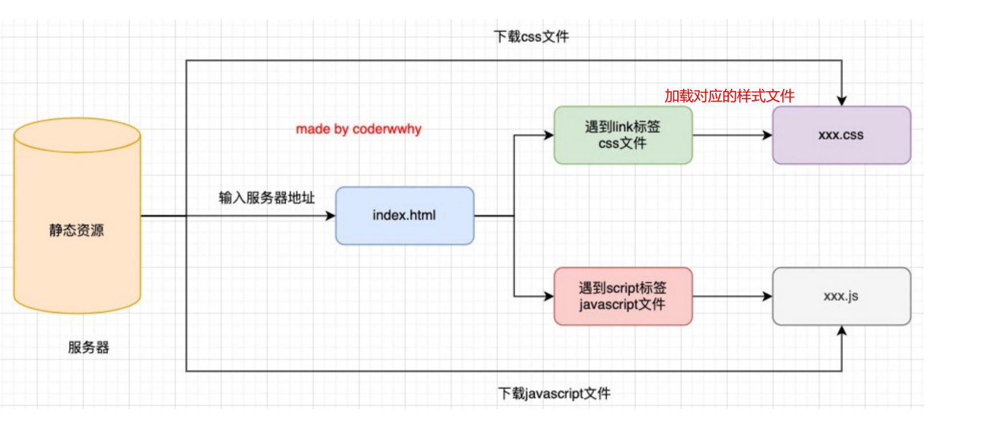
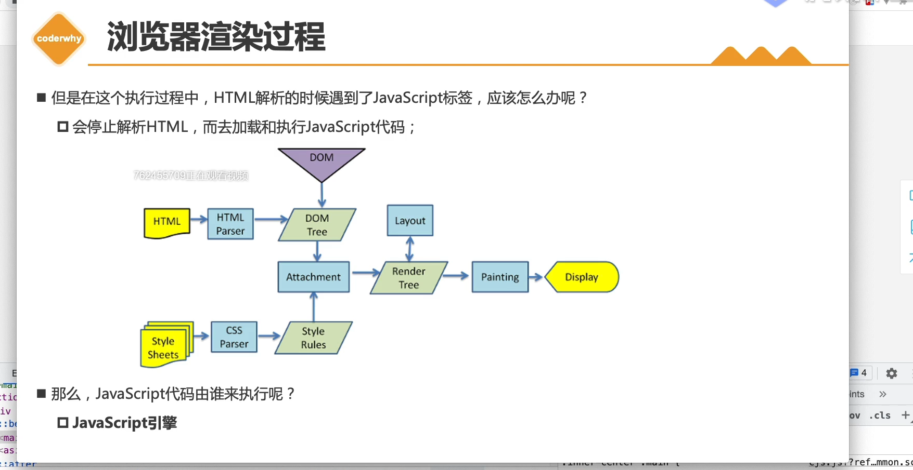
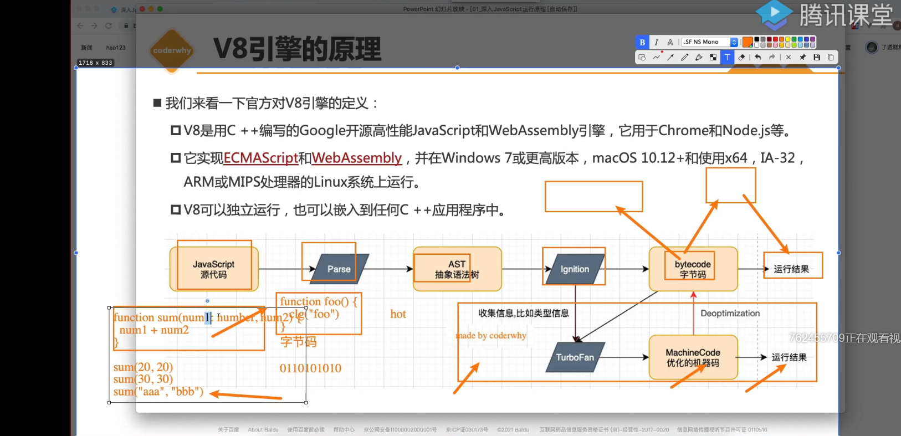
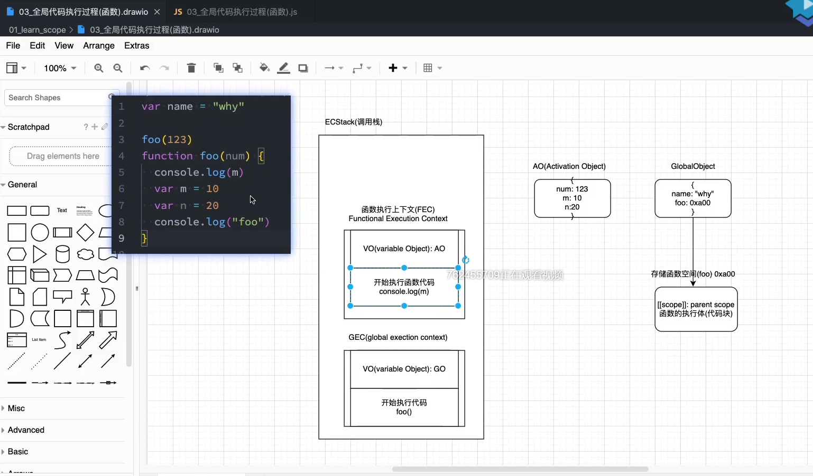
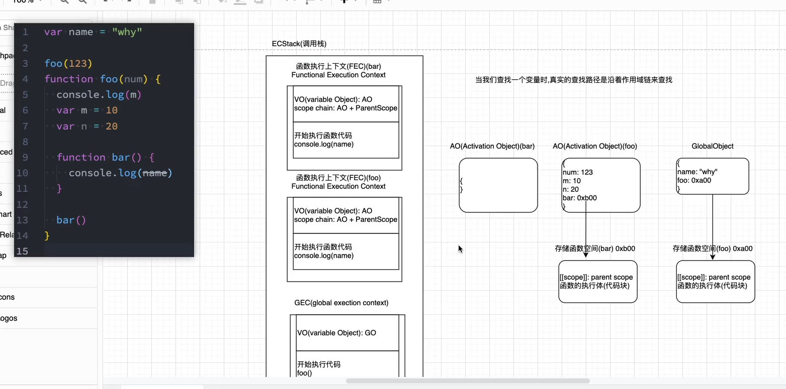
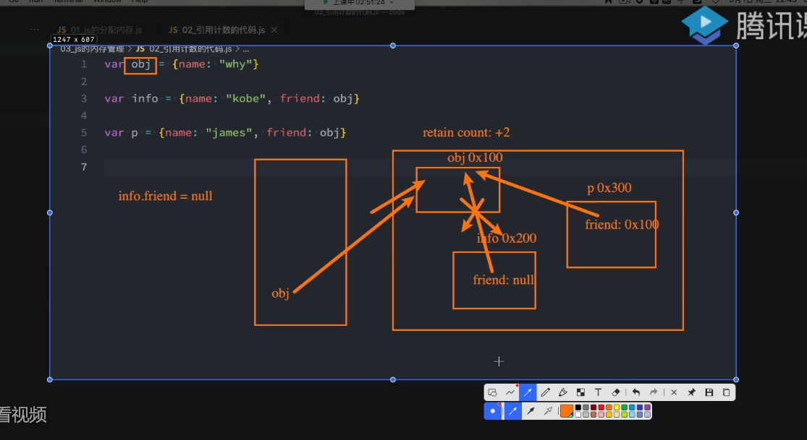
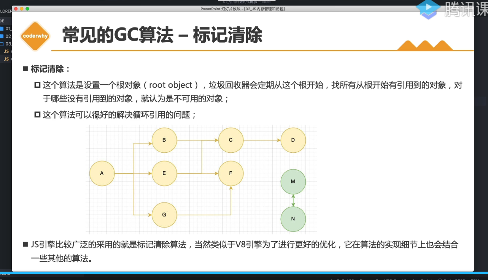
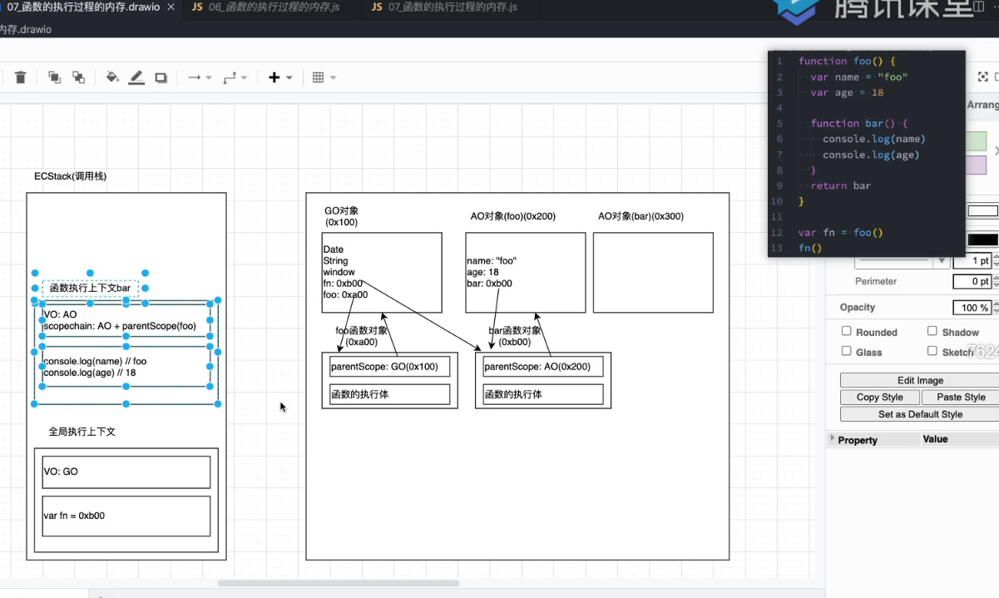

#####    1. 关于TypeScript

- TypeScript只是给JavaScript带来了类型的思维
    - 因为JavaScript本身长期是没有对变量、函数参数等类型进行限制的
    - 这可能给项目带来某种安全隐患

- 在TypeScript的官方文档有这么一句话：源于JavaScript，归于JavaScript
    - TypeScript只是JavaScript的一个超级，在它的基础之上进行了扩展
    - 最终TypeScript还是需要转换成JavaScript代码才能真正运行的
    - 不排除有一天JavaScript语言本身会加入类型检测，那么无论是TypeScript，还是Flow都会退出历史舞台

##### 2. 浏览器工作原理

- 加载静态资源，下载所有的css和js，然后根据需要加载对应的文件
    - ​	

- 浏览器渲染过程

    - 

    - DOM (JS代码可对DomTree进行操作）
    - attachment （附加）
    - Layout布局 （不同浏览器分辨率可能不同，加载的css文件若使用了绝对定位，需要浏览器去适配 ）

- 浏览器由分为两部分：

    - 浏览器内核（WebCore）：指的是浏览器的排版引擎,也称为浏览器引擎/页面渲染引擎/样版引擎
        - 负责HTML解析、布局、渲染等渲染层相关的工作
    - JS引擎（JavaScriptCore）: 比较常见的JavaScript引擎有SpiderMonkey、Chakra、JavaScriptCore、V8
        - 解析、执行JavaScript逻辑层代码

- v8引擎原理

    - 

    - parse模块会将JavaScript代码转换成AST，如果函数没有被调用，那么是不会被转换成AST
        - parse模块可以进行词法和语法分析
        - 网站“astexplorer.net‘可对代码进行词法分析
    - ignition： v8的一个库，可以理解为解释器/转化器，会将AST转换成ByteCode

    - 字节码需要变为汇编指令、机器码后才为运行的结果
        - bytecode可以跨平台，针对不同的平台转变为不同的机器码
    - TurboFan是一个编译器，可以将字节码编译为CPU可以直接执行的机器码
        - 如果一个函数被多次调用，那么就会被标记为热点函数，经过TurboFan转换成优化的机器码，提高代码的执行性能
        - 如果后续执行函数的过程中，类型发生了变化（比如sum函数原来执行的是number类型，后来执行变成了string类型，之前优化的机器码并不能正确的处理运算，就会逆向的转换成字节码（注意图MachineCode有两个走向）即类型未变化直接走机器码提升效率，变化则走字节码重新编译

##### 3. 全局代码执行过程

- 基本概念
    - 执行上下文栈Execution Context Stack 简称ECS 即代码的调用栈
    - 全局代码块执行会构建 Global Execution Context(GEC) GEC会被放到ESC中执行
    - 函数执行上下文 Functional Execution Context (FEC)
    - VO(variable Object) GO(global object) AO(activation object)
    - node中也装有js引擎，,所以可以解析JS，

- 执行过程
    - 先进行预编译
        - 编译在GO中声明的变量等，将其赋值为undefined
        - 遇到函数定义时，不会将其声明为undefined，而是在内存中开辟新空间，即存储函数空间，空间内存储两部分内容，一是函数的父级作用域，二是函数内部的执行体（即代码块），然后将此内存地址赋值给函数
        - 父级作用域在预编译时就已经确定了，而不是在执行时确定（即和它在哪调用无关）
    
    - 开始执行代码
        - 将变量等赋真实的值并运算等
        - 遇到函数执行，找到存储函数，将其放到ECS中，并在ECS中在创建一个FEC(因为执行的是函数),但在真正执行函数前，会再创建一个VO(其对应的就是AO),因为函数内部有时会再声明一些变量之类的，此时AO内部会重复前面的操作，如将变量先声明为undefined  
    - 
    - 函数执行完后，FEC会弹出ECS调用栈并销毁（注：其函数存储空间不会被销毁），内部的AO中的变量若未被其他引用，则也会被销毁
    - 函数若换参并再次执行，则重新压入栈，重复前面的步骤
    - 函数之中嵌套函数时，函数bar执行完bar的调用栈以及AO均会被销毁，bar的存储空间也被销毁，但如果有闭包，情况又不同了
    - 

- 作用域提升例题

    - ```javascript
        // 例子1
        function foo() {
          console.log(n) // undefined  因为定义了n,故在foo内部会先声明n为undefined，既然本身作用域已有，则不会向上找
          var n = 200
          console.log(n)  // 200
        }
        var n =100
        foo()

        // 例子2
        var n = 100
        function foo1() {
          console.log(n) // 100  因为未声明n，故会向副作用域寻找（注意与例1的区别在于定义了n）
        }
        function foo2() {
          var n = 200
          console.log(n) // 200
          foo1()
        }
        foo2()
        console.log(n) // 100
        
        // 例3
        var n = 100
        function foo3() {
          console.log(n) // undefined
          return
          var a = 100
        }
        foo3() // undefined  return是在函数执行时执行
        
        // 例4
        function foo4() {
          var a = b =10
          // 上面一行的等同于下面两行
          // var a = 10
          // b = 10
        }
        foo4() 
        console.log(a) // 报错
        console.log(b) // 10
        ```
        
        

##### 4. 内存管理

- 内存生命周期：申请内存->使用内存->释放内存
    - 不同语言申请和释放不同
    - 手动管理内存：如C、C++,需要编写free函数等来手动释放，对开发者要求高，容易内存泄漏
    - 自动管理内存：如JAVA，JavaScript、Python，使用垃圾回收机制
- 分配方式
    - 基本数据类型：直接在栈空间进行分配
    - 引用数据类型：堆内存开辟空间，将空间的指针返回给变量

- 垃圾回收机制
    - garbage collection 简称GC，GC算法有以下两种
    -  引用计数法
        - 每被引用一次，(对象的retain count)计数加1  ，当计数为0时释放内存
        - 
        - 弊端：存在循环引用（两个对象互相引用时），会造成内存泄漏
    - 标记清除法
        - 从根对象找有引用到的对象，未引用到的则可将其清除
        - 

##### 5. 闭包

- 函数和方法
    - 平常两者是同一个东西
    - 非要区分的话，函数是独立的一个function，当函数属于某个对象时则称其为方法

- 闭包定义：一个函数如果访问了(注意：是访问了)外层作用域中的变量，那么它就是一个闭包

- ```javascript
    function foo() {
      var name = "foo"
      var age = 18
      function bar() {
        console.log(name)
        console.log(age)
      }  
      return bar
    }
    var fn = foo() // 执行到此foo不会被销毁，因为bar的父作用域为foo，引用到了它
    fn()
    ```

- 

##### 6. this指向

- 基础概念

    - this的绑定与定义的位置无关，只和调用方式及调用位置有关
    - this是在运行时被绑定的

- 绑定规则

    - 默认绑定

        - 即独立函数调用，也就是直接调用函数，函数名称前无其他对象

        - ```javascript
            function foo1() {
              console.log(this)
              foo2()
            }
            function foo2() {
              console.log(this)
            }
            foo1() // 打印两次window 因为foo1和foo2都是直接调用的，不是诸如obj.foo1()的形式
            
            function foo() {
              console.log(this)
            }
            foo() // 打印window 原理同上 都是直接调用的函数
            
            ```

    -  隐式绑定

        - object.fn() 这种方式object对象会被JS引擎绑定到fn函数中的this里

        - ```javascript
            // 例1
            function foo() {
              console.log(this)
            }
            const obj = {
              name: 'obj',
              foo
            }
            obj.foo // this指向obj
            
            // 例2
            const obj1 = {
              name: 'obj1',
              foo: function() {
                console.log(this)
              }
            }
            const obj2 = {
              name: 'obj2',
              foo: obj1.foo
            }
            obj2.foo() // this指向obj2 因为obj2.foo是个函数，obj2唤起了函数的执行 
            ```

        - 绑定前提：调用对象的内部必须有个属性是对函数的引用（比如例2中的obj2）

    - 显示绑定

        - 解决隐式绑定的弊端，即不希望在对象内部包含对这个函数的引用，同时又希望在这个对象上进行强制调用

        - 使用apply和call方法，两者接受的第一个参数均为绑定的对象，后续参数apply为数组，call为参数列表

        - ```javascript
            // 例1
            function foo() {
            console.log('apply和call可以显示绑定')
            }
            foo() // 打印“apply和call可以显示绑定”
            foo.call() // 打印“apply和call可以显示绑定”
            foo.apply() // 打印“apply和call可以显示绑定”
            // foo直接调用和使用call和apply调用的区别在于this绑定的不同
            
            // 例2
            function sum(num1, num2) {
              console.log(num1 + num2, this)
            }
            sum.call('call', 20, 30) // 50 call
            sum.apply('apply', [20, 30]) // 50 apply 
            ```

            

        - ```javascript
            // bind绑定 
            function foo () {
              console.log(this)
            }
            foo.call('aaa') // aaa
            foo.call('aaa') // aaa
            // 当多次使用foo指向aaa时需多次绑定，故使用以下bind方法一次绑定就好
            
            const newFoo = foo.bind('aaa')
            newFoo() // aaa
            // 以后直接调用newFoo即可
            ```

    - new绑定

        - 使用new关键字来调用，会执行以下操作

        - 创建一个全新的对象，新对象被prototype连接，新对象会被绑定到函数调用的this上，如果函数没有返回其他对象，表达式会返回这个新对象

        - ```javascript
            function person(name, age) {
              this.name = name
              this.age = age
            }
            const p = new person('coder', 18)
            console.log(p.name, p.age) // coder 18
            ```

- 优先级

    - 默认绑定级别最低，隐式绑定高于默认，显示绑定高于隐式，new绑定高于显式但new不可和“call、apply”同时使用。可和bind同时使用

    - ```javascript
        // 例1
        function foo() {
          console.log(this)
        }
        const obj = {
        	name: 'obj',
        	foo: foo.bind('aaa')
        }
        obj.foo() // 'aaa' 说明显示高于隐式
        
        // 例2
        function foo() {
          console.log(this)
        }
        const bar = foo.bind('aaa')
        const obj = new bar() // foo 打印出的foo是个对象 说明new高于显示
        ```

        

- 箭头函数中的this

    - 箭头函数获取(即不绑定)不了this
    
    - 箭头函数被调用时，不管显示或隐式，都是去它被定义时的上层作用域中找this(即有与没有call、apply等结果都一样)
    
    - ```javascript
        // 例1
        const obj = {
          data: [],
          getData: function() {
        	setTimeout(function() {
          		const arr = [1,2,3]
          		this.data = arr
              console.log(this.data)
          	}, 200)
          }
        }
        obj.getData() //  因为setTimeout,此时this指向window
        // 例2
        const obj = {
          data: [],
          getData: function() {
          	const that = this
          	setTimeout(function() {
          		const arr = [1,2,3]
          		that.data = arr
              console.log(that)
          	}, 200)
          }
        }
        obj.getData() // that指向obj 因为是obj唤起的getData
        // 例3
        const obj = {
          data: [],
          getData: function() {
          	setTimeout(() => {
          		const arr = [1,2,3]
          		this.data = arr
              console.log(this)
          	}, 200)
          }
        }
        obj.getData() // this指向obj
        ```
        
        
        
    - ```javascript
        /*************************************************/
        const name = 'window'
        const obj = {
          name: 'obj',
          foo: () => console.log(this.name)
        }
        obj.foo() // 'window' 创建的obj是一个对象，对象创建时是没有作用域的而函数创建时有，故foo的父级作用域为全局
        /***********************************************/
        // 例题
        const name = 'window'
        const obj1 = {
          name: 'obj1'，
          fn1: function() {
            console.log(this.name)
          },
          fn2: () => console.log(this.name),
          fn3: function() {
            return function() {
              console.log(this.name)
            }
          },
          fn4: function() {
            return () => {
              console.log(this.name)
            }
          }
        }
        const obj2 = {name: 'obj2'}
        obj1.fn1() // obj1
        obj1.fn1.call(obj2) // obj2
        
        obj1.fn2() // window 
        // 因为f2是箭头函数，箭头函数无this，obj1.f2并没有进行隐式绑定，相当于没有唤起函数，故箭头函数中的this会向上层作用域中寻找，而对象是无作用域的，只有函数有，即obj1无作用域，因此this会指向全局
        obj1.fn2.call(obj2) // window
    
        obj1.fn3()() // window 独立函数调用，指向全局
        obj1.fn3.call(obj2)() // window 虽然obj2唤起的函数调用，但拿到的是执行后的结果，然后再独立函数调用
        obj1.fn3().call(obj2) // obj2
        
        obj1.fn4()() // obj1 第一次obj1.fn4()执行后是箭头函数，箭头函数接着执行，而得到的箭头函数是fn4执行后的结果，故箭头函数的父作用域为fn4，而fn4又是obj1唤起的，故最终指向obj1
        obj1.fn4.call(obj2)() // obj2
        obj1.fn4().call(obj2) // obj1
        ```
    
    - ```javascript
        var name = 'window'
        function Person(name) {
          this.name = name,
          this.fn1 = function () {
            console.log(this.name)
          },
          this.fn2 = () => console.log(this.name),
          this.fn3 = function () {
            return function () {
              console.log(this.name)
            }
          },
          this.fn4 = function () {
            return () => console.log(this.name)
          }
        }
        var person1 = new Person('person1')
        var person2 = new Person('person2')
        
        person1.fn1() // person1
        person1.fn1.call(person2) // person2
        
        person1.fn2() // person1 箭头函数的上一级是个函数，函数有作用域，且是person1唤起的(这点容易迷惑)
        person1.fn2.call(person2) // person1 其实call方法唤起箭头函数执行并不能改变指向
        
        person1.fn3()() // window
        person1.fn3.call(person2)() // window
        person1.fn3().call(person2) // person2
        
        person1.fn4()() // person1 第一次执行是person1唤起的，且结果是箭头函数的执行，箭头函数会向fn4中找，而fn4是person1唤起的
        person1.fn4.call(person2)() // person2
        person1.fn4().call(person2) // person1
        ```
    
    - ```javascript
        var name = 'window'
        function Person (name) {
          this.name = name
          this.obj = {
            name: 'obj',
            fn1: function () {
              return function () {
                console.log(this.name)
              }
            },
            fn2: function () {
              return () => console.log(this.name)
            }
          }
        }
        var person1 = new Person('person1')
        var person2 = new Person('person2')
        
        person1.obj.fn1()() // window
        person1.obj.fn1.call(person2)() // window
        person1.obj.fn1().call(person2) // person2
        
        person1.obj.fn2()() // obj 函数第一次执行后箭头函数执行时会寻找上层作用域，而上层作用域fn2是个函数，而fn2又是被obj唤起的，故this指向obj
        person1.obj.fn2.call(person2)() // person2 同上，但上层作用域fn2是person2唤起的
        person1.obj.fn2().call(person2) // obj
        ```
    
        

