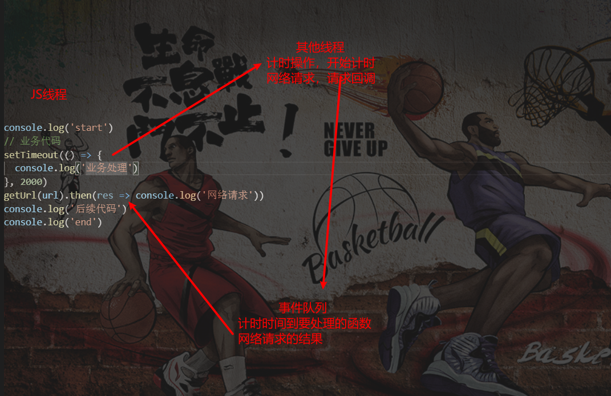

#####     1. 关于TypeScript

- TypeScript只是给JavaScript带来了类型的思维
    - 因为JavaScript本身长期是没有对变量、函数参数等类型进行限制的
    - 这可能给项目带来某种安全隐患

- 在TypeScript的官方文档有这么一句话：源于JavaScript，归于JavaScript
    - TypeScript只是JavaScript的一个超级，在它的基础之上进行了扩展
    - 最终TypeScript还是需要转换成JavaScript代码才能真正运行的
    - 不排除有一天JavaScript语言本身会加入类型检测，那么无论是TypeScript，还是Flow都会退出历史舞台

##### 2. 浏览器工作原理

- 加载静态资源，下载所有的css和js，然后根据需要加载对应的文件
    - ​	

- 浏览器渲染过程

    - 

    - DOM (JS代码可对DomTree进行操作）
    - attachment （附加）
    - Layout布局 （不同浏览器分辨率可能不同，加载的css文件若使用了绝对定位，需要浏览器去适配 ）

- 浏览器由分为两部分：

    - 浏览器内核（WebCore）：指的是浏览器的排版引擎,也称为浏览器引擎/页面渲染引擎/样版引擎
        - 负责HTML解析、布局、渲染等渲染层相关的工作
    - JS引擎（JavaScriptCore）: 比较常见的JavaScript引擎有SpiderMonkey、Chakra、JavaScriptCore、V8
        - 解析、执行JavaScript逻辑层代码

- v8引擎原理

    - 

    - parse模块会将JavaScript代码转换成AST，如果函数没有被调用，那么是不会被转换成AST
        - parse模块可以进行词法和语法分析
        - 网站“astexplorer.net‘可对代码进行词法分析
    - ignition： v8的一个库，可以理解为解释器/转化器，会将AST转换成ByteCode

    - 字节码需要变为汇编指令、机器码后才为运行的结果
        - bytecode可以跨平台，针对不同的平台转变为不同的机器码
    - TurboFan是一个编译器，可以将字节码编译为CPU可以直接执行的机器码
        - 如果一个函数被多次调用，那么就会被标记为热点函数，经过TurboFan转换成优化的机器码，提高代码的执行性能
        - 如果后续执行函数的过程中，类型发生了变化（比如sum函数原来执行的是number类型，后来执行变成了string类型，之前优化的机器码并不能正确的处理运算，就会逆向的转换成字节码（注意图MachineCode有两个走向）即类型未变化直接走机器码提升效率，变化则走字节码重新编译

##### 3. 全局代码执行过程

- 基本概念
    - 执行上下文栈Execution Context Stack 简称ECS 即代码的调用栈
    - 全局代码块执行会构建 Global Execution Context(GEC) GEC会被放到ESC中执行
    - 函数执行上下文 Functional Execution Context (FEC)
    - VO(variable Object) GO(global object) AO(activation object)
    - node中也装有js引擎，,所以可以解析JS，

- 执行过程
    - 先进行预编译
        - 编译在GO中声明的变量等，将其赋值为undefined
        - 遇到函数定义时，不会将其声明为undefined，而是在内存中开辟新空间，即存储函数空间，空间内存储两部分内容，一是函数的父级作用域，二是函数内部的执行体（即代码块），然后将此内存地址赋值给函数
        - 父级作用域在预编译时就已经确定了，而不是在执行时确定（即和它在哪调用无关）
    
    - 开始执行代码
        - 将变量等赋真实的值并运算等
        - 遇到函数执行，找到存储函数，将其放到ECS中，并在ECS中在创建一个FEC(因为执行的是函数),但在真正执行函数前，会再创建一个VO(其对应的就是AO),因为函数内部有时会再声明一些变量之类的，此时AO内部会重复前面的操作，如将变量先声明为undefined  
    - 
    - 函数执行完后，FEC会弹出ECS调用栈并销毁（注：其函数存储空间不会被销毁），内部的AO中的变量若未被其他引用，则也会被销毁
    - 函数若换参并再次执行，则重新压入栈，重复前面的步骤
    - 函数之中嵌套函数时，函数bar执行完bar的调用栈以及AO均会被销毁，bar的存储空间也被销毁，但如果有闭包，情况又不同了
    - 

- 作用域提升例题

    - ```javascript
        // 例子1
        function foo() {
          console.log(n) // undefined  因为定义了n,故在foo内部会先声明n为undefined，既然本身作用域已有，则不会向上找
          var n = 200
          console.log(n)  // 200
        }
        var n =100
        foo()

        // 例子2
        var n = 100
        function foo1() {
          console.log(n) // 100  因为未声明n，故会向父作用域寻找（注意与例1的区别在于定义了n）
        }
        function foo2() {
          var n = 200
          console.log(n) // 200
          foo1()
        }
        foo2()
        console.log(n) // 100
        
        // 例3
        var n = 100
        function foo3() {
          console.log(n) // undefined
          return
          var n = 100
        }
        foo3() // undefined  return是在函数执行时执行
        
        // 例4
        function foo4() {
          var a = b =10
          // 上面一行的等同于下面两行
          // var a = 10
          // b = 10
        }
        foo4() 
        console.log(a) // 报错
        console.log(b) // 10
        ```
        
    
- 函数参数作用域例题

    - 当函数的参数有默认值时，会形成一个新的作用域，这个作用域用于保存参数的值

    - ```javascript
        var x = 1
        function foo (x, y = function() { x = 3 console.log(x) // 3 }) {
        	console.log(x) // undefined
        	var x = 2
        	y()
        	console.log(x) // 2
        }
        foo()
        console.log(x) // 1
        // undefined 3 2 1
        ```

    - 此段代码有三层作用域

        - 全局作用域 x为1
        - foo内作用域，x初始为undefined，故先打印undefined，后“var x = 2”，虽然y内更改了x，但foo内本身有自己的x且x=2故打印2
        - y默认值为函数，会在自己内部形成新的作用域，在自己的作用域内有x且x=3

##### 4. 内存管理

- 内存生命周期：申请内存->使用内存->释放内存
    - 不同语言申请和释放不同
    - 手动管理内存：如C、C++,需要编写free函数等来手动释放，对开发者要求高，容易内存泄漏
    - 自动管理内存：如JAVA，JavaScript、Python，使用垃圾回收机制
- 分配方式
    - 基本数据类型：直接在栈空间进行分配
    - 引用数据类型：堆内存开辟空间，将空间的指针返回给变量

- 垃圾回收机制
    - garbage collection 简称GC，GC算法有以下两种
    -  引用计数法
        - 每被引用一次，(对象的retain count)计数加1  ，当计数为0时释放内存
        - 
        - 弊端：存在循环引用（两个对象互相引用时），会造成内存泄漏
    - 标记清除法
        - 从根对象找有引用到的对象，未引用到的则可将其清除
        - 

##### 5. 闭包

- 函数和方法
    - 平常两者是同一个东西
    - 非要区分的话，函数是独立的一个function，当函数属于某个对象时则称其为方法

- 闭包定义：一个函数如果访问了(注意：是访问了)外层作用域中的变量，那么它就是一个闭包

- ```javascript
    function foo() {
      var name = "foo"
      var age = 18
      function bar() {
        console.log(name)
        console.log(age)
      }  
      return bar
    }
    var fn = foo() // 执行到此foo不会被销毁，因为bar的父作用域为foo，引用到了它
    fn()
    ```

- 

##### 6. this指向

- 基础概念

    - this的绑定与定义的位置无关，只和调用方式及调用位置有关
    - this是在运行时被绑定的

- 绑定规则

    - 默认绑定

        - 即独立函数调用，也就是直接调用函数，函数名称前无其他对象

        - ```javascript
            function foo1() {
              console.log(this)
              foo2()
            }
            function foo2() {
              console.log(this)
            }
            foo1() // 打印两次window 因为foo1和foo2都是直接调用的，不是诸如obj.foo1()的形式
            
            function foo() {
              console.log(this)
            }
            foo() // 打印window 原理同上 都是直接调用的函数
            
            ```

    -  隐式绑定

        - object.fn() 这种方式object对象会被JS引擎绑定到fn函数中的this里

        - ```javascript
            // 例1
            function foo() {
              console.log(this)
            }
            const obj = {
              name: 'obj',
              foo
            }
            obj.foo // this指向obj
            
            // 例2
            const obj1 = {
              name: 'obj1',
              foo: function() {
                console.log(this)
              }
            }
            const obj2 = {
              name: 'obj2',
              foo: obj1.foo
            }
            obj2.foo() // this指向obj2 因为obj2.foo是个函数，obj2唤起了函数的执行 
            ```

        - 绑定前提：调用对象的内部必须有个属性是对函数的引用（比如例2中的obj2）

    - 显示绑定

        - 解决隐式绑定的弊端，即不希望在对象内部包含对这个函数的引用，同时又希望在这个对象上进行强制调用

        - 使用apply和call方法，两者接受的第一个参数均为绑定的对象，后续参数apply为数组，call为参数列表

        - ```javascript
            // 例1
            function foo() {
            console.log('apply和call可以显示绑定')
            }
            foo() // 打印“apply和call可以显示绑定”
            foo.call() // 打印“apply和call可以显示绑定”
            foo.apply() // 打印“apply和call可以显示绑定”
            // foo直接调用和使用call和apply调用的区别在于this绑定的不同
            
            // 例2
            function sum(num1, num2) {
              console.log(num1 + num2, this)
            }
            sum.call('call', 20, 30) // 50 call
            sum.apply('apply', [20, 30]) // 50 apply 
            ```

            

        - ```javascript
            // bind绑定 
            function foo () {
              console.log(this)
            }
            foo.call('aaa') // aaa
            foo.call('aaa') // aaa
            // 当多次使用foo指向aaa时需多次绑定，故使用以下bind方法一次绑定就好
            
            const newFoo = foo.bind('aaa')
            newFoo() // aaa
            // 以后直接调用newFoo即可
            ```

    - new绑定

        - 使用new关键字来调用，会执行以下操作

        - 创建一个全新的对象，新对象被prototype连接，新对象会被绑定到函数调用的this上，如果函数没有返回其他对象，表达式会返回这个新对象

        - ```javascript
            function person(name, age) {
              this.name = name
              this.age = age
            }
            const p = new person('coder', 18)
            console.log(p.name, p.age) // coder 18
            ```

- 优先级

    - 默认绑定级别最低，隐式绑定高于默认，显示绑定高于隐式，new绑定高于显式但new不可和“call、apply”同时使用。可和bind同时使用

    - ```javascript
        // 例1
        function foo() {
          console.log(this)
        }
        const obj = {
        	name: 'obj',
        	foo: foo.bind('aaa')
        }
        obj.foo() // 'aaa' 说明显示高于隐式
        
        // 例2
        function foo() {
          console.log(this)
        }
        const bar = foo.bind('aaa')
        const obj = new bar() // foo 打印出的foo是个对象 说明new高于显示
        ```

        

- 箭头函数中的this

    - 箭头函数获取(即不绑定)不了this
    
    - 箭头函数被调用时，不管显示或隐式，都是去它被定义时的上层作用域中找this(即有与没有call、apply等结果都一样)
    
    - ```javascript
        // 例1
        const obj = {
          data: [],
          getData: function() {
        	setTimeout(function() {
          		const arr = [1,2,3]
          		this.data = arr
              console.log(this.data)
          	}, 200)
          }
        }
        obj.getData() //  因为setTimeout,此时this指向window
        // 例2
        const obj = {
          data: [],
          getData: function() {
          	const that = this
          	setTimeout(function() {
          		const arr = [1,2,3]
          		that.data = arr
              console.log(that)
          	}, 200)
          }
        }
        obj.getData() // that指向obj 因为是obj唤起的getData
        // 例3
        const obj = {
          data: [],
          getData: function() {
          	setTimeout(() => {
          		const arr = [1,2,3]
          		this.data = arr
              console.log(this)
          	}, 200)
          }
        }
        obj.getData() // this指向obj
        ```
        
        
        
    - ```javascript
        /*************************************************/
        const name = 'window'
        const obj = {
          name: 'obj',
          foo: () => console.log(this.name)
        }
        obj.foo() // 'window' 创建的obj是一个对象，对象创建时是没有作用域的而函数创建时有，故foo的父级作用域为全局
        /***********************************************/
        // 例题
        const name = 'window'
        const obj1 = {
          name: 'obj1'，
          fn1: function() {
            console.log(this.name)
          },
          fn2: () => console.log(this.name),
          fn3: function() {
            return function() {
              console.log(this.name)
            }
          },
          fn4: function() {
            return () => {
              console.log(this.name)
            }
          }
        }
        const obj2 = {name: 'obj2'}
        obj1.fn1() // obj1
        obj1.fn1.call(obj2) // obj2
        
        obj1.fn2() // window 
        // 因为f2是箭头函数，箭头函数无this，obj1.f2并没有进行隐式绑定，相当于没有唤起函数，故箭头函数中的this会向上层作用域中寻找，而对象是无作用域的，只有函数有，即obj1无作用域，因此this会指向全局
        obj1.fn2.call(obj2) // window
    
        obj1.fn3()() // window 独立函数调用，指向全局
        obj1.fn3.call(obj2)() // window 虽然obj2唤起的函数调用，但拿到的是执行后的结果，然后再独立函数调用
        obj1.fn3().call(obj2) // obj2
        
        obj1.fn4()() // obj1 第一次obj1.fn4()执行后是箭头函数，箭头函数接着执行，而得到的箭头函数是fn4执行后的结果，故箭头函数的父作用域为fn4，而fn4又是obj1唤起的，故最终指向obj1
        obj1.fn4.call(obj2)() // obj2
        obj1.fn4().call(obj2) // obj1
        ```
    
    - ```javascript
        var name = 'window'
        function Person(name) {
          this.name = name,
          this.fn1 = function () {
            console.log(this.name)
          },
          this.fn2 = () => console.log(this.name),
          this.fn3 = function () {
            return function () {
              console.log(this.name)
            }
          },
          this.fn4 = function () {
            return () => console.log(this.name)
          }
        }
        var person1 = new Person('person1')
        var person2 = new Person('person2')
        
        person1.fn1() // person1
        person1.fn1.call(person2) // person2
        
        person1.fn2() // person1 箭头函数的上一级是个函数，函数有作用域，且是person1唤起的(这点容易迷惑)
        person1.fn2.call(person2) // person1 其实call方法唤起箭头函数执行并不能改变指向
        
        person1.fn3()() // window
        person1.fn3.call(person2)() // window
        person1.fn3().call(person2) // person2
        
        person1.fn4()() // person1 第一次执行是person1唤起的，且结果是箭头函数的执行，箭头函数会向fn4中找，而fn4是person1唤起的
        person1.fn4.call(person2)() // person2
        person1.fn4().call(person2) // person1
        ```
    
    - ```javascript
        var name = 'window'
        function Person (name) {
          this.name = name
          this.obj = {
            name: 'obj',
            fn1: function () {
              return function () {
                console.log(this.name)
              }
            },
            fn2: function () {
              return () => console.log(this.name)
            }
          }
        }
        var person1 = new Person('person1')
        var person2 = new Person('person2')
        
        person1.obj.fn1()() // window
        person1.obj.fn1.call(person2)() // window
        person1.obj.fn1().call(person2) // person2
        
        person1.obj.fn2()() // obj 函数第一次执行后箭头函数执行时会寻找上层作用域，而上层作用域fn2是个函数，而fn2又是被obj唤起的，故this指向obj
        person1.obj.fn2.call(person2)() // person2 同上，但上层作用域fn2是person2唤起的
        person1.obj.fn2().call(person2) // obj
        ```
    
        

##### 7. call、apply、bind模拟实现

- 本质是用C++写的，此处用js模拟内部实现

- Object('参数') 会将参数为null和undefined转为空对象，若参数为对象则不改变它

- ```javascript
    /***************call的实现*****************/
    Function.prototype.call = function (thisArg, ...args) {
    	// 1. 获取到要执行的函数
    	var fn = this // 外部谁调用了call，此处的this会指向它，如外部的foo.call()则由于隐式绑定，this指向foo，此时如果紧接着执行“fn()”不考虑边界(即极端)情况基本上已经实现了模拟
      // 2. 将thisArg转换成对象类型(防止传来的thisArg为非对象类型时调用不了函数)
      thisArg = (thisArg !== null || thisArg !== undefined) ? Object(thisArg) : window // 非对象类型如null、undefined等指向window
      // 3. 调用需要被执行的函数
      thisArg.fn = fn
      var result = thisArg.fn(...args) // 这一步才是真正的“person”唤起了foo函数的调用
      delete thisArg.fn // 因为thisArg是传来要指向的参数，手动给它加了fn属性，利用完后再手动将其删掉
      // 4. 将最终结果返回出去
      return result
    }
    function foo(num1, num2) {
      console.log('函数被执行', this)
      return num1 + num2
    }
    foo.call('person', 1,2)
    /***************apply的实现**************/
    // 和call实现基本一样，就是边界情况不同，传参为数组或不传参时的处理 主要第三步不同
    Function.prototype.apply = function (thisArg, args) {
    	// 直接从第三步开始
      thisArg.fn = fn
      args = args || [] // 若不传则默认args为undefined，是不能使用“...”展开的 或形参args给默认值为数组,则可省略此行
      var result = thisArg.fn(...args)
      delete thisArg.fn
    }
    ```

- ```javascript
    /**************bind模拟***************/
    Function.prototype.bind = function(thisArg, ...args) {
      var fn = this
      thisArg = (thisArg !== null || thisArg !== undefined) ? Object(thisArg) : window
    	//  返回函数：因为外部是声明了一个变量 然后每次将这个变量作为方法去调用
      return function(...newArgs) {
        thisArg.fn = fn
        var finalArgs = [...args, ...newArgs] // 拼接参数：目的是可用两种方式进行传参
        var result = thisArg.fn(finalArgs)
        delete thisArg.fn
        return result
      }
    }
    function foo(num1,num2) {
      console.log(num1, num2)
    }
    // 调用传参方式1
    var fn = foo.bind('person', 1, 2)
    fn()
    // 调用传参方式2
    var fn = foo.bind('person', 1)
    fn(2)
    ```

- ```javascript
    // Array中slice的实现原理
    Array.prototype.slice = function(start, end) {
      var arr = this
      start = start || 0
      end = end || arr.length
      var newArr = []
      for(var i = start; i < end; i++) {
        newArr.push(arr[i])
      }
      return newArr
    }
    var str = Array.prototype.slice.call([1,2,3], 1,3) // 此方法也可将函数中的arguments参数转为数组，因为上面实现原理用的是length属性,还可用ES6新语法Array.from(arguments)转arguments
    console.log(str) // [2,3]
    
    ```

    

##### 8. 纯函数

- 定义

    - 相同的输入值，则要产生相同的输出值（即如果内部依赖了外部变量，更改了外部变量后，两次相同的输入值却得到了不同的输出值，这样不能称为纯函数）

    - 函数在执行过程中，不可产生副作用，诸如“触发事件、修改全局变量、修改参数等”

    - ```javascript
        // 非纯函数
        function test(obj) {
          obj.age = 10
        } 
        // 纯函数
        function test(obj) {
          return { ...obj, age: 10 }
        }
        // 严格来说，纯函数只能返回，不可修改/输出/打印参数。
        ```

        

##### 9. 函数柯里化

- 定义：把接收多个参数的函数变成接收单一参数且返回接收余下参数，并且返回结果的新函数的技术

- ```javascript
    // 如将foo变为fn
    function foo(m, n, l) {
    	return m + n +l
    }
    foo(1, 2, 3)
    function fn(m) {
      return function(n) {
        return function(l) {
          return m + n + l
        }
      }
    }
    fn(1)(2)(3)
    // 将fn以箭头函数的形式进行简写，如下
    var fn = m => n => l =>{
      return m + n +l
    }
    // 上面箭头函数的简写其实就是省略return和花括号的过程，即如下
    var fn = m => {
      return n => {
        return l => {
          return m + n +l
        }
      }
    }
    ```

- 好处：执行单一职责、逻辑可复用、还可定制化

    - ```javascript
        // 如x值固定，y、z不固定
        function sum(x) {
        	return y => {
        		y = y + 1
            return z => {
              z = z * z
              return x +y + z
            }
        	}
        }
        const newSum  = sum(1)
        const a = newSum(2)(3)
        const b = newSum(4)(5)
        // 以上代码就实现了单一职责，即每个函数内部只执行固定的内容；对比y和z内部，逻辑进行了复用；重新以变量接受函数第一次执行后，可实现定制化
        // 相当于将一个功能拆分成多段，且每个阶段都可进行复用
        ```

- 封装一个工具函数，将普通函数转为柯里化函数

    - ```javascript
        function currying(fn) {
        	function curried(...args) {
        		// 判断当前已接收的参数个数，与函数本身需要接收的参数是否已一致
        		// 当传入的参数大于等于需要的参数时就执行函数； "fn.length"可拿到函数fn实参的个数
        		if (args.length >= fn.length) {
        			return fn.apply(this, args) // 此行为真正执行函数 使用call方法防止外部调用时改变了this实际的指向
        		} else {
              // 未达到个数需要返回新函数来继续接收参数
              return function (..secondArgs) {
                // 接收到参数后需要递归调用curried来检查函数的参数个数是否已一致
              	return curried.apply(this, [...args, ...secondArgs])
              }
        		}
        	}
        	return curried
        }
        function sum(x, y, z) {
          return x + y +z
        }
        var currySum = crrying(sum)
        console.log(currySum(1, 2, 3)) // 6
        console.log(currySum(1, 2)(3)) // 6
        console.log(currySum(1)(2)(3)) // 6
        // 使用if分支的目的，就是应对出现上面的传参个数不同的情况
        ```

##### 10. 组合函数

- 定义：对某个数据，依次执行函数fn1和fn2，如果调用时每次都需要进行两个函数调用，操作上就显得重复，现将这两个函数组合起来依次调用，这个过程就是对函数的组合，称为组合函数

- ```javascript
    function add(num) {
    	return num + num
    }
    function square(num) {
    	return num * num
    }
    function composeFn(fn1, fn2) {
    	return function(count) {
    		return fn1(fn2(count))
    	}
    }
    var newFn = composeFn(add, square)
    console.log(newFn(10)) // 组合式
    console.log(add(square(10))) // 原生
    
    // 优化后的组合函数 即考虑边界情况
    function fn1(num) {
      return num * 2
    }
    function fn2(num) {
      return num * num
    }
    function fn3(m, n) {
      return m + n
    }
    function fn(...fns) {
      const length = fns.length
      for(let i =0; i < length; i++) {
        if(typeof fns[i] !== 'function') {
          throw new TypeError('传入的参数必须为函数') 
         }
      }
      return function(...args) {
        let index = 0
        let result = length ? fns[index].apply(this, args) : args // 如果参数函数只有一个，直接将它返回即可
        while(index++ < length) {
          result = fns[index].call(this, result) // 有多个参数则循环执行当前参数函数
        }
        return result
      }
    }
    const f = fn(fn3, fn2, fn1)
    console.log(f(5)) // 18
    console.log(fn1(fn2(fn3(1, 2)))) // 18
    // 注意函数参数的顺序
    ```


##### 11. with、eval、严格模式

- with语句

    - with(obj) {} 
    - 功能：类似于函数，有自己的作用域，它是扩展一个语句的作用域链
    - 特殊点：内部查找作用域时，先向obj中查找，再向with的上层查找
    - 不建议使用with语句，因为它可能是混淆错误和兼容性问题的根源，严格模式下不允许使用

- eval

    - 是一个全局函数，可将传入的字符串当成JS代码来执行

    - ```javascript
        // 例
        const str = 'const mesage = "hellow"; console.log(message)'
        eval(str)
        console.log(message) // hellow
        ```

    - 不建议在开发中使用eval：

        - 可读性差
        - eval是个字符串，执行过程中有可能被篡改，造成被攻击的风险
        - eval的执行必须经过JS解释器，不能被JS引擎优化

- 严格模式：

    - 特点：
        - 通过抛出错误来替换一些原有的静默错误
        - 禁用了在ECMAScript未来版本中可能会定义的一些语法
        - 让JS引擎在执行代码时可进行更多优化(不需要对一些特殊语法进行处理)

    - 开启严格模式
        - "use strict"
        - 在单个文件头部使用，单个文件开启严格模式
        - 在函数内部首行使用，只针对当前函数开启
        - 特殊点：无论是否在严格模式下，setTimeout中的this都会指向window

##### 12. Proxy与Reflect

- Proxy
    - 如果希望监听一个对象的相关操作，那么我们可以先创建一个代理对象(Proxy对象)，之后对该对象的所有操作都通过代理对象来完成，代理对象可以监听我们想要对原生对象进行哪些操作

    - 用法：

        ```javascript
        // const objProxy = new Proxy(被代理对象, 捕获器)
        // 捕获器共有13种，常用的为get、set
        // 捕获器中的函数参数 receiver:调用的代理对象，即objProxy
        const obj = {
          name: 'kobe',
          age: 18
        }
        const objPxoxy = new Proxy(obj, {
          // 获取值时的捕获器
          get(target,key,receiver) {
            return target[key] + 'hahaha'
          },
          // 设置值时的捕获器
          set(target,key,newVal,receiver) {
          	target[key] = newVal
          },
          // 监听in的捕获器
          has(target,key) {
            return key on target  // 返回true/false
          },
          // 监听delete的捕获器
          deleteProperty(target,key) {
            delete terget[key]
          }
        })
        objProxy.age = 20
        console.log(objProxy.name) // kobehahaha
        console.log(obj.name) // kobe
        console.log(obj.age) // 20
        console.log('name' in objProxy) // true
        ```

- Reflect
    - 一般proxy和reflect结合使用

    - Reflect和Object用法及其相似，很多功能都一样，如Object.getPrototypeOf()和Reflect.getPrototypeOf()

    - Reflect的常见方法也有13个，并且和Proxy的13种捕获器是对应的

    - 设计Reflect的原因：

        - JS在设计之初有很多不足，Object承担了一些本不该它承担的作用
    - 修改某些Object方法的返回结果使其变得更合理，如：Object.defineProperty(obj,name,desc)在无法定义时会抛出错误，而使用Reflect.defineProperty(obj,name,desc)则会返回false
    
    - 用法：
    
        - ```javascript
            const obj = {
              name: 'kobe',
              age: 18
            }
            const objPxoxy = new Proxy(obj, {
              // 获取值时的捕获器
              get(target,key,receiver) {
                return Reflect.get(target,key)
                //  return target[key]
              },
              // 设置值时的捕获器
              set(target,key,newVal,receiver) {
                // target[key] = newVal 方式1
                Reflect.set(target,key,newVal) // 方式2  	
            		// 方式1和2稍微有点区别
                // 方式2设置时会返回一个布尔值用于检测是否设置成功，方式1则无法检测，如某个对象使用了“Object.freeze(target)”冻结了对象使之不可设置
                // 其次方式1也是直接对源对象进行操作，违背了代理对象的初衷
          }
            })
          ```
    
    - Reflect中receiver参数的作用
    
        - get和set中才有receiver
    
        - receiver是创建出来的代理对象，作用是为了改变obj里get方法中this的指向，使this指向receiver这个参数
    
        - Reflect中不传receiver时
    
            - ```javascript
                const obj = {
                	_name: 'kobe',
                	get name() {
                		console.log(this)
                		return this._name
                	},
                	set name(newVal) {
                		this._name = newVal
                	}
                }
                const objProxy = new Proxy(obj, {
                	get(target, key) {
                		console.log('代理对象被访问,此行只打印一次')
                		return Reflect.get(target, key)
                	},
                	set(target, key, newVal) {
                		Reflect.set(target, key, newVal)
                	}
                })
                console.log(objProxy.name) // ‘代理对象被访问，此行只打印一次' {_name: 'kobe',name:[Getter/Setter]} kobe
                // 代码执行时
                // 1. 先到objProxy中的get方法，target为obj,key为name，故再到obj的name方法，此时name方法中的this指向obj
                // 2.因为this指向obj，相当于拦截name方法并未起到作用，因为仍然直接访问到obj._name
                ```
    
        - Reflect中传receiver时
    
            - ```javascript
                const obj = {
                	_name: 'kobe',
                	get name() {
                		console.log(this)
                		return this._name
                	},
                	set name(newVal) {
                		this._name = newVal
                	}
                }
                const objProxy = new Proxy(obj, {
                	get(target, key, receiver) {
                		console.log('代理对象被访问,此行会被打印两次')
                		return Reflect.get(target, key, receiver)
                	},
                	set(target, key, newVal, receiver) {
                		Reflect.set(target, key, newVal, receiver)
                	}
                })
                console.log(objProxy.name) // '代理对象被访问，此行会被打印两次' {_name: 'kobe',name:[Getter/Setter]} '代理对象被访问，此行会被打印两次' kobe
                // 1. 先到objProxy中的get方法，target为obj, 然后再到obj的name方法，此时name方法中的this指向objProxy
                // 2. 因此此时是访问objProxy._name，故会再次来到objProxy的get方法中，此时拦截就起到了作用
                
                ```
    
        - 应用
    
            - ```javascript
                function Student(name, age) {
                	this.name = name
                	this.age = age
                }
                function Teacher() {
                }
                // 执行student中的内容，但是创建出来对象却是Teacher对象，即改变this指向 
                const teacher = Reflect.construct(Student, ['kobe', 18], Teacher)
                console.log(teacher) // Teacher {name: 'kobe', age: 18}
                console.log(teacher.__proto__ === Teacher.prototype) // true
                ```
    
                

##### 13. 响应式原理

- 基础结构

    - 自动监听单个对象属性值的变化

    - ```javascript
        // 封装收集依赖的类
        class Depend {
        	constructor (fn) {
        		this.fns = []
        	}
        	// 添加依赖
        	addDepend(fn) {
        		this.fns.push(fn)
        	}
        	// 通知响应
        	notify() {
        		this.fns.forEach(item => item())
        	}
        }
        const depend = new Depend()
        
        // 需要及时响应的方法
        function fn1() {
        	console.log('需及时响应的方法1')
        }
        function fn2() {
        	console.log('需及时响应的方法2')
        }
        // 创建收集响应方法的函数
        function watchFn(fn) {
        	depend.addDepend(fn)
        }
        watchFn(fn1)
        watchFn(fn2)
        const obj = {
        	name: 'kobe',
        	age: 18
        }
        const objProxy = new Proxy(obj, {
        	get: function(target, key, receiver) {
        		return Reflect.get(target, key, receiver)
        	},
        	set: function(target, key, newVla, receiver) {
        		Reflect.set(target, key, newVla, receiver)
        		depend.notify() // 此行是值变化调用及时响应的方法
        	}
        })
        objProxy.age = 20 // 需及时响应的方法1 需及时响应的方法2
        objProxy.age = 30 // 需及时响应的方法1 需及时响应的方法2
        ```


- 基础结构上的改进

    - 监听多个对象 每个对象应该为一个map

    - 多个对象可能有相同的属性 每个属性应该有它自己的depend

    - ```javascript
        class Depend {
        	constructor() {
        		this.fns = []
        	}
        	// 收集响应式方法
        	addDepend() {
        		this.fns.push(...arguments)
        	}
        	// 通知响应式方法
        	notify() {
        		console.log('dao')
        		this.fns.forEach(item => item())
        	}
        }
        // 需响应式的方法1
        function fn1() {
        	console.log('需响应式的方法1')
        }
        // 需响应式的方法2
        function fn2() {
        	console.log('需响应式的方法2')
        }
        const depend = new Depend()
        // 收集需要响应式的方法
        function watchFns() {
        	depend.addDepend(...arguments)
        }
        watchFns(fn1, fn2)
        depend.notify()
        // 封装一个获取depend函数
        const targetMap = new WeakMap()
        function getDepend(target, key) {
        	// 根据target对象获取map的过程
        	let map = targetMap.get(target)
        	if (!map) {
        		map = new Map()
        		targetMap.set(target, map)
        	}
        	// 根据key获取depend对象
        	let depend = map.get(key)
        	if (!depend) {
        		depend = new Depend()
        		map.set(key, depend)
        	}
        	return depend
        }
        const obj = {
        	name: 'kobe',
        	age: 18
        }
        const objProxy = new Proxy(obj, {
        	get(target, key, receiver) {
        		return Reflect.get(target, key, receiver)
        	},
        	set(target, key, newVal, receiver) {
        		Reflect.set(target, key, newVal, receiver)
        		const depend = getDepend(target, key)
        		depend.notify()
        	}
        })
        ```

- 再次改进 正确收集依赖

    - 依赖收集错误，应在get中收集而非在watchFns中，否则每个对象的每个属性对应的depend方法为空，即根本未收集到属性变化时需调用的函数

    - 重写watchFns方法

    - 难理解的点: watchFns中的fn需要执行一次，当执行时代理对象的get方法中才能收集到依赖(即哪个函数需要为响应式)

    - bug：方法fn1中，若使用了两次objProxy.age，则fns中会被push两次fn1

    - ```javascript
        // 封装依赖收集
        class Depend {
        	constructor() {
        		this.fns = []
        	}
        	// 收集响应式方法
        	addDepend(fn) {
        		this.fns.push(fn)
        	}
        	// 通知响应式方法
        	notify() {
        		this.fns.forEach(item => item())
        	}
        }
        // 收集需要响应式的方法
        let activeFn = null
        function watchFns(fn) {
        	activeFn = fn
        	fn()
        	activeFn = null
        }
        // 封装一个获取depend函数
        const targetMap = new WeakMap()
        function getDepend(target, key) {
        	// 根据target对象获取map的过程
        	let map = targetMap.get(target)
        	if (!map) {
        		map = new Map()
        		targetMap.set(target, map)
        	}
        	// 根据key获取depend对象
        	let depend = map.get(key)
        	if (!depend) {
        		depend = new Depend()
        		map.set(key, depend)
        	}
        	return depend
        }
        const obj = {
        	name: 'kobe',
        	age: 18
        }
        const objProxy = new Proxy(obj, {
        	get(target, key, receiver) {
        		const depend = getDepend(target, key)
        		depend.addDepend(activeFn)
        		return Reflect.get(target, key, receiver)
        	},
        	set(target, key, newVal, receiver) {
        		Reflect.set(target, key, newVal, receiver)
        		const depend = getDepend(target, key)
        		depend.notify()
        	}
        })
        // 需响应式的方法1
        function fn1() {
        	console.log(objProxy.age)
        	console.log(objProxy.age)
        	console.log('age变化时执行它')
        }
        // 需响应式的方法2
        function fn2() {
        	console.log(objProxy.name)
        	console.log('name变化时执行它')
        }
        watchFns(fn1)
        watchFns(fn2)
        console.log('*******************age发生了变化*****************');
        objProxy.age = 20
        ```

- 最终版
    - 优化：不在get方法中手动传activeFn,而是直接添加

    - 抽离代理方法，多个对象也可进行代理

    - 使用set方法代替数组解决方法中调用多次属性则执行多次方法的bug

    - ```javascript
        // 封装依赖收集
        let activeFn = null
        class Depend {
        	constructor() {
        		// 使用set去重
        		this.fns = new Set()
        	}
        	// 收集响应式方法
        	addDepend() {
        		if (activeFn) {
        			this.fns.add(activeFn)
        		}
        	}
        	// 通知响应式方法
        	notify() {
        		this.fns.forEach(item => item())
        	}
        }
        // 封装一个获取depend函数
        const targetMap = new WeakMap()
        function getDepend(target, key) {
        	// 根据target获取map
        	let map = targetMap.get(target)
        	if (!map) {
        		map = new Map()
        		targetMap.set(target, map)
        	}
        	// 根据key获取depend
        	let depend = map.get(key)
        	if (!depend) {
        		depend = new Depend()
        		map.set(key, depend)
        	}
        	return depend
        }
        const obj = {
        	name: 'kobe',
        	age: 18
        }
        const info = {
        	address: '苏州',
        	phone: 110
        }
        // 抽离代理方法
        function proxyFn(obj) {
        	return new Proxy(obj, {
        		get(target, key, receiver) {
        			const depend = getDepend(target, key)
        			depend.addDepend()
        			return Reflect.get(target, key, receiver)
        		},
        		set(target, key, newVal, receiver) {
        			Reflect.set(target, key, newVal, receiver)
        			const depend = getDepend(target, key)
        			depend.notify()
        		}
        	}) 
        }
        const objProxy = proxyFn(obj)
        const infoProxy = proxyFn(info)
        // 收集需要响应的方法
        function watchFns(fn) {
        	activeFn = fn
        	fn()
        	activeFn = null
        }
        // 需要响应的方法1
        function fn1() {
        	console.log('age变化时执行它')
        	console.log(objProxy.age)
        	console.log(objProxy.age)
        }
        // 需要响应的方法2
        function fn2() {
        	console.log('address变化时执行它')
        	console.log(infoProxy.address)
        	console.log(infoProxy.address)
        }
        watchFns(fn1)
        watchFns(fn2)
        console.log('***************age、address发生了变化************')
        objProxy.age = 20
        infoProxy.address = '杭州'
        ```

        

##### 14. 进程与线程

- 基础概念

    - 操作系统：联系软件与硬件的桥梁，软件装在硬件上，通过操作系统才能运行
    - 进程：
        - 计算机已经运行的程序，是操作系统管理程序的一种方式
        - 比如打开了一个音乐软件，就可看作是一个进程，但一个应用程序并不一定只有一个进程，比如浏览器就是多进程的
        - 即启动一个应用程序就可默认启动一个(或多个)进程
    - 线程：
        - 操作系统能够运行运算调度的最小单位，它通常被包含在进程中
        - 每一个进程中都会启动至少一个线程来执行程序中的代码，这个线程被称为主线程
    - 操作系统好比工厂，进程好比车间，线程好比工人
    - 浏览器中的线程：
        - 多数浏览器都是多进程的，打开一个tab页面就会开启一个新进程，这是为了防止一个tab页面卡死造成所有页面无法响应而需整个浏览器强制退出
        - 每个进程中又有很多线程，有些线程是执行JS代码，有些线程是管理浏览器的操作(如点击浏览器头部收藏夹的操作)
        - JS的代码执行是在一个单独的线程中执行的，这就意味着JS代码在同一时刻只能做一件事
        - 如果某个线程的操作比较耗时，那就意味着当前线程会被阻塞
        - 执行JS代码时，如果遇到网络请求、定时器等代码都不是JS线程来做而是浏览器其他线程帮忙处理的，等到有结果时通过事件队列进行结果回调

- 浏览器事件循环机制

    - 
    - 代码执行时，JS线程执行相关代码
    - 遇到耗时操作时，其他线程负责处理，然后将处理结果推到事件队列中
    - JS线程再不断的从队列中取出事件继续执行
    - 如此形成一个事件循环

- 宏任务与微任务

    - 事件队列包含宏任务队列与微任务队列
    - 宏任务队列(macrotask queue)
        - 包含定时器、ajax请求、DOM回调(如点击事件)、一些UI Rendering
    - 微任务队列(microtask queue)
        - 包含queueMicrotask、Promise.then
        - 注：new Promise中的代码是在JS线程上执行的，而Promise.then中的代码是在微任务队列中
    - 在执行任何宏任务之前都需先保证微任务队列已被清空
        - 即在执行宏任务的的过程中
        - 若宏任务1执行时依次将多个函数推到微任务中，宏任务1主线执行完不会执行宏任务2
        - 而是执行刚才推到微任务中的函数，待到微任务中的执行完再执行宏任务2

-  事件循环面试题

    - 题1

        - ```javascript
            setTimeout(function () {
            	console.log('setTimeout1')
            	new Promise(function (resolve) {
            		resolve()
            	}).then(function () {
            		new Promise(function (resolve) {
            			resolve()
            		}).then(function () {
            			console.log('then4')
            		})
            		console.log('then2')
            	})
            })
            new Promise(function (resolve) {
            	console.log('promise1')
            	resolve()
            }).then(function () {
            	console.log('then1')
            })
            setTimeout(function () {
            	console.log('setTimeout2')
            })
            console.log(2)
            queueMicrotask(() => {
            	console.log('queueMicrotask1')
            })
            new Promise(function (resolve) {
            	resolve()
            }).then(function () {
            	console.log('then3')
            })
            // promise1
            // 2
            // then1
            // queueMisrotask1
            // then3
            // setTimeout1
            // then2
            // then4
            // setTimeout2
            ```

        - 第一个setTimeout中的函数会被推入到宏任务队列中

        - 然后执行setTimeout后面第一个Promise中的代码，故先打印’promise1‘，然后执行resolve，则将链式中then里的函数推入到微任务队列中

        - 将第二个setTimeout中的函数推入到宏任务中

        - 打印’2‘

        - 将queueMicrotask中的代码推入到微任务队列中

        - 执行最后一个Promise，执行里面的resolve，故将then里的函数推入到微任务队列中

        - 此时主线执行完了，会在微任务队列中继续执行

        - 微任务队列中打印’then1‘

        - 然后打印’queueMicrotask1‘

        - 然后打印’then3'

        - 此时微任务队列中的代码执行完毕，开始执行宏任务队列中的第一个宏任务

        - 故打印‘setTimeout1',然后执行promise，走resolve,故再将链式中then里的整个函数推入到微任务队列中

        - 此时第一个宏任务执行完毕，但由于微任务队列中有代码，因此不会执行第二个宏任务，而是继续执行微任务

        - 故会再次执行微任务队列中Promise,走resolve，然后将链式再then里的代码推入到微任务队列中

        - 推入后然后打印’then2'，本次微任务执行完毕

        - 微任务队列中还有代码，故会打印'then4'

        - 此时微任务队列已清空

        - 然后执行第二个宏任务，打印‘setTimeout2'

    - 题2

        - ```javascript
            async function bar() {
            	console.log(2)
            	return new Promise(resolve => {
            		resolve()
            	})
            }
            async function foo() {
            	console.log(1)
            	await bar()
            	console.log(3)
            }
            foo()
            console.log(4)
            // 1
            // 2
            // 4
            // 3
            ```

        - 打印完’1‘后会继续在主线程上执行bar函数，bar函数中的代码为同步执行

        - 因为await bar()相当于 const res = await bar() ,此时res为bar里走了then后返回的res

        - 而await bar()后的代码则是等到bar中执行resolve，走then后有了res才会执行，即await bar()后的代码可看做是then里返回了res后的代码

        - 打印‘2’后执行resolve

        - 执行resolve会走then，then中的代码会被推入到微任务队列中，上上步已说’console.log(3)‘会被当做then里的代码，故一起推入

        - 然后主线程打印’4‘

        - 执行微任务打印’3‘

    - 题3

        - ```javascript
            async function async1() {
            	console.log('async1 start')
            	await async2()
            	console.log('async1 end')
            }
            async function async2() {
            	console.log('async2')
            }
            console.log('script start')
            setTimeout(function () {
            	console.log('setTimeout')
            }, 0)
            async1()
            new Promise(function (resolve) {
            	console.log('promise1')
            	resolve()
            }).then(function () {
            	console.log('promise2')
            })
            console.log('script end')
            // script start
            // async1 start
            // async2
            // promise1
            // script end
            // async1 end
            // promise2
            // setTimeout
            ```

        - 和题2类似

        - 执行async2中的代码时,执行完’console.log('async2')'后无代码，相当于return undefined

        - 而在Promise中“return undefined”相当于Promise.resolve(undefined)

        - 既然resolve则会走then,故’await async2()‘后的’console.log('async1 end')‘会被一同推入微任务队列中

