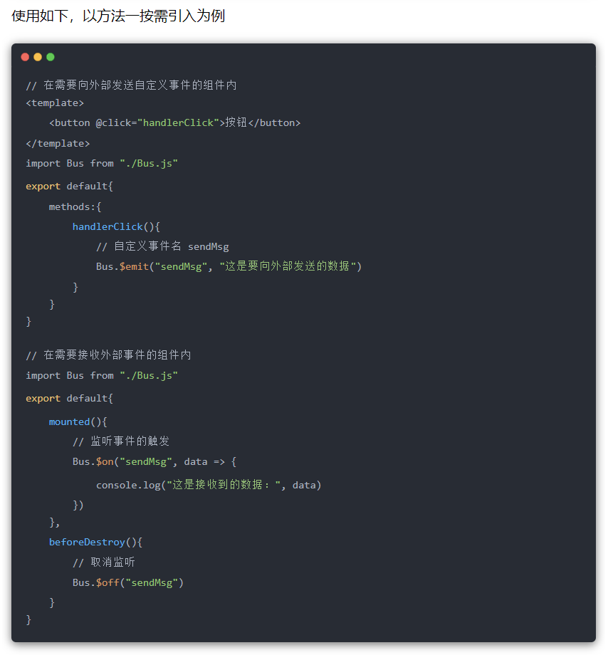

####  第一章: 基本语法

##### 第1节: 基础知识

######  1.框架和库的区别：

- 框架：是一套完整的解决方案，但对项目的侵入性较大，项目如果需要更换框架则整个项目需要重新架构
- 库(插件)：提供某一个小功能，对项目侵入性较小，如果某个库无法完成某些需求可以容易切换到其他库实现需求

######  2.业务处理过程:

- view视图层(用户操作界面触发请求)

-  -->app.js项目入口(一切请求都先进入这里处理)

-  -->router.js路由分发处理模块(只负责分发路由)

-  -->controller业务处理层(封装了逻辑代码,只处理业务,不处理数据的crud)

-  -->model负责操作数据库,执行sql语句,进行数据的crud(create/read/updata/delete)

######  3.MVC和MVVM

- MVC是后端分层开发概念即model view controller(实际包含router.js和controller)

-  前端负责MVVM ，即model(此处model非后端的,后端操纵的是数据库里的) view viewmodel

-  MVVM分层开发思想，把每个页面分成M V VM层,其中VM是核心,是M和V的调度


##### 第2节: 基础指令

###### 1. mustache语法(插值表达式): 

- {{mes}} 插值表达式，只替换自己的占位符，两边其他元素被保留

- 括号内还可写表达式或进行简单的(或三元)运算
  - 如 {{mes++}}， 但不可写JS语句和流控制否则报错

###### 2. v-once ：

- 只进行一次渲染

###### 3. v-html="str"： 

- 解析HTML代码并渲染，但会覆盖原文本(其他指令则会将标签当成字符串)

###### 4. v-text="str"： 

- 无闪烁问题但其赋值的文本会将元素中的原文本替换掉

###### 5. v-pre 

- 跳过这个元素和其子元素的编译,即将其原封不动的显示出来

###### 6. v-cloak 

- 解决插值表达式闪烁问题

###### 7. v-bind：

- 简写为“:”，为属性动态绑定属性值(注:绑定的值实际是个变量/表达式),即动态更新HTML属性

- 属性值写为"'str'"和"str"区别：前者绑定的是个字符串,后者则为变量/表达式

- 动态绑定class(对象语法):   
  - :class="{clna1:name1,clna2:name2}"，在data中控制“name1/name2”为true或false

- 动态绑定class(数组语法):    
  - :class="[name1,'name2']" 注意:不加引号代表变量,加引号为写死的字符串

-   动态绑定style(对象语法): 
  - :style="{key:value}" value用变量代替一般不写死

-   动态绑定style(数组语法): 
  - :style="[变量]" 在data中写成数组对象

-   v-bind:style 在运行时会自动为style添加浏览器前缀

###### 8. v-on

- 简写为“@”，绑定事件机制(即绑定方法) ，在对应的DOM上绑定事件监听器,监听用户行为进行交互

- 绑定方法时若不传参可省略括号且方法本身会有默认参数event被传入
  - 若传参且需要event时将实参写为“$event”($event为用于访问原生事件)放在最后,形参可写为“event”

-  事件修饰符：

  - “.stop” 阻止事件向上冒泡(默认为冒泡) 

  - “.prevent” 阻止默认行为(如为a链接添加一个别的事件,点击时阻止a链接跳转而是去做事) 

  - “.self” 元素本身触发事件才在该元素身上发生
    -  如点击不会传递冒泡; 内层冒泡传递到本层由于不是自身点击也不会发生

  -  “.capture” 使用捕获机制
    - 需将此属性添加到父元素上，只有添加了的父元素才会触发，因此需要给每个父元素都添加

  -  “.once” 事件只触发一次

  -  键盘符: “keyup/down.” 

    - 如keyup.enter="way" 或 keyup.13="way"

    - 此外vue还提供了一些快捷名称如: “.enter 、.tab、 .delete”等

  -  “.native” 监听组件根元素的原生事件

    - 原生的“div、button”等可直接进行“@click”

    - 但不可直接对组件的点击进行监听,需写为“@click.native”

  -   @load="methodName" vue提供的监听图片加载是否完成

###### 9.v-if和v-show

- v-if：

  - 将元素从DOM树中移除或添加,有较高的切换性能消耗

  - 惰性,如果初始条件为假则什么也不做,条件第一次为真时才局部编译

- v-show:

  - 切换元素display属性,有较高的初始渲染消耗

  -  在任何条件下都会被编译并保留,只是简单的基于CSS切换

  -  不可用在“<template>上”

-  如果元素频繁切换,最好用v-show  

-   如果显示一次或永不显示,没必要将其渲染,最好用v-if

###### 10.v-for

- 循环数组: 

  -  v-for='item in list' 仅获取值 

  -  v-for='(item,index) in list' 获取值和索引(从0开始)

-  循环对象数组:
  -  v-for='object in Array' 获取到对象object， 提取对象值使用“object.属性”， 获取索引的用法同上

-  循环对象: 
  -  v-for='(value,[key],[index]) in object'  key和index为可选参数

-   迭代数字: 
  -  v-for='count in number' count值从1开始

-   使用v-for指令最好添加key,用以指明当前循环对象的身份,由于v-for渲染已更新过的列表元素时,列表项虽已发生更改但它仍简单复用此处的每个元素,并没有跟踪每个节点由此可能造成乱序(详看diff算法及数据结构)

-   v-bind绑定key时，绑定值只能为number或string类型
  -    一般为“:key='onlyitem'”(不和index绑定)
  -    添加了key属性的元素不会被复用,而未添加则Vue在渲染时出于效率考虑会尽可能复用已有的元素、
  -    

###### 11.v-model

- 数据双向绑定,只能用于表单元素

-   仅仅对于input时，原理:语法糖,v-bind和v-on的结合

  - 实质:v-bind绑定数据(:value="mes"),v-on绑定input事件(v-on:input="change")

  - change(event){this.mes=event.target.value}

-   和radio组合:
  - v-model绑定相同的变量即可,即代替了name属性形成互斥
  - 但value属性要写,因为提交的就是它,实际上v-model绑定的就是它

-   和checkbox组合:

  - 单个复选框:如同意某一项协议,此时v-model为布尔值,value值不影响v-model

  - 多个复选框:v-model绑定同一个变量,变量对应数组即可(注:写法“变量:[]” 必须有“[]”)
    - 此时要有value,选中时会将value添加进数组中

-   和select(下拉菜单)组合: 

  - v-model加到select标签上而非option标签上

  - v-model会优先匹配value属性,若无value则匹配“<option>”的text
  - 单选:v-model对应的变量绑定单个字符串即可 即“变量:""”

  - 多选:v-model对应的变量绑定数组,注意写法(select标签内要添加multiple属性)

  - 值绑定(:value):一般input中的value不写死,故需动态绑定(此知识点是对checkbox和select的优化)

  ```html
  <label v-for="item in items" :for="item">
    <input type="checkbox" :value="item" :id="item" v-model="hobbies">
  </label>
  ```

  ```javascript
   hobbies:[],
   items:["篮球","足球","排球","火球"]
  ```

-   修饰符:

  -  v-model.lazy：输入框失去焦点或按回车时才同步数据,而非默认的数据改变时立刻同步

  -  v-model.number：将输入框的内容当做数字处理,默认情况下输入的内容是被当做字符串进行处理的

  -  v-model.trim：去除输入内容左右两端的空格

##### 第3节: 数组中能在vue中及时响应的方法

###### 1.  及时响应的方法: 

- push/pop/shift/unshift/sort/reverse/splice 
- 这些方法均可及时响应且不会改变原数组

######  2. 不能及时响应的方法:

- 直接使用Arr[index]='str'索引值修改
  - 解决方法: vue提供的set方法: vue.set(Arr,index,newValue) ,可直接通过相应的索引进行修改

- 修改数组长度Arr.length=num
  - 解决方法: 通过修改splice()数组中的元素

###### 3.响应式对象添加或删除属性

- vue监测不到响应式对象属性的变动,解决方案：
    - vue自带的vue.set(obj,key,value)添加属性
    - vue.delete(obj,key)删除属性
    - obj.assign方法用新对象替换原对象

##### 第4节: 计算属性

1. 计算属性有两个特定的get和set方法,但一般不写set方法则为只读属性

2. 所有计算属性都以函数形式写在computed内,最终返回计算后的结果

3. 例:

```vue
<h2>{{str}}</h2>
```

```javascript
computed:{
  str: {
    set: function(value) {
      console.log(value * 2)
    }
    get: function() {
      console.log("example")
    }
  }
  // 使用set时可直接“vm.str=x”此时形参value等于x
  // 若只有一个属性则可直接简写为str(){...}
}
```

4. 特点
   - 性能更高,其内部的方法只调用一次
   - 计算属性依赖缓存,计算结果会被缓存起来，其他DOM可直接使用结果；
   - 当数据变化时才会再次重新取值计算再次调用
   - 当遍历大数组和做大量计算时使用计算属性
   - 而methods则是只要被渲染就会被调用

##### 第5节: watch

 1. watch监控一个值的变换，并调用因为变化需要执行的方法

 2. 当数据发生变化时，我们通过watch可以拿到变化前和变化后的值，之后做一系列操作

 3. 监听单个值变化

    ```vue
    <template>
      <div>
        <input v-model="demo"></input>
      </div>
    </template>
    
    <script>
    // v-model、data和watch需保持变量名一样
      export default {
        data() {
          return {
            demo: '',
          };
        },
        watch: {
          //	此种写法首次绑定不会执行监听函数，有值发生改变才会执行
          demo(newVal,oldVal) {
            console.log(newVal + oldValue)
          }
         
          /*	
          此种写法首次绑定则会执行监听函数
          demo:{
            handler(newVal,oldVal) {
               console.log(newVal + oldValue)
    　      },
             immediate: true
          }	
          */
        }
      };
    </script>
    ```

4. 监听对象里面单个值变化

    ```vue
    <template>
      <div>
        <input v-model="demo.name"></input>
      </div>
    </template>
    
    <script>
    // v-model、data和watch需保持变量名一样
      export default {
        data() {
          return {
            demo: {
              name: '',
          };
        },
        watch: {
          'demo.name'(newVal,oldVal) {
            console.log(newVal + oldValue)
          }
        }
      };
    </script>
    ```

5. computed、watch、methods区别

    - 功能上：computed是计算属性，watch是监听一个值的变化，然后执行对应的
    - 是否调用缓存：computed中的函数所依赖的属性没有发生变化，那么调用当前的函数的时候会从缓存中读取，而watch在每次监听的值发生变化的时候都会执行回调
    - 是否调用return：computed中的函数必须要用return返回，watch中的函数不是必须要用return
    - computed默认第一次加载的时候就开始监听；watch默认第一次加载不做监听，如果需要第一次加载做监听，添加immediate属性，设置为true
    - 使用场景：computed----当一个属性受多个属性影响的时候，使用computed-----购物车商品结算。watch–当一条数据影响多条数据的时候，使用watch-----搜索框

    - methods 是个方法，表示一个具体的操作过程，主要书写业务逻辑

##### 第6节: 过滤器

1. 在插值“{{}}”中数据的尾部添加管道符“|” 

    - 经常用于格式化文本,如字母大小写,货币千位使用逗号分隔等

    - {{msg | filtername([arg1],[arg2])}} 

        - 将msg作为参数传递给filtername进行处理,filtername可接受参数,但第一个参数为msg

        - 注:当filtername接受参数时形参需比实参多一个参数作为msg

2. 写法:

    - ```javascript
        //  过滤器无参数时
        {{ msg | filtername }} 
        /*------------------------*/
        filters:{
          filtername(str) {
            return console.log(str) 
          }
        }
        
        // 有参数时
        {{ msg | filtername(str) }} 
        /*------------------------*/
        filters:{
          filtername(Msg,Str) {
            return console.log(Msg + Str) 
          }
        }
        ```

        

    - ```javascript
        //  从外部引入方法将其注册为过滤器
        {{ msg | filtername }} 
        /*------------------------*/
        import filtername from '...'
        /*------------------------*/
        filters:{ filtername }
        
        // 注：引入的filtername方法内部处理完毕需将结果return
        ```
    
    3.  注意： 私有filters中拿不到this，故过滤器方法中若用到this，则改变策略，即不使用过滤器，而在methods或计算属性中写方法，传参调用 （此问题尤雨溪在github上回答过）

------

#### 第二章: 组件

##### 第1节：组件创建步骤

###### 1. 方法1:

- 常规方法创建,但vue2.0之后不推荐此写法

1. 创建组件构造器:

    - ```javascript
        const myComponent=Vue.extend({
          template: `<div><h2>第一步创建组件</h2></div>` 
         })
        ```

        

2. 注册组件:

    - Vue.component('组件标签名',组件构造器名)

    - 如：Vue.component('my-cpn',myComponent)

3. 使用组件:
   
    - <my-cpn></my-cpn>   

###### 2. 方法2:

- 使用注册语法糖,同方法1相比只是省略了“extend”而已
- 直接注册 “Vue.component('组件标签名',{template:}) ”就是把extend内的内容直接替换过来

注:方法1和2都是全局注册,无需在实例中再次去注册

模块化:从代码逻辑角度划分,方便代码分层开发,保证每个功能模块单一

组件化:从UI界面角度划分,前端的组件化,方便UI组件重用

##### 第2节: 全局与局部组件

######  1. 全局组件:

- 写在实例外部的“Vue.component('组件标签名',组件构造器名)”
- 全局均可使用

######  2.局部组件: 

- 写在实例内部的如同methods方法“components:{组件标签名:组件构造器名}”
- 只能在挂载的实例内使用

###### 3.$el属性

- 所有的组件都有一个“$el”属性用来获取组成组件的元素
- 如: 直接拿组件的offsetTop属性“this.$refs.str.offsetTop”拿不到,需写为“this.$refs.str.$el.offsetTop”
- 注: 仅仅是组件来用“$el”

##### 第3节: 父子组件

- 组件只能先创建再注册,书写顺序不可反
- 子组件应先创建再创建父组件

- 可在父组件中注册子组件

- ```javascript
    const son=Vue.extend({
      template:
      	` <div><h2>这是子组件</h2></div> `
    })
    const par=Vue.extend({
      template:
      	`<div><h2>这是父组件,下面是调用的子组件</h2></div>`,
      	components:{cpnson:son},
    })
    Vue.component('cpnpar',par)
    ```

    

- 针对上例,不可直接在实例中使用(好比附庸的附庸不是我的附庸)

- 若想在实例中直接使用子组件则必须将其进行全局注册或在实例中再次进行注册

##### 第4节: 组件中的data

- 组件内部不能访问实例中的数据,故需有自己的data数据,但data必须写为一个函数,其内部再返回一个对象
  
- 如: data(){return {key:value}}
  
- data写为函数而非对象的原因

    - 组件的目的就是为了进行复用,当组件复用时,组件内的data数据也应跟随模板一块复用,若data内直接写为对象,相当于把data直接挂载到这个组件的原型上了,所有复用的组件共用一个data， 当别的地方复用组件并修改组件内的数据时,其他地方复用的组件也会受到影响，因此data应跟随组件进行深拷贝，这样每复用一次组件，就会返回一份新的data

- ```javascript
    function Box(){};
    Box.prototype.data = {
      msg:"aaa"
    };
    let b1=new Box();
    let b2=new Box();
    b1.data.msg = "bbb"; //这里修改一个实例的属性，会造成另一个实例的属性也跟着修改了
    console.log(b1.data.msg);	// bbb
    console.log(b2.data.msg);	// bbb
    ```
    
    
    
    ```javascript
    function Box() {
      this.data = this.data();
    }
    Box.prototype.data = function() {
      return {
        msg:"aaa"
      }
    };
    var b1=new Box();
    var b2=new Box();
    b1.data.msg="bbb";	// 以函数的形式去定义的属性，这样它们有自己的作用域，在修改的时候不会影响到别人
    console.log(b1.data.msg);	// bbb
    console.log(b2.data.msg);	// aaa
    ```
    
    

##### 第5节: 父组件通过props属性向子组件传值

###### 1. 传值步骤:

1. 子组件构造中写“props['变量1','变量2']”

2. 父组件引用的子组件标签中绑定:“变量1=数据1” ，然后子组件内即可通过“变量1”获取数据
    - 其实就是在子组件中定义一个变量,变量在父组件引用的子组件标签中与父组件相应的数据进行绑定，子组件获得数据

###### 2. props类型限制:

1. 可以为数组如:“props: [str1, str2]”

2. 也可为对象:

    ```javascript
    props: {
      str1: Number, 	// 绑定传入的值需为number型
      str2: [Number,string], // 绑定传入的值需为number或string型
      str3: {
        type:Number,
        default:100, 	// 绑定类型的同时为其指定默认值
        required:true,	 // 模板标签内必须绑定变量进行传值引用
      }, 
      str4: {
        type:Object,
        default() {return {} }  // 默认值也可为函数
      },
      str5: {
        type:Array,
          default() {return [] }  // 默认值也可为数组
        }
    }
    ```

    -   支持的type类型有:String/Number/Boolean/Array/Object/Date/Function/Symbol/自定义构造函数

    -   当type类型为Array或Object时必须写“default函数”

###### 3. 驼峰标识:

-   props定义时使用驼峰命名变量,但在模板标签里绑定数据时大写改为小写同时增加短横
-   组件在注册时使用驼峰命名，但在父组件中引用时也需将大写改为小写同时增加短横

-   浏览器解析元素时会把元素和属性都变成小写(HTML里不区分大小写),因此驼峰命名时要变为短横

-   注: 当模板标签里绑定方法时无需更改,如“@titleClick="titleClick"”

###### 4. 示例

```html
<div id="app">
  <son-cpn :son-mes='parMes'></son-cpn>
</div>
<template id="sonCpn">
  <div>
    <h2>{{sonMes}}</h2> 
  </div>
</template>
```


```javascript
Vue.component('parentCpn',{
  template:"#sonCpn",
  props: {
    sonMes: '',
  }
})
const vm = new Vue({
  el: "#app",
  data: {
    parMes:"这是父组件中的数据，sonMes接收"
  }
}) 
```

###### 5.优缺点

- 缺点：跨层级通信，兄弟组件通讯困难，需子组件-父组件-子组件；父子-子孙通信需多层嵌套

- 优点：灵活简单，可以对`props`数据进行计算属性，数据监听等处理；一层父子组件通信方便

##### 第6节: 子组件通过$emit向父组件发送事件

######  1. 整体流程:

1. 子组件某元素触发事件 
    - 如: <button @click=btn>点击</button>

2. 子组件方法内定义事件函数,若要告知父组件则函数内需包含“this.$emit('自定义事件名',[数据])”即触发此事件
    - 如: btn(){this.$emit('clibtn',[data1],[data2])}

3. 父组件引用的子组件标签添加事件，即接收子组件发射来的事件(用“v-on”绑定子组件的自定义事件名，即监听此事件)
    - 如: <son @clibtn='rec'></son>

4. 父组件要执行的事件函数
    -  如: rec(data1,data2){}

######  2. 注意事项:

1. 第二步传递多个数据时,只需在实参后继续添加,然后第四步父组件添加对应的形参即可
2. 第三步父标签模板中的点击事件是“@子组件事件名称=父组件自定义事件名称” 
    -  即子组件触发的事件父组件需用别名进行接收 而不是直接使用“@click=子组件事件名称”

3. 另第三步添加事件时会默认将数据进行传递,如同event事件默认传递一样,故只需在第四步添加形参接收即可

######  3. 示例

```html
<div id="app">
  <mycpn @btnclick="parClick"></mycpn>
</div>
<template id="soncpn">
  <div>
    <button  @click=btn(item)>点击</button>
  </div>
</template>
```


```javascript
Vue.component('mycpn',{
  template:"#soncpn",
  data(){
    return {
      item: 123
    }
  },
  methods:{
    btn(value){
      this.$emit('btnclick', value)
    }
  }
})
const vm = new Vue({
 el:"#app",
 methods:{
    parClick(item) {
      console.log(item); 	// 123
    }
  }
})
```

##### 第7节: 父组件访问子组件的方法

-  通过“this.$children”

    - 得到的是个数组集合,然后通过下标拿到具体的子组件,最后通过“.”方法直接访问具体子组件的属性、数据等

    - 如:console.log(this.$children[2].id)
    - 缺点：不可控性大,有一定风险（通过v-if改变组件状态，很容易出现调用错误）

    - 优点：可直接获取vue实例，对实例下的数据和方法直接获取或者引用，适合已知的固定化的页面结构

-  通过“this.$refs”

    - 得到的是个对象,因此需要给子组件添加属性“ref='refName'”(ref既可绑定组件也可绑定普通元素),然后就可通过“refName.”访问数据

    - 如:console.log(this.$refs.keyName.name)

    - 优点：v-if改变其他组件状态不会受到影响
    - 缺点：如果元素未渲染到页面是获取不到的，如在生命周期“created“中就不可使用

##### 第8节: 子组件访问父组件的方法

-  通过“this.$parent”
    - 直接访问上一级父对象,拿到父对象后直接使用“.”方法访问父对象中的数据
    - 缺点：每个模块应尽量只做一件事，组件应相互保持独立，如果一个组件需要访问其父组件的上下文，那么该组件将不能在其它上下文中复用
-  通过“this.$root”直接访问根元素，用法同上

##### 第9节: 中央事件总线$bus

1. 用途：

    - 对于一些非父子组件来说，它们一方面不适用props，另一方面又没有必要使用Vuex，则可使用$bus

2. 使用流程:

    - 可直接在“main.js”文件中`Vue.prototype.$bus = new Vue()`将“$bus”挂载到Vue原型上
        - A组件触发事件 `this.$bus.$emit('methodName',[data])`
        - B组件监听事件 `this.$bus.$on('methodName',([data]) => {})`

    - 还可创建类似方法的单独JS文件进行导出

        - ```javascript
            // 创建bus.js文件
            import Vue from 'vue'
            export const bus = new Vue()
            
            /*-------------*/
            // A组件引入bus
            import { bus } from "./bus.js";
            bus.$emit('methodName', [data])
            
            /*-------------*/
            // B组件引入bus
            import { bus } from "./bus.js";
            bus.$on('methodName', ([data]) => {})
            ```

3. 移除监听：
    - 原因：vue是单页应用，某个页面刷新后与之相关的bus会被移除，导致业务无法继续；另业务有反复操作的页面，bus在监听时会触发多次，也是一个隐患；故vue页面销毁时同时移除bus事件监听
    - 移除：
        - `this.$bus.$off('methodName')`或`bus.$off('methodName')` 移除某个事件监听
        - `this.$bus.$off()`或`bus.$off()` 移除所有事件监听

##### 第10节: 组件通信方式总结

- 通信方式共有12种

- props

- $emit/v-on(即@)

- .sync

    - 可以实现数据双向绑定，即子组件可修改父组件传来的数据且父组件的数据同步改变

    - ```javascript
        // 用法
        <children :data.sync="propData" />
        //  在要传的数据后加修饰符“.sync”即可
        ```

        

- v-model

    - 

- ref

- children/parent

- attrs/listeners

    - 

- provide/inject

    - 

- EventBus

    - 
    - 

- Vuex

- $root 可以拿到 App.vue 里的数据和方法

- slot

- 父子组件通信

    - props、attrs/listeners、$emit/v-on、ref、.sync、v-model、children/parent

- 兄弟组件通信
  
    - EventBus、Vuex、$parent
- 跨层级组件通信
  
    - provide/inject、EventBus、Vuex、attrs/listeners、$root

##### 第11节: 插槽

###### 1. 基本使用:

- 插槽:父组件提供了安插内容到子组件中的方法

- 子组件模板之中使用“<slot></slot>”标签相当于预留了占位,父组件引用子组件并在子组件中写其他元素时,所写内容会代替“slot”标签的位置

- 默认值：“slot”标签中设置了元素,若父组件不在子组件中添加其他内容，则默认显示slot中的元素否则显示所加内容

- 多个值：父组件在子组件中虽然添加多个内容,但这些内容一起将子组件的一个slot标签的位置代替掉

- 注：一个插槽就是一个位置,若子组件中有多个slot而组件标签中虽只有一个元素但它会显示多次

######  2. 具名插槽:

- 子组件 “<slot name="slotName"></slot>”设置name属性后,父组件内的元素添加“slot='slotName'”属性与其对应才可替换其位置，否则slot位置若有默认元素则显示默认元素，若无默认元素则其位置什么也不显示

- 无name的“slot”标签属于匿名插槽，组件标签内的元素可默认将其替换掉

###### 3.作用域插槽: v-slot(slot-scope已被废弃)

- 编译作用域：父组件模板的所有东西都会在父级作用域内编译，子组件模板的所有东西都会在子级作用域内编译，子组件中的变量不会去父级作用域查找，即父在父,子在子

- 父组件改变子组件数据的渲染形式，即内容仍为子组件的内容，但是由父组件来决定如何渲染，为了在父组件中使用子组件所属的数据，父组件中添加“v-slot='临时变量名'”属性,临时变量将保存子组件中的slot中的数据，这样父组件中就可随意渲染普通的子slot绑定时的数据

- ```vue
  // 父组件  将子组件引入并注册后
  <template>
    <div class="parent">
      <son v-slot="title">
        <h1>父元素通过v-slot拿到了子组件插槽时绑定的title(也就是ti)数据</h1>
        <h2>{{title.name}}</h2> // firstName
      </son>
    </div>
  </template>
  ```
  
   
  
  ```vue
  // 子组件
  <template>
    <div class="son">
      <slot :title="ti"></slot> // 匿名插槽
    </div>
  </template>
  
  <script>
    export default {
      data() {
        return {
          ti: {
            name: 'firstName'
          }
        }
      }
    }
  </script>		
  ```
  
  

##### 第12节: 生命周期   

1. 生命周期图示

    

2. 主要生命周期分类

    - 创建期间的生命周期函数：
        - beforeCreate：实例刚在内存中被创建,此时未初始化data和methods属性
        - created：实例已在内存中被创建好,data和methods也被初始化,但模板还未被编译
        - beforeMount：模板已完成编译但还未被挂载到页面中
        - mounted：模板已编译好并被挂载到页面指定容器中显示

    - 运行期间的生命周期函数：
        - beforeUpdate：状态更新之前执行此函数，此时data值是最新的，但是界面上的数据是旧的，因为此时还未开始重新渲染DOM节点
        - updated：实例更新完毕后调用此函数，此时data和界面上的数据都已完成更新，页面也重新被渲染

    - 销毁期间的生命周期函数：
        - beforeDestory：实例销毁之前调用，在这一步实例仍可完全调用
        - destoryed：实例销毁后调用，函数调用后，vue实例指示的所有东西都会解绑，所有事件监听器会被移除，所有的子实例也会被销毁


------

#### 第三章: webpack(webpack4语法)

##### 第1节: 基础

1. 安装工具

    - 安装好node后,命令行输入“npm i nrm -g https://registry.npm.taobao.org”安装nrm (node自带软件包管理工具npm) 

    - nrm提供了安包的几个常用地址,安装好nrm后，输入“nrm ls”(即list)查看下载包的地址，其中有淘宝镜像等网址,注意:是在此网址里下载所用的包

    - 输入“nrm use npm”或“nrm use taobao”即可切换下载源 然后再用“npm i 包名”下载包即可

    - 推荐使用淘宝源,下载较快 ；npm是国外源地址下载较慢 ；cnpm后期可能会出现版本问题

2. 下载包

    - 下载指定版本“npm i webpack@3.6.0 -g” @紧跟版本名 -g为全局安装(即在本机上以后无需安装)

    - 局部安装“npm i webpack@3.6.0 --save-dev” 

    -  --save-dev是开发时依赖,项目打包后不需继续使用 

    -   --save运行时依赖

    -   若下载vue,则不得带-dev 因为vue在运行时代码也依赖它

3. 其他

    - webpack和grunt/glup的区别

        -  前者更加强调模块化开发管理,而文件压缩合并及预处理为附带功能

        -  后者强调前端流程的自动化,模块化不是其核心
    - dist文件夹下放置打包好的文件 
        - src文件下放置源文件，里面的lib文件夹里放置手动拷贝过来的第三方包
        - node_modules是用npm装的第三方包
    - 指令：“webpack 原文件路径 新文件路径” 将原文件打包到指定的新文件中，打包后的文件名为“bundle.js”
    - npm cache clean --force 清除缓存
    
4. npx工具

    -  npx作用很多，但常使用它来调用项目中某个模块的指令
        - 如全局安装webpack5.1.3，项目安装webpack3.6.0，终端执行命令webpack --version则查找到的是全局
        - 而使用npx webpack --version查找到的是项目安装的版本

5. npm发布自己的包

    - 注册账号： https://www.npmjs.com/

    - 命令行登录：npm login

    - 修改package.json

        - 在“scripts”同级别下配置对象

        - ```javascript
            "repository": {
              "type": "git"
            	"url": "自己的github仓库地址"
            }
            "homepage": "自己的官网地址(无官网则此行可不写)"
            ```

    - 发布到npm registry：npm publish

    - 更新包：

        - package.json文件中修改“version”的版本号，版本号不能与上次发布的重复
        - 重新npm publish

    - 删除发布的包：npm unpublish

    - 让发布的包过期：npm deprecate

##### 第2节: webpack的配置

1. 在当前文件夹内输入“npm i webpack@3.6.0 --save-dev”为本地安装
    - 生成“package-lock.json”和“node_modules”文件夹

2. “npm init”: 初始化 即重新开始配置相关的文件,给包起名配置路径等
    - 通过初始化生成了“package.json”包管理工具文件

3. package.json文件:

    - 主要用来记录依赖包名称、版本、运行指令等

    - dependencies运行依赖 、devDependencies开发依赖

    - 在“script”中可以配置映射，使用时直接“npm run 映射名”

        -   如: build(映射名):webpack(映射命令) 
-   “npm run build” 相当于直接运行命令“webpack”
        -   对于常用的映射名start/test/stop/restart，可省略掉‘run’直接‘npm start’，但其他命令则不可省略
        -  直接输入“webpack”为使用全局方式打包,不推荐使用 
        -   构建映射的好处：凡是在终端直接执行的命令均为全局,构建映射后执行命令时优先去本地配置文件执行命令，若无相对应的映射再执行全局 
-  **注意：在构建映射时最后一个对象结尾千万不能给逗号,否则打包时报错**
   
- 指定包版本：
  
    -   三个数字分别代表主版本号、次版本号和修订号
    -   “~1.2.2”表示安装“1.2.x”的最新版但不安装高于“1.3.x”，即主次不变，修订安装最新的
    -   “^1.2.2”表示安装“1.x.x”的最新版但不安装高于“2.x.x”，即主不变，次和修订安装最新的
    -   前面还可加“*”和空，星则是最新版本，而空则是锁定修订号
    -   latest安装最新版本

4. “vue.config.js”文件（脚手架2是webpack.config.js）
    - 用来配置打包路径，起别名等

  

##### 第3节: 处理CSS和Less

1. webpack仅仅是处理JS之间的关系，CSS、图片之类的还需插件loader来处理

2. 处理css文件下载css-loader和style-loader
   
- css-loader负责加载 ，style-loader负责解析 ，二者都要安装
  
3. loader使用安装步骤:

    -  “npm i --save-dev css-loader@version style-loader@version” 进行安装(二者版本不对应可能会出错）

    -  在webpack.config.js中使用“module”进行配置

    -  “use”配置时“style”在前“css”在后,因为webpack读取loader时从右往左

    -  配置代码如下(如何配置代码可进webpack官网查看):

        ```javascript
        module:{
          rules:[
          	{
            	test:/\.css$/, 	// 处理css文件 注意:此处正则键值不带引号 
              use:['style-loader','css-loader']
            },
          ]
        }
        ```
        
        

4. 安装配置less-loader和less

    -  配置文件,类似css配置

    ```javascript
    {
      test:/\.less$/,
      use: [
        {loader: "style-loader"},
        {loader: "css-loader"},
        {loader: "less-loader"}
      ]
    }
    ```

    

##### 第4节: 处理图片

1. 安装url-loader并在“rules”中进行图片相关配置

2. 当图片大于“url-loader”配置中设置的limit值时会将图片处理成file文件，此时需要下载“file-loader”并在“output”中进行“public-path”的配置

    - 注: public-path的路径配置代表以后所有url的文件前面均会添加的前缀,因为打包文件是针对dist文件夹的

    - 目前入口文件index未在src文件在中,以后将index也打包到src中时,路径“dist/”就需要改变了

3. webpack自动生成的图片名字较长,是个32位的哈希值,因此需要自定义命名 

    - 在options中添加“name: 'img/[name].[hash:8].[ext]'”

    - img 文件图片要打包到的文件夹 

    - [name] 获取图片原名

    - [hash:8] 防止图片名冲突依然使用hash但只保留8位 

    - [ext] 使用图片原扩展名(即后缀名)

    - 注:此处的中括号不是可选参数的意思而是规定写法 ，若不带括号则所有的图片均会以“name”字符串命名

4. 配置代码如下(注意：处理图片路径写在output中,而配置具体内容写在“module”的rules中):

    ```javascript
    output: {
      publicPath: 'dist/'
    },
    /*-----------------*/
    {
      test:/\.(jpg|png|gif|jpeg)$/,
      use: [
        { 
          loader: 'url-loader',
          options: {
            limit: 8192,	//当加载的图片小于limit时会将图片编译成base64字符串形式 大于limit时需用file-loader
            name: 'img/[name].[hash:8].[ext]' //注意单引号
          }
        }
      ]
    }
    ```

    

	5. 处理字体文件也类似:	{test: /\.(ttf|eot|svg|woff|woff2)/, use: 'url-loader'}


##### 第5节: ES6语法转换为ES5

1. 安装对应的loader(有两套包,若失败就两套都装上）

    -  npm i babel-loader@7.1.5 babel-core@6.26.3 babel-preset-es2015@6.24.1 -D (或将第三个换为babel-plugin-transform-runtime )

    -  npm i babel-preset-env babel-preset-stage-0 -D

2. 配置代码如下:

    ```javascript
    {
      test: /\.m?js$/, 	// 处理ES6语法
      exclude: /(node_modules|bower_components)/, // 排除node中的JS文件不编译
      use: [
      	{
        	loader: 'babel-loader',
         	options: {presets: ['es2015']}  // 由于未用第二套包“babel-preset-env”故将“babel/preset-env”改为“es2015”
         }
      ]
    }
    ```

    

3. 根目录下新建“.babelIrc”文件(注:需按JSON格式来写)进行如下配置:

    ```json
    // 两种配置方法,首选第二个
    {
      "presets": ["env","stage-0"],
      "plugins": ["transform-runtime"]
    }
    /*-------------------*/
    {
      "presets": [
          [
            "env", 
            {
              "modules": false,
               "targets": {
                  "browsers": ["> 1%", "last 2 versions", "not ie <= 8"]
               }
             }
          ],
          "stage-2"
        ],
      "plugins": ["transform-vue-jsx", "transform-runtime"]
    }
    ```

    

##### 第6节:引用vue

1. vue编译时有两种方式 

    - runtime-only 只能在“.vue”文件中使用template,JS文件中不可使用,编译时只识别render函数，在“.vue”文件中开发时推荐使用

    - runtime-compiler 代码中可有template，因为runtime-compiler可编译template

2. 下载安装本地的VUE:

    - npm i vue@2.5.1 --save 注意:不得带-dev 因为vue运行时也要依赖

    - 引入 “import Vue from 'vue'”

3. 修改编译方式

    - vue默认使用“runtime-only”方式编译，若使用了template则报错，修改编译方式即可

    - 进行模板文件配置，代码如下(在module.exports里配置,和entry、module等同级别)  

        ```javascript
        resolve: {
          alias: { // 起别名 更改vue的编译方式让其到vue中指定的文件夹下使用指定文件
            'vue$': 'vue/dist/vue.esm.js'
           }
        }
        ```

        

4. 补充:

    - resolve主要用来解决路径问题

    - 和“alias”同级别写“extension:{'.css','.vue'...}” 以后引入的"css、vue"文件就可省略后缀名

    - 注: 在index文件里引入bundle.js文件时，把js文件放在body中最后位置，即先搭结构再引文件否则报错
    - 在vue的实例化中,如果有template,则其会将el挂载的组件替换掉，意思就是模板中的内容会直接将“<div id="#app"></div>>”替换掉,故div内部不需写任何东西

##### 第7节: 直接引用“.vue文件”

1. 需对“.vue”进行处理，安装“vue-loader”和“vue-template-complier”
   
- npm i vue-loader@13.0.0 vue-template-complier@2.5.1 --save-dev
  
2. 配置文件

    ```javascript
    {
       test:/\.vue$/,
       use:['vue-loader']
     }
    ```

    

3.  补充

    - vue-loader版本15以上就需要安装vue-loaderplugin

    - 在“webpack.json”中直接更改包的版本号,然后运行“npm i”就可将包重新更新下载

    - “vue-template-complier”的版本和“vue”的版本不一致可能会报错

##### 第8节: 插件的扩展

1. loader和plugin的区别

    - loader主要用于加载转换某些类型的模块,是一个文件加载器
        - 只专注于加载转化文件
        - webpack 本身只能打包commonjs规范的js文件，所以对css，图片等格式的文件没法打包，如果想将其他文件也打包的话，就会用到`loader`，所以Loader的作用是让webpack拥有了加载和解析非JavaScript文件的能力
    - plugin是插件,是对webpack的扩展,是个扩展器
        - 目的在于解决loader无法实现的其他事，从打包优化和压缩，到重新定义环境变量
        - Plugin可以扩展webpack的功能，让webpack具有更多的灵活性。 在 Webpack 运行的生命周期中会广播出许多事件，Plugin 可以监听这些事件，在合适的时机通过 Webpack 提供的 API 改变输出结果
    - 运行时机：
        - loader运行在打包文件之前（loader为在模块加载时的预处理文件）
        - plugins在整个编译周期都起作用

2. 版权声明插件“BannerPlugin”

    - webpack自带，故不需安装只需配置即可

    - 首先引入webpack：const webpack = require('webpack')

    - 然后和“module、resolve”同级配置:
        -  plugins:[new webpack.BannerPlugin('版权声明信息,此处的信息会出现在bundle.js的首行')]

3. 打包html的插件“html-webpack-plugin”（脚手架3应该不再需要它）

    - 项目发布时发布的是dist文件夹里的内容，故需将同dist同级的index文件打包进dist文件里

    - 此插件有两个功能:
        - 自动生成一个“index.html”文件 (可根据指定模板生成)
        -  自动将打包好的“bundle.js”文件引入到“index.html”文件中

    - 安装方式: npm i html-webpack-plugin@3.2.0 --save-dev

    - 配置方式(同BannerPlugin): 

        ```javascript
        const htmlWebpackPlugin = require('html-webpack-plugin')
        
        plugins: [new htmlWebpackPlugin({template:' index.html'})]
        ```

        

    - 会找寻配置文件所在目录中的“index.html”为模板生成新的“index.html”到dist文件夹中，故配置文件output中的“publicPath:'dist/'”需删除，模板“index.html”文件无需引入“bundle.js”

4. js压缩插件“uglifyjs-webpack-plugin”

    - 作用:自动将打包后的“bundle.js”进行压缩

    - 安装方式: npm i uglifyjs-webpack-plugin@1.1.1 --save-dev

    - 配置方式(同BannerPlugin):

        ```javascript
        const uglifyjsWebpackPlugin = require('uglifyjs-webpack-plugin')
        
        plugins:[new uglifyjsWebpackPlugin()]
        ```

        

5. 热刷新(即自动打包)插件“webpack-dev-server”

    - 作用: 运行一次映射命令以后就可启动使用热刷新(只需运行一次“npm run dev”,以后每次保存都会自动刷新,类似Google插件liveReload；另“npm run dev是脚手架2的命令,“npm run serve”脚手架3的运行命令)

    - 安装方式: npm i webpack-dev-server@2.9.1 --save-dev -g

    - 映射命令: “"dev":"webpack-dev-server --open"”

    - 配置方式:

        ```javascript
        devServer: {
          contentBase: './dist', 	// 为哪个文件夹提供服务,默认为根目录
          inline: true;	// 页面是否实时刷新
          port: 8080;	// 指定端口号,默认为8080故可不指定
        }
        ```

        

6. eslint

    - 手动关掉eslint
        - config文件夹下index.js文件中,将“useEslint”属性值改为false即可

    - vscode编辑器在进行代码格式化时会将单引号变为双引号,同时也会在花括号尾部加分号,但这两项与ESlint的要求冲突了,要以ESLint为准时:

        - 在根目录下新建“.prettierrc”文件(此文件为json文件),在此文件中修改

        - 格式化时不加分号："semi":false

        - 用单引号代替双引号："singleQuote":true

    -  函数名称和小括号之间不带空格,但ESLint要求带,将此要求禁用掉:
        - 在ESLint配置文件“.eslintrc.js”中的rules中添加“'space-before-function-paren':0”

7. vue-lazyload

    - 图片懒加载插件

    - 具体安装使用流程

        - 安装vue-lazyload插件

        - main.js文件引入“import VueLazyload from 'vue-lazyload'”
        - 并使用“'Vue use(VueLazyload,{可选参数})'”
            - 可选参数示例: “loading:require('占位图片地址')” 即当图片未加载出时显示此张图片

        - 将原来图片属性“:src='XXX'”改为“v-lazy='XXX'”

------

#### 第四章：Vue ClI

##### 第1节: 脚手架2和3的安装及项目初始化

1. CLI:Command-Line Interface 命令行界面,俗称脚手架,可用其快速搭建Vue开发环境及对应的webpack配
2. 开发大型项目时,需考虑代码目录结构、项目结构和部署、热加载、代码单元测试等,借助脚手架来快速完成

3. 脚手架依赖node和webpack

    - 安装方式: npm i @vue/cli@3.2.1 -g 全局安装 (安装的是脚手架3)

    - 如果想用脚手架2,使用桥接工具将2的模板拉取下来即可: npm i @vue/cli-init@3.2.0 -g
    - 安装时空格键切换是否选中某项

4. 初始化项目:

    - 脚手架2: vue init webpack projectname 注意: 项目名称不为中文或大写字母 

    - 脚手架3: vue create projectName

5. 运行项目:

    - 脚手架2: npm run dev 

    - 脚手架3: npm run serve

    - 可到package.config文件中查看或更改

##### 第2节:Vue-CLI3(脚手架3)

1. 与脚手架2的区别:

    - 脚手架2是基于webpack3打造,3则是基于webpack4打造

    - 脚手架3设计原则是“零”配置(其实是将一些配置文件隐藏起来了)

        - 移除了根目录下的build、config等目录
        - 移除static文件夹,新增了public文件夹且index.html移动到了public文件夹内

        - 任意文件下控制台输入“vue ui”命令,就可启动本地服务进行可视化配置

2. 创建自定义的配置文件:

    - 在根目录下创建“vue.config.js”,将配置代码写在此，到时会将此文件与默认配置文件合并打包；

    - 此文件可修改webpack的默认配置

    - 配别名：

        ```javascript
        module.exports = { 
          configureWebpack: { 
            resolve: { 
              alias: {
                'assets': '@/assets', 	// 默认将@解析为“/src”根路径
              } 
            }
          } 
        }
        // 在使用“import”文件时无需使用“../”等而直接可用别名代替配置的路径
        // 如果不是使用“import”引入,如下面的图片引入就需加“~”
        ```

    - 图片在引入时需“src='~@/assets/xxx'”，webpack将@解析为“/src” 再用“~”动态引入

3. 修改配置文件:

    - 方式1: 通过命令“vue ui”可视化工具进入图形界面操作

    - 方式2: 在module包里“@vue”文件夹下“cli-service-->lib-->service.js”

    


------

#### 第五章: router

##### 第1节:基本概念

1. 路由:通过互联网将信息从源地址传输到目的地址的活动
2. 路由器提供了两种机制:路由和转送

    - 路由:决定数据包从来源到目的地的路径

    - 转送:将输入端数据转移到合适的输出端
3. 路由表:本质为映射表,决定了数据包的指向 (映射表: 内网ip对应电脑mac(物理)地址)
4. 后端路由:后端处理URL和页面之间映射的关系，对于普通网站来说所有的超链接都是url地址,所有的url地址都对应服务器上的资源
5. SPA(单页面富应用)主要特点:在前后端分离的基础上增加了前端路由
6. 前端路由:
    - 对于单页面应用程序来说,主要通过hash(即#号)实现不同页面之间的切换，这种由hash改变切换页面的方式叫前端路由
    - 核心：改变URL但页面不进行整体刷新，但如果点击了刷新按钮，则会向服务器重新请求所有资源
    - hash特点：HTTP请求中不会包含hash内容,所以单页面程序内容跳转主要由hash实现
    - 一次性把所有的HTML css和JS请求过来，然后点到哪个路由，就懒加载渲染对应的页面，路由改变时，并未向服务器请求数据
7. URL的hash也是锚点,本质上是改变window.location的href属性；可直接通过location.hash来改变href但不刷新页面
    - hash和history的区别：
    - 有无#号
    - 使用history模式在访问二级页面的时候，做刷新操作，会出现404错误，那么就需要和后端人配合让他配置一下apache或是nginx的url重定向，重定向到你的首页路由上
8. router

    - route 一个路由信息对象(当前路由对象)
    - routes 一组路由信息对象
    - router 路由控制对象(路由器对象)
    -  路由为插件,所有插件都需“Vue.use(插件名)”来使用
9. 后端渲染

    - 早期的网站开发整个HTML是由服务器渲染好返回给客户端进行展示

    - 后端写的代码在服务器就已经完成了，Java代码从数据库中读取数据，配合HTML和css，然后拿给浏览器，无需浏览器进行渲染
10. 后端路由

    - 后端处理URL和页面之间的关系，即后端将URL嵌套在页面中，处理好后发送给浏览器
    - 页面请求不同的路径内容时，服务器渲染好页面并返回给客户端；
    - 这种情况下渲染好的页面无需单独加载JS和CSS，可直接交给浏览器展示。利于SEO优化
    - 缺点：
        - 整个页面需后端来编写维护
        - 前端人员若要开发页面则需PHP和JAVA等来编写
        - 通常情况下HTML和数据以及逻辑混合在一起，不易编写和维护
11. 前端渲染：浏览器中显示的网页内容大部分由前端写的JS代码在浏览器中执行渲染生成

##### 第2节: 安装和使用路由

1. 安装 “npm i vue-router@3.0.1 --save”

2. 使用

    ```javascript
    import Vue from 'vue'
    import VueRouter from 'vue-router’ // 导入路由
    
    const Home = () => import('@/view/home/Home') // 引入相关组件
    
    Vue.use(VueRouter) 	// 使用路由
    const routes ={
      {
        path: '/home',
        component: Home,
      },
     // 在此配置路由映射
    }
    const router = new VueRouter({
      routes,	// 将路由挂载到实例上
      mode: 'history'
     })		// 创建路由实例
    
    export default router  // 导出路由
    ```

    

3. 路由重定向：默认显示的页面
   
   - 只需配置路径:{path:'/',redirect:'/home'}
   
4. 更改路径模式:

    - 默认情况下路径为哈希模式,即路径带“#”号 ，即mode模式默认为哈希

    - 创建路由实例化时增加“mode:history”即可更改为H5不带“#”的history模式

5. 声明式导航：

    - 通过`<router-link to="" tag=""><router-link/>`进行跳转

    - to 指定跳转的路径

    - tag 指定渲染成哪种标签组件

    - replace 不可通过页面上方的箭头后退或前进

    - active-class 当“router-link”对应的路由匹配成功时会自动给当前元素添加类名“router-link-active”，也可在路由实例化时设置“linkActiveClass:自定义类名” 然后给对应的“router-link”添加自定义类名即可

6. 编程式导航：

    - 通过代码跳转而不通过“router-link”路径

    - 给需要的按钮增加点击事件,methods写跳转代码即可

    - 如:

        ```html
        <button @click='toHome'></button>
        <router-view></router-view>
        ```

        
        
        ```javascript
        methods:{
          toHome() {
            this.$router.push('/home')
          }
        }
        ```
        
        

##### 第3节:路由懒加载

1. 懒加载概念:
    - 路由中定义了多个页面，所有的页面最终都会被打包在一个js文件中，如果一次性从服务器中请求这个页面耗时较长 
    - 路由懒加载主要作用就是将路由对应的组件打包成一个个js代码块，当这个路由被访问时才加载对应的组件

2. 加载写法:

    - 方式1: 结合vue的异步组件和webpack的代码分析

        ```javascript
        const Home = resolve => {
        	require.ensure( 
           ['../components/Home.vue'],
           () => {
            resolve(require('../components/Home.vue'))
            }
          )
        }
        ```

        

    -  方式2: AMD写法

        ```javascript
          const Home = resolve => require(['../components/Home.vue'],resolve)
        ```

        

    -   方式3: ES6写法

        ```javascript
        const Home = () => import('../components/Home.vue')
        ```


##### 第4节: 路由嵌套

1. 父组件写入`<router-link to='/parentPath/sonPath'>`及`<router-view>`

2. 路由路径配置下父组件添加属性`children:[{path:sonPath,component:”}]`
    - 此时子组件的路径名直接写名字即可,无需拼接“/”及父组件名字


##### 第5节: 路由传参

1. 动态获取路由: 

    - $route:获取处于活跃状态路由的信息
        - $route.params.变量名 

    -  注意与“$router”(跳转路由)的区别

2. 动态绑定路由:

    - 配置路径：如“path:'/user/:userId'”

    - 设置按钮 `<router-link :to="'/user/'+userId">用户</router-link>`

3. 要取得userId的数据，使用“$route.params.userId”

4. 传参方式:

    - 动态创建路由然后通过params方法

    - 使用类似node中的query方法：$route.query.keyName


##### 第6节:全局导航守卫

1. 导航守卫:vue-router提供的主要用来监听路由进入和离开的

2. 为何使用导航守卫:

    - 在一个SPA应用中用来改变网页标题 

    - 标题是通过“title”标签实现的，但一个SPA中只有一个固定的HTML，切换页面时title因此不会改变，但可通过JS修改

3. 普通方式修改标题
   
   - 修改标题的位置是每一个路由对应的vue文件,可通过“mounted”生命周期函数执行对应代码修改，但页面较多时不易维护，因为需要在多个页面执行类似的代码
   
4. 使用导航守卫修改标题

    - vue-router提供了beforeEach(前置钩子)和afterEach(后置钩子)钩子函数,它们会在路由即将改变前和改变后触发

    - 步骤:

        -  在每一个路由路径配置下(与path、component同级别)增加“meta:{title:str}”

        -  利用beforeEach钩子函数：

            ```javascript
            router.beforeEach((to,from,next) => {
              window.document.title = to.matched[0].meta.title; 
              next()
            })
            // to 即将进入的目标路由
            // from 当前导航即将离开的路由对象 
            // next 调用该方法后才能进入下一个钩子
            ```

        -   注:使用前置钩子函数必须主动调用next方法,使用后置钩子函数则无需写

5. 其他守卫:

    - 除全局守卫外,还有路由独享守卫及组件内的守卫等,具体看官网 

6. 从一个路由跳转到另一个路由后再跳转回来,记录其未跳之前的状态 

    - 使用“beforeRouterLeave”钩子和“path”

        ```javascript
        beforeRouterLeave(to,from,next){this.path=this.$router.path; next()}
        ```

    -  但一般使用currentIndex方法去解决这个问题而不使用钩子

##### 第7节: keep-alive

1. vue内置的一个组件,可以使被包含的组件保留状态或避免重新渲染 

2. 当从一个页面跳转到另一个页面时,由于是路由管理,上个页面会被销毁,因此若要再跳转回去使之保持原状态则在那个组件外面包裹“keep-alive”

3. <router-view>也是一个组件,如果它被嵌在<keep-alive>里面,则所有路径匹配到的视图组件都会被缓存

4. keep-alive的属性:

    - include(可为字符串或正则)：只有匹配的组件会被缓存 
    - exclude：匹配到的组件不被缓存

    -  例：

        ```html
        <keep-alive exclude="About,Home">
          <router-view></router-view> 
        </keep-alive>
        ```

        ```javascript
        // 相关的vue组件必须添加对应的name属性，还需写两个钩子，另注意钩子中的“router”和“route”
        export default {
          name: "About",
          data() {
            return {path: ''}
          },
          activated() {
            this.$router.push(this.path)
          },
          beforeRouteLeave() {
            this.path = this.$route.path
          }
        }
        ```

        


------

#### 第六章：Vuex

##### 第1节：基本概念

1. Vuex：专为vue.js应用程序开发的状态管理模式
2. 作用：可将多个界面里共享的状态数据放入到vuex中，可将其看为多个组件里共享的变量放在了同一个对象里

3. 应用场景：比如用户的登录状态、用户名称、头像、地理位置信息、商品的收藏、购物车中的商品等，将这些状态信息放在统一的地方进行保存和管理,并且它们还都是响应式的
4. Vuex是个插件,项目中可使用可不使用，安装: “npm i vuex@3.0.1 --save” 

##### 第2节：入口文件

1. 单独建个“store”文件夹,新建一个入口index.js文件

2. 入口文件: 

    ```javascript
    import Vue from 'vue'
    import Vuex from 'vuex'
    Vue.use(Vuex)
    const store = new Vuex.Store({
      state: {},
      getters: {},
      mutation: {},
      ...
    })
     export default store
      // main.js文件引入此入口文件,然后实例上再进行挂载(像路由挂载一样)
      // 此后就可通过“$store”拿到store对象
    ```

 

3. 对于同步方法，组件可以直接在Mutation中进行更改；异步方法如请求接口需要放在Action中

4. Devtools插件：vue开发的一个浏览器插件，用来记录每次改变State的状态,方便跟踪记录

##### 第3节:vuex-state

1. 单一状态树(Single Source of Truth): 也叫单一数据源,即在vue实例中只创建一个store进行挂载,将所有状态信息保存在这个store对象中,需要的数据向它拿即可，数据不要创建并保存在多个store中

2. state：用于存储数据,通过“this.$store.state.属性”的方式获取状态/数据，类似于data

##### 第4节:vuex-getters

1. 类似于计算属性computed

2. 在getters里面写的函数只接收两个默认参数

    -   如: add(state,getters){} 即只接收state属性和它本身getters

    - 
      
        ```javascript
        state: {
        	num: 1
        },
        getters: {
          reduec() {
            return 123
          },
          add(state,getters) {
            console.log(state.num)  // 1
            console.log(getters.reduce) // 123
            // state、getters只是形参,写为aaa也无所谓
          }
        }
        ```

3. 如果要接受外部传参，需要使用闭包，即在函数内部return一个函数用来接受形参

    - ```javascript
        getters: {  
          add() {
            return function(str) {console.log(str)
            // 简化写法：return str => {console.log(str)}
            }
          }
        }
        ```

##### 第5节:vuex-mutations

1. 类似于methods，方法必须是同步的,不得进行异步操作，否则数据更改但Devtools工具不能及时更新数据

2. 使用“mutations”中的方法,目的是Vuex可以更明确的追踪state中的数据,mutations的唯一目的就是用来修改state中的状态,里面的每一个方法尽可能只做一件事

3. 组件使用时只需“this.$store.commit('方法名'，[实参])”  注：需commit方法而非拿到store对象直接调用方法,store状态的更新唯一方式就是提交Mutation

4. mutations中的方法也接收默认参数state及形参

    - ```javascript
        methods: {
          submitAdd() {
            this.$store.commit('add', 123)  	//  提交单个数据
          }
        }
        /* -------------------------------------- */
        mutations: {
          add(state,str) {
            console.log(str) // 123
          }
        }
        ```

        
        
    - 
      
        ```javascript
        data() {
          return {
            Obj: {id: 110,name: ss}
          }
        },
        methods: {
          submitAdd() {
            this.$store.commit({
              type: 'add',
              Obj
            })  	//  提交的数据是个对象
          }
        }
        /* -------------------------------------- */
        mutations: {
          add(state,payLoad) {
            console.log(payLoad.id) // 110
          }
        }
        ```

5. 常量类型

    - 在mutations中定义了很多事件类型,即方法名称，当方法较多时若methods中提交的方法名称和mutations定义的方法名称不一致时就会报错,因此定义一个常量统一一下

    - 建一个mutation-type.js文件,文件中定义常量名；mutations文件和methods文件中均引入相应常量再使用即可

    - ```javascript
        /* mutations-type.js */
        export const STR1 = str1;
        export const STR2 = str2;
        
        /* mutations文件中 */
        import {STR1} from 'mutations-type'
        mutations: {
          [STR1]() {
            console.log(123)
          }
        }
        
        /* methods文件中 */
        import {STR1} from 'mutations-type'
        methods: {
          add() {
            this.$store.commit(STR1)
          }
        }
        //  实质就是可随意定义一个字符串作为中间值，mutations和methods两个文件中的常量指向同一个字符串,因此字符串可随意写,即使写错也无妨,只要保证两个文件中常量名称一样即可
        ```


##### 第6节:vuex-actions

1. 作用也类似于methods，同步方法在mutations中执行，异步在actions中执行

2. 注意第二节的流程图，调用actions中的方法的写法为“this.$store.dispatch('reduce',[data])”

3. 在actions中定义的方法也接受两个参数context和形参，但需注意：

    - 若未使用“module”，此时**context**为整个**store对象**，
    - 如果使用了“module”，此时**context**为属于自己module里的**store对象**
    - 未简化写法可使用解构赋值，取出必要的属性，如“{state,mutations}”来代替context

4. 注意:

    - 如果是同步方法,组件直接commit “mutations”中的方法即可
    - 如果是异步方法，流程如下：组件dispatch“actions中的方法” --> actions中的方法commit"mutations中的异步方法" --> mutations写具体方法

5. 

    ```javascript
    methods: {
      submit() {
        this.$store.dispatch('add',123)
      }
    }
    ```

    ```javascript
    import Vue from 'vue'
    import Vuex from 'vuex'
    Vue.use(Vuex)
    const store = new Vuex.Store({
      state: {
        num: 1,
      },
      mutations: {
        addStr(state,payLoad) {
          console.log(state.num) // 2
          console.log(payLoad) 	// 123
        }
      },
      actions: {  
        add(context, payLoad) {
          context.state.num = 2;
          context.commit('addStr', payLoad)
        }
      }
    })
    export default store // 注意导出后在main.js文件中引入并挂载到实例上
    ```


##### 第7节:vuex-modules

1. 如果有多个状态可进行抽离

    ```javascript
    const moduleA = {
      state: {
        num: 1,
      },
      getters: {},
      mutations: {
        addA() {
          console.log('A和B中的方法不能重名')
        }
      }
    }
    const moduleB = {
      state: {
        num: 2,
      },
      getters: {},
      mutations: {
        addB() {
           console.log('A和B中的方法不能重名')
        }
      }
    }
    
    ```

    ```javascript
    import Vue from 'vue'
    import Vuex from 'vuex'
    import moduleA from '......' 	// 根据导出方式引入A和B
    import moduleB from '......'
    Vue.use(Vuex)
    const store = new Vuex.Store({
      state: {},
      getters: {},
      modules: {
        moduleA,moduleB
      }
    })
    ```

    ```javascript
    // 用法
    // state的用法比较特殊,且每个模块的state中的值不会进行合并： this.$store.moduleName.state.key
    // moduleA和B中mutations与mutations中的方法名不能重名，因为会进行合并，getters、actions同mutations
    methods: {
      add() {
        console.log(this.$store.moduleA.state.num) 	// 1 
        console.log(this.$store.moduleA.state.num) 	// 2
        this.$store.commit('addA')
      }
    }
    ```

    

##### 第8节：mapGetters

1. vue封装好的内部使用辅助函数，将vuex中的getters函数进行映射，需要单个vue文件引入即可

2. getters映射到computed中，而actions、mutations同样也可映射,用法都相同,只需将其映射到methods中（映射前要引入函数）

3. 用法：

    ```javascript
    // vuex文件
    getters: {
      addOne() {
        return 123;
      },
       addTwo() {
        return 456;
      }
    }
    ```

    ```javascript
    // 单个vue文件
    {{addA}} 		// 123
    {addB}			// 456
    // {{addOne}}		// 123
    // {{addTwo}}		// 456
    /*----------------------------------------------*/
    import { mapGetters } from 'vuex'
    computed： {
      ...mapGetters({  // 解构
        addA: 'addOne',
        addB: 'addTwo'
    })	// 写法1,
    // ...mapGetters(['addOne','addTwo'])  		// 写法2
    }
    ```

    


------

#### 第七章: axios

##### 第1节: 功能特点

1. 可在浏览器中发送XMLHttpRequests请求

2. 在node.js中发送http请求

3. 支持Promise API

4. 拦截请求和响应

5. 转换请求和响应数据

##### 第2节: 使用步骤

1. 安装: npm i axios@0.18.0 --save

2. 导入: import axios from "axios"

3. 使用: 方法有多种

    - 不带参数：

        - axios({url:'urlstr'}).then(res => {})

        - axios.get('urlstr').then(res => {})

    - 带参数:

        - axios.get({url:'urlstr',params:{type:'',page:num}}).then(res => {})
- axios({url:urlstr,success: fun(){}})
4. 若将axios直接挂载到vue原型上则可直接使用“this.$http”发起请求

##### 第3节: 发送并发请求

1. 通过数组形式获取结果

    ```javascript
    axios.all(
      axios({}),
      axios({})
    )
    .then(res => {
      console.log(res[0] + res[1])
    })
    ```

    

2. 使用提供的spread方法

    ```javascript
    axios.all(
      axios({}),
      axios({})
    )
    .then(axios.spread(res1,res2) => {
      console.log(res1 + res2)
    }) 
    ```

    

##### 第4节: 基础配置信息

1. 全局配置 

    - 使用“defaults”

    -   如：axios.defaults.timeout = 5000

    -   如：axios.defaults.baseURL = "" 

2. 常见的配置选项：

    -   请求地址 url: '/user' 

    -   请求类型 method: 'get'

    -   请求路径 baseURL: 'http:www...'

    -   请求前的数据处理 transformRequest: [function(data){}]

    -   请求后的数据处理 transformResponse: [function(data){}]

    -   自定义的请求头 headers: {'x-Requested-Width':'XMLHttpRequest'}

    -   URL查询对象 params: {key: value} (注:当请求类型为get时使用params)

    -   请求体 data: {key: value} (注:当请求类型为post时使用data)

    -   超时设置 timeout: 5000

    -   还有其他的设置如跨域是否带token、身份验证信息等根据接口文档中用到的话再查询

##### 第5节: 拦截器

1. 全局拦截: axios.interceptors

2. 局部拦截: objname.interceptors

3. 拦截请求: 

    ```javascript
    objname.interceptors.request.use(
      config => {
        ......		// (处理config)
        return config
      }, 
      err => {}
    )
    ```

    

    - 传入两个箭头函数,分别处理拦截成功和失败的代码,拦截成功后必须将config做return处理,否则相当于未进行发送请求，因为发送的请求被拦截了

    - 拦截请求的作用:

        -  config中的一些信息不符合服务器要求，将其过滤处理掉
        - 处理某些网络请求(比如有登录token)必须携带一些特殊的信息

        -  优化界面,如每次发送网络请求时都希望在界面上显示一个正在发送的图标

4. 拦截响应: 

    ```javascript
    objname.interceptors.response.use(
      result => { 
        ...... 	// (处理result)
        return result
      }, 
      err => {}
    )
    ```

    

##### 第6节: 封装

 1. 可创建多个实例,请求哪个实例就用哪个

    ```javascript
    const service1 = axios.create({
      baseURL: 'http://152.136.185.210:7878/api/m5',
      timeout: 5000
    })
    service1({
      url: '/home/data'
    }).then(res => {
      console.log(res);
    })
    
    const service2 = axios.create({
      baseURL: 'http://152.136.185.210:7878/api/m5',
      timeout: 5000
    })
    service2({
      url: '/home/data'
    }).then(res => {
      console.log(res);
    })
    ```

    

2. 完整封装示例

    ```javascript
    import axios from 'axios'
    const service = axios.create({
      baseURL: 'http://152.136.185.210:7878/api/m5',
      timeout: 5000
    })
    service.interceptors.request.use(
      config => {
        return config
      },
      error => {}
    )
    service.interceptors.response.use(
      res => {
        return res
      },
      error => {}
    )
    export default service
    ```


##### 第7节：其他网络相关

1. 跨域使用token的方式维持状态

2. 不跨域则使用cookie在客户端或session在服务器端记录状态

3. 登录-token原理分析
    - 登录页面输入用户名和密码经过服务器验证后会生成该用户的token并返回,客户端存储token,后续所有的请求都携带该token发送请求,服务器验证token是否通过

------

#### 第八章：样式

##### 1. style中的属性“scoped”：

- scoped代表作用域的意思,即style中的样式只在当前vue文件中有效,否则样式会作用在全局

- 原理：通过PostCSS转译实现，scoped会为当前vue组件文件的所有DOM增加一个唯一的“v-data-something”属性标记,再在每个样式选择器后加上对应的[v-data-something]字段

- 缺点：

    - 由于只是通过属性限制,类还是原来的类,在其他地方对类设置样式仍可造成污染。

    - 添加了属性选择器,对于CSS选择器的权重加重了。

    - 如果组件内部还有组件，只会给子组件的根节点添加data属性，在外层组件中无法修改子组件中除了根节点以外的节点的样式  

##### 2. 修改第三方组件：

- vue引用了第三方组件，需要在组件中局部修改第三方组件的样式，而又不想去除scoped属性造成组件之间的样式污染，此时只能通过“>>>”，穿透scoped。

- 有些Sass 之类的预处理器无法正确解析“>>>”,可以使用“/deep/”(操作符“>>>”的别名)

- 用法: 需在组件外层新加一个div包裹它，直接给组件设置class/id是无效的

- 外层div /deep/ 第三方组件 {样式}

    ```css
    .wrapper /deep/ .swiper-pagination-bullet-active{
      background: #fff;
    }
    ```

    

##### 3.style的属性"lang"

- 普通的style标签只支持普通的样式,如果要启用scss(sass)或less,需为其设置“lang='scss'”或“lang='less'”

- less/scss属于预处理语言,CSS预处理器为CSS增加一些编程的特性,无需考虑浏览器的兼容性问题。

- scss是sass的升级版

##### 4. import引入css：

- vue文件中在script标签内引入css文件直接“import”即可

- 在style标签内引入时需“@import”