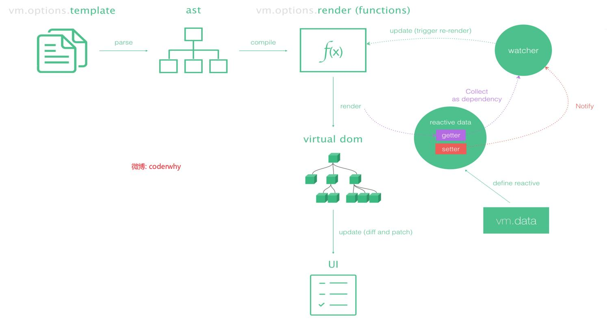
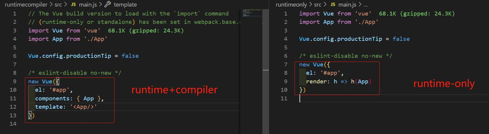
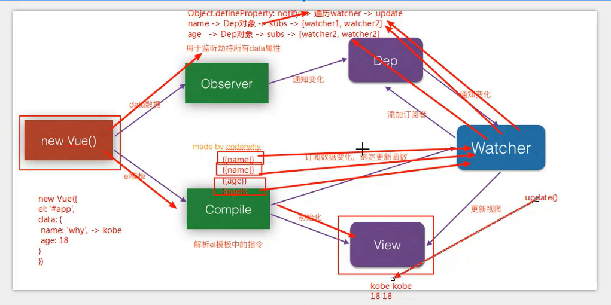

### vue常见知识点-1

##### 1. 防抖debounce

- 原理: 在n秒后执行该事件,如果n秒内又触发该事件则重新计时

- 应用场景：登录、发短信、搜索框搜索联想等按钮避免用户点击太快，以致于发送了多次请求

- 库：underscore、lodash(不过很久未维护了)两个库都有

- 基础结构

    - ```javascript
        let i = 0
        function foo() {
        	console.log(++i, this)
        }
        function debounce(fn, delay) {
        	// 定义一个定时器，保存上一次的定时器
        	let timer = null
        	return function(...args) {
        		// 取消上一次的定时（第一次无timer故先判断）
        		if(timer) clearTimeout(timer)
            timer =	setTimeout(() => {
            	// 外部传入的要真正执行的函数
            	// fn() 同时使用箭头函数和apply的目的是如果fn内部有执行this相关的代码，this指向可能会错误
        			fn.apply(this, args)
        		}, delay)
        	}
        }
        const bar = debounce(foo, 2000)
        // 按钮点击触发事件
        function btnClick() {
        	bar()
        }
        ```

- 改进版

    - 基础版缺点：第一次点击也会延迟执行

    - 增加一个参数，外界决定点击时是否立即执行一次

    - 条件判断时若仅判断immediate，当连续点击时第一次是立即执行，但接下来的每次都是立即执行，因为默认immediate为false，传过来的immediate为true，第一次执行后immediate一直为true未再初始化为false，故延迟失去效果

    - 延时过程中取消函数执行(只需在回调函数内封装一个取消的方法即可)

    - ```javascript
        let i = 0
        function foo() {
        	console.log(++i, this)
        }
        function debounce(fn, delay, immediate = false) {
        	let timer = null
        	let isInvoke = false
        	return function(...args) {
        		if (timer) clearTimeout(timer)
        		if (immediate && !isInvoke) {
        			fn.apply(this, args)
        			isInvoke = true
        		} else {
        			timer = setTimeout(() => {
        				fn.apply(this, args)
        				isInvoke = false
        			}, delay)
        		}
        	}
        }
        ```

- 延时过程中取消函数执行

    - ```javascript
        // 由外界决定是否立即执行
        let i = 0
        function foo() {
        	console.log(++i, this)
        }
        function debounce(fn, delay, immediate = false) {
        	let timer = null
        	let isInvoke = false
        	const _debounce =  function(...args) {
        		if (timer) clearTimeout(timer)
        		if (immediate && !isInvoke) {
        			fn.apply(this, args)
        			isInvoke = true
        		} else {
        			timer = setTimeout(() => {
        				fn.apply(this, args)
        				isInvoke = false
        			}, delay)
        		}
        	}
        	// 封装取消功能
        	_debounce.cancelBtn = function() {
        		if (timer) clearTimeout(timer)
        		timer = null
        		isInvoke = false
        	}	
        	return _debounce
        }
        const bar = debounce(foo, 2000, true)
        // 触发事件
        function btnClick() {
        	bar()
        }
        // 取消事件
        function cancelClick() {
        	bar.cancelBtn()
        }
        ```

- 如果要防抖函数有返回值

    - ```javascript
        // 如果函数有返回值则需再传入一个回调
        let i = 0
        function foo() {
        	console.log(++i, this)
        	return '防抖函数有返回值'
        }
        function debounce(fn, delay, immediate = false, callBack) {
        	let timer = null
        	let isInvoke = false
        	const _debounce =  function(...args) {
        		if (timer) clearTimeout(timer)
        		if (immediate && !isInvoke) {
        			// 拿到函数返回值
        			const res= fn.apply(this, args)
        			// 执行回调
        			if (callBack && typeof callBack === 'function') callBack(res)
        			isInvoke = true
        		} else {
        			timer = setTimeout(() => {
        				const res =	fn.apply(this, args)
        				if (callBack && typeof callBack === 'function') callBack(res)
        				isInvoke = false
        			}, delay)
        		}
        	}
        	// 封装取消功能
        	_debounce.cancelBtn = function() {
        		if (timer) clearTimeout(timer)
        		timer = null
        		isInvoke = false
        	}	
        	return _debounce
        }
        const bar = debounce(foo, 2000, true, res => {
        	console.log(res)
        })
        // 触发事件
        function btnClick() {
        	bar()
        }
        // 取消事件
        function cancelClick() {
        	bar.cancelBtn()
        }
        ```

- 内部this

    - ```javascript
        // 写法1: 使用箭头函数的this
        function debounce(func,wait) {
          let timeout;
          return function (...args) {
            if(timeout) clearTimeout(timeout);
            timeout = setTimeout(() => {
              func.apply(this,args)
            },wait)
          }
        }
        // 写法2: 使用普通函数的this
        function debounce(func,wait) {
          let timeout;
          return function () {
            let content = this;
            let args = arguments;
            if(timeout) clearTimeout(timeout);
              timeout = setTimeout(function() {
                func.apply(content,args)
            },wait)
          }
        }
        function fu() {
          // doSomeThing
        }
        const str = debounce(fu,300);
        str();
        ```

##### 2. 节流throttle 

- 原理: n秒内该事件只触发一次 

- 应用场景: 滚动加载、加载更多、滚到底部监听

- 基础结构

    - ```javascript
        let i = 0
        function foo() {
        	console.log(++i, this)
        }
        function throttle(fn, interval) {
        	// 上次触发时间
        	let lastTime = 0
        	const _throttle = function() {
        		// 本次点击触发时间
        		const nowTime = new Date().getTime()
        		const remainTime = interval - (nowTime - lastTime)
        		if (remainTime <= 0) {
        			fn()
        			lastTime = nowTime
        		}
        	}
        	return _throttle
        }
        const bar = throttle(foo, 2000)
        function btnClick() {
        	bar()
        }
        ```

- 外界控制第一次是否立即触发

    - ```javascript
        let i = 0
        function foo() {
        	console.log(++i, this)
        }
        function throttle(fn, interval, options = {leading: false}) {
        	let lastTime = 0
        	const _throttle = function() {
        		const nowTime = new Date().getTime()
        		// !lastTime判断是否是第一次，因为只有第一次进来时lastTime才为0
        		// !options.leading判断是否要进行立即触发
        		if (!lastTime && !options.leading) lastTime = nowTime
        		const remainTime = interval - (nowTime - lastTime)
        		if (remainTime <= 0) {
        			fn()
        			lastTime = nowTime
        		}
        	}
        	return _throttle
        }
        const bar = throttle(foo, 2000, {leading: false})
        function btnClick() {
        	bar()
        }
        ```

        


##### 3. 时间戳过滤器 

```javascript
// 简单版
function dateFormat(dateVal) {
  const dt = new Date(dateVal * 1000);
  const y = dt.getFullYear();
  const m = (dt.getMonth() + 1 + '').padStart(2, '0');
  const d = (dt.getDate() + '').padStart(2, '0');
  const hh = (dt.getHours() + '').padStart(2, '0');
  const mm = (dt.getMinutes() + '').padStart(2, '0');
  const ss = (dt.getSeconds() + '').padStart(2, '0');
  return `${y}-${m}-${d} ${hh}:${mm}:${ss}`
}
```


```javascript
//  一劳永逸版
// fmt格式: “yyyy-MM-dd hh:mm:ss” 也可以有其他格式但字母不得改变 

function formateDate(date, fmt) {
  date = new Date(date * 1000); // 时间戳是秒但Date函数的参数需为毫秒
  if (/(y+)/.test(fmt)) {
    fmt = fmt.replace(RegExp.$1,(date.getFullYear() + '').substr(4 - RegExp.$1.length));
  }
// 单独将年提取出来,因为年份是4个字,但传过来的字数为1/2/3/4个都可以
// “/(y+)/” 即看传过来的有几个y
// “RegExp.$1” 即将匹配到的第一个子字符串“y+”保存起来 (可百度RegExp.$1的含义)
// “date.getFullYear() + ''” 将年由数字转为字符串(也可使用“string”方法转)
// “substr(4 - RegExp.$1.length)” 根据传来的格式判断年份需要几位(如2019 --> 19)
// “fmt.replace()” 将截取好的年份进行替换

  let o = {
    'M+': date.getMonth() + 1,
    'd+': date.getDate(),
    'h+': date.getHours(),
    'm+': date.getMinutes(),
    's+': date.getSeconds(),
  }
  for (let k in o) {
    if (new RegExp(`(${k})`).test(fmt)) {
      let str = o[k] + '';
      fmt = fmt.replace(RegExp.$1, (RegExp.$1.length !== 1) ? str : str.padStart(2,'0'))
    }
  }
// 判断“月日时分秒”是否传过来，如果传过来则再进行补零操作

  return fmt;
}
```


##### 4. 混入mixins

- 其实就是将相同的生命周期函数,methods方法、data数据等抽离到一个js文件中,哪个组件需要引入即可

    ```javascript
    // 抽离js文件写法:
    export const funName = {
      data() {
        return {
          data1: ''
        }
      },
      mounted() {
        fun() {
        }
      }
    }
    // 组件引用时：
    import {funName} from '...'	// 1.先从JS文件中引入方法
    mixins:[funName]	// 2.和data、methods等同级别创建mixins数组放置引入的数据
    ```

    

##### 5. runtime-only 和 runtime+compiler 

1. 先看vue程序运行过程

    



2. parse 解析；ast(abstract syntax tree) 抽象语法树；compiler 编译

3. runtime+complier（运行加编译）方式编译过程：

    - 根据main.js文件可知

    - 先将app进行组件注册
    - 再将组件放进template中
    - template -->（通过parse）ast -->（通过compiler）render --> vdom --> ui

4. runtime-only（只运行）方式编译过程：

    - 使用此种方式需安装 vue-template-compiler
    - ".vue"文件通过vue-loader进行加载，通过vue-template-complier已将app中的template编译为render函数
    - 根据main.js文件可知

    - 直接将app组件进行render函数渲染
    - render --> vdom --> ui   

5. runtime-only：

    - 通过vue-template-complier将本该vue处理的template代替处理，vue在main.js文件里直接使用，因而此种方式性能更高，编译出的代码量更少

    - h 函数的本质是createElement 函数，这个函数的作用就是生成一个 VNode节点，render 函数得到这个 VNode 节点之后，返回给 Vue.js 的 mount 函数，渲染成真实 DOM 节点，并挂载到根节点上

        ```javascript
        //  render的箭头函数还原
        render: function (createElement) {
           return createElement(App);
        }
        // createElement函数可接受组件，也可自行创建标签， 具体用法查看原生JS
        //render函数创建的元素会直接将页面中el指定的容器替换掉
        ```

        

##### 6. 响应式原理

- 回答
    - vue会遍历data中所有数据的属性
    - 然后通过Object.defineProperty把这些属性全部转为getter/setter
    - 通过getter拦截属性的获取，进行依赖的收集；通过setter拦截属性的更新，通知依赖进行回调
    - 每个组件实例都有watcher监听对象，它会在组件渲染过程中把属性记录为依赖
    - 当依赖项的setter被调用时，会通知watcher重新计算，因此使关联的视图进行更新

- 清楚两点即可知道原理
    - vue内部是如何监听数据发生改变的 （通过数据劫持）
    - vue是如何通知哪些组件数据已变化，视图需及时刷新 （通过发布者订阅者模式）

- 数据劫持

    - **Object.defineProperty**的方法里面的setter 与getter方法的**观察者模式**

    ```javascript
    const obj = {
      name: 'coder',
      age: 18,
    }
    // 数据劫持
    Object.keys(obj).forEach(key => {
      let value = obj[key];
      Object.defineProperty(obj,key,{
        set(newValue) {
          console.log('监听' + key + '值改变');
          value = newValue;
          console.log(value);
          // 在此处调用发布者模式 dep.notify() 具体看下段代码
        },
        get() {
          // get收集依赖
        console.log('获取' + key + '值改变');
        return value      
        }
      })
    })
    obj.name  //会触发get()
    obj.name = 'kobe'  // 触发set()
    ```

    

- 发布订阅者模式

    ```javascript
    // 发布者
    class Dep {
      constructor() {
        this.subs = []; // 将所有订阅者汇总到一个数组里
      }
      addSubs(watcher) {
        this.subs.push(watcher)  // 收集所有订阅者信息
      }
      notify() {
        this.subs.forEach(item => item.update()) // 通知所有订阅者数据进行了更新，让订阅者去做数据更新后自己的事
      }
    }
    
    // 订阅者
    class Watcher {
      constructor(name) {
        this.name = name  // 实例化每一个订阅者,记录订阅者信息
      }
      update() {
        console.log(this.name + '发生了update')  // 每个订阅者根据数据做自己的事情
      }
    }
    
    const dep = new Dep();
    
    const w1 = new Watcher('张三'); 	// 实例化对象
    dep.addSubs(w1) // 对象去订阅者哪里登记
    const w2 = new Watcher('李四')
    dep.addSubs(w2)
    
    dep.notify() 	// 发布者调用方法一次通知所有订阅者
    ```

    




##### 7.v-if与v-for

哪个优先级更高？如果同时出现如何优化性能更好

```vue
<!--1.v-if与v-for同级时 -->
<p v-for="item in items" :key="item.id" :v-if="flag">{{item.name}}</p>

<!--2.v-if与v-for不同级时 -->
<div v-if="flag">
	<p v-for="item in items" :key="item.id">{{item.name}}</p>
</div> 
```


```javascript
export default {
	data() {
		return {
    	items: [
      	{id: 1,name: '张三'},
      	{id: 2,name: '李四'}
    	],
    	flag: true,
  	}
	},
	mounted() {
  	console.log(this.$options.render);
	}
}
```

```javascript
// 打印同级时的渲染函数
var render = function() {
  var _vm = this
  var _h = _vm.$createElement
  var _c = _vm._self._c || _h
  return _c(
    "div",
    { staticClass: "search" },
    _vm._l(_vm.items, function(item) {
      return _c("p", { key: item.id, attrs: { "v-if": _vm.flag } }, [
        _vm._v(_vm._s(item.name))
      ])
    }),
    0
  )
}
var staticRenderFns = []
render._withStripped = true

export { render, staticRenderFns }
// "_l"为列表渲染函数 会循环输出“_vm.items”,每次循环时执行后面的function
// 根据以上打印出的render函数可知 先执行列表渲染函数再判断v-if
```

```javascript
// 打印不同级时的渲染函数
var render = function() {
  var _vm = this
  var _h = _vm.$createElement
  var _c = _vm._self._c || _h
  return _c("div", { staticClass: "search" }, [
    _vm.flag
      ? _c(
          "div",
          _vm._l(_vm.items, function(item) {
            return _c("p", { key: item.id }, [_vm._v(_vm._s(item.name))])
          }),
          0
        )
      : _vm._e()
  ])
}
var staticRenderFns = []
render._withStripped = true

export { render, staticRenderFns }
// 根据打印出的render函数可知会先根据flag的结果是执行具体的函数还是执行“_e()”这个空函数
```

- 综上可知：
    - 同级别时，v-for优先v-if被解析，每次渲染都会先执行循环函数再判断，浪费性能
    - 优化：在v-for外部嵌套一层v-if，先判断再循环

##### 8.组件通信

- 使用场景分为三类：父子、兄弟和跨级别
- 通信方式有六种：
    - props
    - $emit/$on、$bus
    - $parenrt/$children、ref
    - vuex
    - $attrs/$listeners
    - provide/inject


##### 9.vue性能优化方法

- 这里主要探讨代码层面的优化

- 路由懒加载

    - 打包时减小体积、加载时按需加载

- keep-alive 缓存页面

    - 可include和exclude更细节处理页面

- v-show复用DOM

    - 某些渲染时间较长或任务较重的代码块进行复用

- 长列表性能优化

    - 仅展示数据

        - 列表仅做数据展示而不改变就不需响应化，则可将其冻结

        - ```javascript
            // showData 要展示的数据  getData某个数据
            showData = object.freeze(getData)
            ```

            

    - 大数据长列表

        - 可采用虚拟滚动，即只渲染视图区域中的内容，用户滚动时处理滚动行为，动态更新或渲染，DOM可复用更新，不需消耗太多资源
        - 推荐库：vue-virtual-scroller、vue-vvirtual-scroll-list

- 图片懒加载

    - 为提高页面加载速度，对图片过多的页面，未出现在视图区域中的图片先不做加载，等到滚动到可视区域再加载

- 第三方插件按需引入

    - 如element-ui按需引入避免体积太大

##### 10.vue-router 导航钩子

导航钩子形式共有三种

- 全局导航钩子 

    - `beforeEach(to,from,next){}`  路由改变前调用
        - 参数：to即将进入的目标路由，from当前正要离开的路由对象，next路由控制参数
        - next()进入下一个钩子、next(false)取消导航、next('/login')强制进入到此路由
        - 常用于验证用户登录权限
    - `afterEach(to,from){}` 路由改变后的钩子
        - 少个参数next,用法同beforeEach
        - 常用于自动让页面返回最顶端

- 路由配置中的导航钩子

    - `beforeEnter(to,from,next){}` 用法同全局导航钩子

    - ```javascript
        // 在路由配置中进行设置
        const router = new VueRouter({
        	routes: [
        		{
        			path: '/login',
        			component: Login,
        			beforeEnter: (to,from,next) => {
        				// ...
        			}
        		}
        	]
        })
        ```

- 组件内的钩子函数

    - 在单个vue文件中使用
    - beforeRouteEnter(to,from,next)
        - 该组件对应路由被确认前调用
        - 此时实例还未被创建，故不能获取实例，即this
    - beforeRouterUpdate(to,from,next)
        - 当前路由改变，但该组件复用时调用
        - 例：对于一个带有动态参数的路径“/foo/:id” 在“/foo/1”和"/foo/2"跳转时调用
        - 可访问组件实例this
    - beforeRouterLeave(to,from,next)
        - 导航离开该组件的对应路由时调用
        - 可访问组件实例this

    

##### 11.深拷贝

- 基础结构

    - ```javascript
        function cloneDeep(obj) {
        	const  typeofValue = typeof obj
          // 函数类型的话直接返回原函数就行，因为函数本身就是用来复用的
          if (typeofValue === 'function') return obj
          // 若是字符串之类的直接返回即可
        	if (obj !== null && typeofValue !== 'object') return obj
          // 判断是数组还是对象
        	const newObj = Array.isArray(obj) ? [] : {}
        	for (const key in obj) {
        		newObj[key] = cloneDeep(obj[key])
        	}
        	return newObj
        }
        const obj1 = {
        	name: 'kobe',
        	friends: {
        		name: 'james'
        	},
          arr: ['ball', 'paint']
        }
        const obj2 = cloneDeep(obj1)
        obj2.friends.name = 'curry'
        obj2.arr[0] = 'basketBall'
        console.log(obj1) // {name: 'kobe', friends: {name: 'jsmes'}, arr: ['ball', 'paint']} 
        console.log(obj2) // {name: 'kobe', friends: {name: 'curry'}, arr: ['basketBall', 'paint']}
        ```