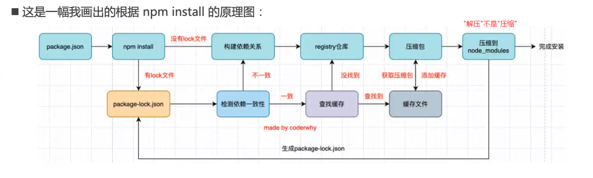
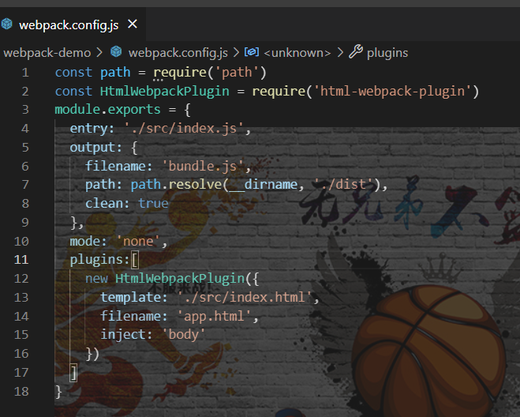
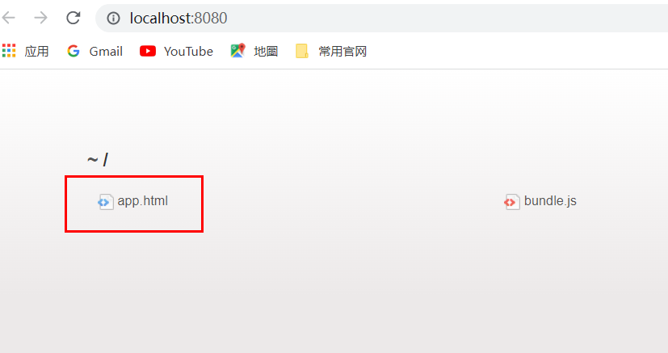
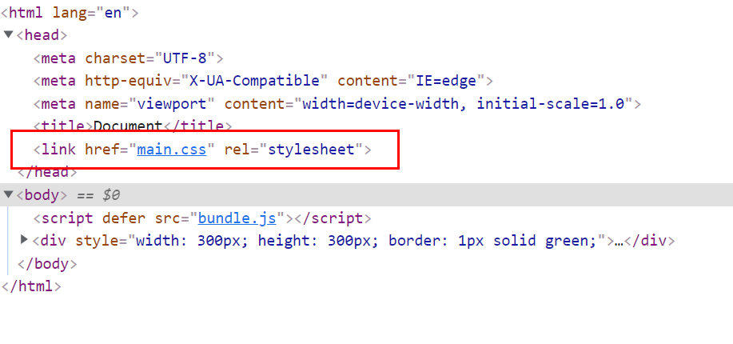
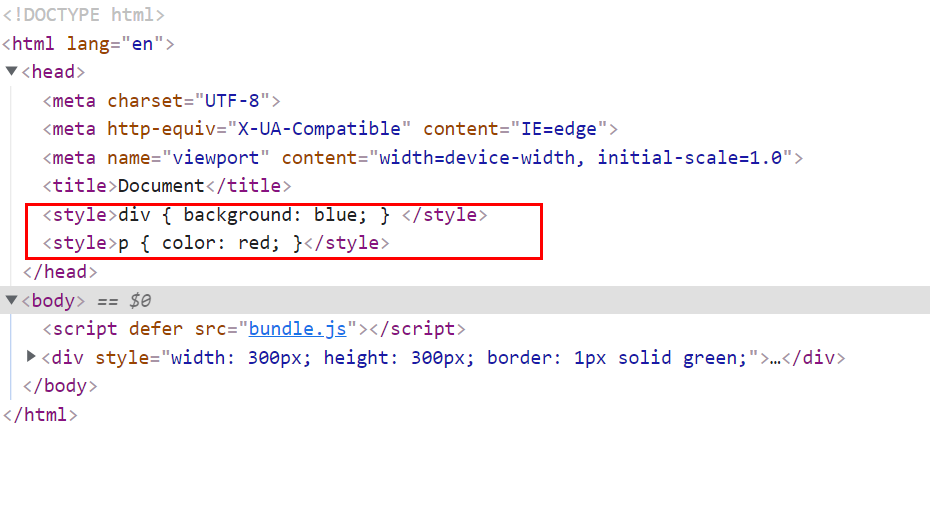
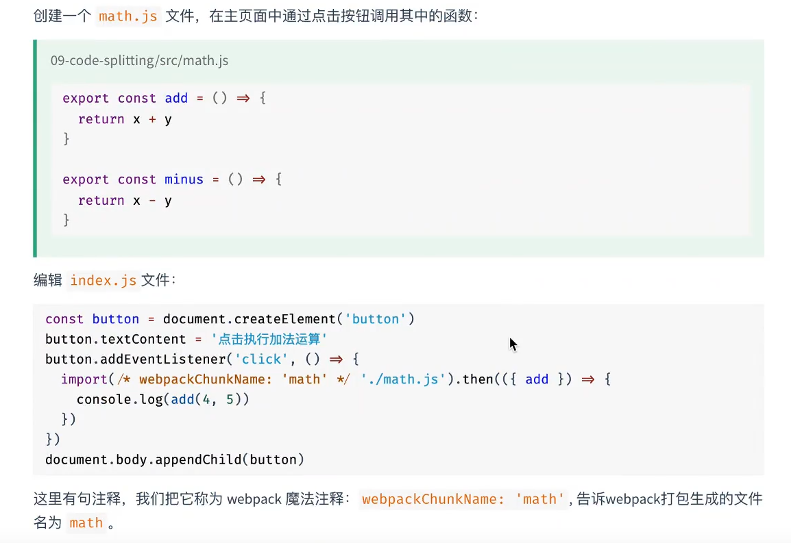
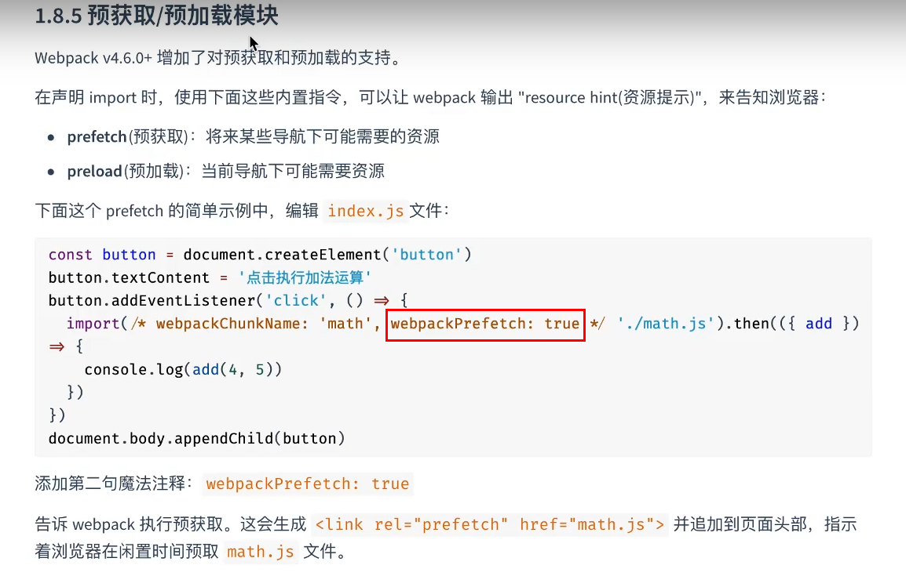
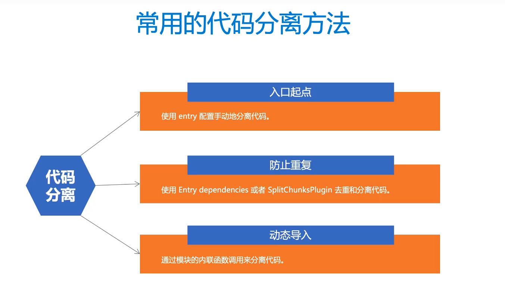
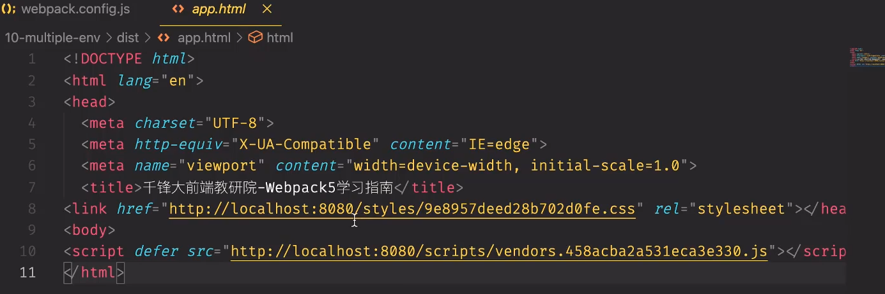

##### 第一章：基础

###### 1. 基础命令

- pwd(print work directory) 打印当前目录
- npx webpack （运行webpack，但npx是在当前文件夹下查找它，若查找不到则往父级目录查找，作用：优先使用本地webpack，若无本地才会使用全局）
- npx webpack --watch 自动监测文件变化，即命令输入一次以后直接保存即可自动编译
- npm init -y 生成package.json文件
- npm install webpack webpack-cli --save-dev 局部安装生成modules包和package-lock.json文件
- -S与-D的区别
    - -S即--save 包名被注册在dependencies中，生产环境依赖
    - -D即--dev 包名被注册在devDependencies中，开发环境依赖
    - npm i -d 就是npm install --save-dev 即开发环境安装
    - npm i -s 就是npm install --save 即生产环境安装
- npm install原理图
    - 
    - 检测依赖一致性：指对比package和package-lock包版本是否一致，若不一致(package中的版本较高的话)则将lock中的更新至指定的最新版本，如果lock中版本较高的话则直接使用lock中的版本
    - 查找缓存：系统控制台输入`npm get cache`会得到一个文件夹路径，缓存的包就在此文件夹中
- npm cache clear 清除缓存
- npm rebuild 强制重新build

###### 2. webpack.config.js文件

- entry：入口文件
- output：出口文件
    - filename：打包好的JS文件名
    - path：设置打包文件出口路径
        - 引入path模块，调用path模块的resolve方法
        - path: path.resolve(__dirname, './dist')  含义为调用resolve方法，以当前文件(webpack.config.js)所在的位置为参考，找到与其同级的dist文件夹，将它作为出口
        - 
    - clean: true 每次打包前先将dist文件夹清除掉
- devtool: 'inline-source-map' 程序报错时可精准定位到源码

###### 3.html-webpack-plugin

- 使用步骤

    - 引入`const HtmlWebpackPlugin = require('html-webpack-plugin')`

    - ```json
        // 注册使用
        plugins: [
        	new HtnlWebpackPlugin({
        		template: './index.html', // 以哪个文件作为模板
        		filename: 'app.html', // 打包好的文件命名
        		inject: 'body' // 在app.html中的body中放置script标签，引入bundle.js文件
        	})
        ]
        ```


###### 4. webpack-dev-server

- 作用：热更新模块

- 安装`npm i webpack-dev-server -D`

- ```javascript
    // 配置
    // 与entry同级别
    devServer: {
    	static: './dist'
    }
    ```

- 运行一次命令`npx webpack-dev-server` 会生成本地和线上的链接地址，点击链接进入浏览器

    - 也可 `npx webpack-dev-server --open` 自动打开浏览器无需手动点击链接

- 浏览器中点击首页的html文件即可

- 

###### 5. 处理css和less

- webpack仅仅是处理JS之间的关系，CSS、图片之类的还需插件loader来处理
- 处理css文件下载css-loader和style-loader
  
- css-loader负责加载 ，style-loader负责解析 ，二者都要安装
  
- loader使用安装步骤:

    - “npm i --save-dev css-loader@version style-loader@version” 进行安装(二者版本不对应可能会出错）

    - 在“module”中进行配置，“use”配置时“style”在前“css”在后,因为webpack读取loader时从右往左（详细配置可进webpack官网查看）

    - ```javascript
        module:{
          rules:[
          	{
            	test:/\.css$/, 	// 处理css文件 注意:此处正则键值不带引号 
              use:['style-loader','css-loader']
            }
          ]
        }
        ```

- 安装配置less-loader和less

    - ```javascript
        {
          test:/\.less$/,
          use: [
            {loader: "style-loader"},
            {loader: "css-loader"},
            {loader: "less-loader"}
          ]
          // 也可写为 use: ['style-loader', 'css-loader', 'less-loader'] 省略键
        }
        ```

- 将css和less合到一起配置

    - ```javascript
        {
        	test: /\.(css|less)$/,
        	use: ['style-loader', 'css-loader', 'less-loader']
        }
        ```

###### 6. 抽离和压缩css

- 抽离插件“mini-css-extract-plugin”

    - 可将css文件合并抽离成一个单独的文件，为每个包含css的JS文件创建一个css文件，并且支持css和SourceMaps的按需加载
    - 注：本插件基于webpack5的新特性构建

- 抽离的配置过程

    - 安装并引入`const MiniCssExtractPlugin = require('mini-css-extract-plugin')`

    - ```javascript
        // 实例化
        plugins: [
          new MiniCssExtractPlugin({
           	filename: 'styles/[contenthash].css' // 在dist根目录下新建一个styles文件夹，将此文件根据内容以hash命名放入其中（若不配置filename,则默认在dist根目录下生成main.css）
          })
        ]
        ```

    - ```javascript
        // 配置
        rules: [
        	{
        		test: /\.css$/,
        		use:[MiniCssExtractPlugin.loader, 'css-loader']
        		// 之前是通过style.loader将样式放到head中的，现在抽离样式style.loader就不需要了，将它替换掉
        	}
        ]
        ```

    - 配置好后运行`npx webpack` 会生成默认的main.css文件，此文件会在入口html文件的head头部以link方式引入

    - 下面两张图为mini-css-extract-plugin和style.loader加载css的区别

        - 
        - 

- 压缩插件“css-minimizer-webpack-plugin”

    -  安装并引入`const CssMinimizerPlugin = require('css-minimizer-webpack-plugin')`

    - 更改`mode: production` 改为生产环境

    - ```javascript
        // 设置优化配置
        // 与entry同级别配置
        optimization: {
        	minimizer: [
            new CssMinimizerPlugin()
        	]
        }
        ```

###### 7. 使用babel-loader

- webpack只能做JS的打包，并不能将转化（如es6语法转为es5）,故需babel进行转化，babel和webpack进行结合就需要babel-loader

- 先安装三个插件

    - babel-loader：应用babel解析es6的桥梁
    - @babel/core：babel的核心模块
    - @babel/preset-env：babel预设，一组babel插件的集合

- 再安装两个

    - 上面三个运行时需要“regeneratorRuntime”全局辅助函数，故需再安装以下两插件
    - @babel/runtime
    - @babel/plugin-transform-runtime

- ```javascript
    {
      test: /\.m?js$/, 	// 处理ES6语法
      exclude: /(node_modules|bower_components)/, // 排除node中的JS文件不编译
      use: {
        	loader: 'babel-loader',
         	options: {
            presets: ['@babel/preset-env'],
            plugins: [
              ['@babel/plugin-transform-runtime']
            ]
          }  
      }
    }
    // webpack4的配置中，是新建了“.babelIrc”的json文件进行配置，webpack5应该是可将其写到配置中，无需新建
    ```


------


##### 第二章：代码分离

###### 1. 分离方法

- 手动配置entry分离：

    - 缺点：如果有多个入口文件，那么这些多个入口共享的文件会分别在每个包里重复打包

    - ```javascript
        entry: {
        	index: './src/index.js',
        	another: './src/another.js'
        }
        output: {
            filename: 'bundle.js',
            path: path.resolve(__dirname, './dist')
        }
        // 如果两个入口文件都用到了某个文件，则共享文件会分别在各自的包里进行打包
        // 注：此时出口文件应修改，否则报错，因为打包后的chunk文件的filename重名了,改为如下
        output: {
            filename: '[name].bundle.js',
            path: path.resolve(__dirname, './dist')
        }
        ```

- 防止重复分离：

    - ```javascript
        // 方式1: 手动配置
        entry: {
        	index: {
        		import: './src/index.js',
        		dependOn: 'shared'
        	},
        	another: {
            import: './src/another.js',
            dependOn: 'shared'
        	},
        	shared: 'lodash' // 当以上两个模块中有lodash这个模块时会将其抽离出来并取名为shared
        }
        // 方式2: 通过webpack内置的插件split-chunks-Plugin
        entry: {
          index: './src/index.js',
          other: './src/other.js'
        }
        optimization: {
          splitChunks: {
            chunks: 'all'
          }
        }
        ```

         

- 通过模块的内联函数import

    - 就是将动态获取的内容（如异步获取的 内容）再抽到一个文件中
- 如index.js文件中通过import引入了一个动态文件，打包时它将会被再抽离成一个文件
  
    - 应用：懒加载（感觉这种不算是第三种方法）
- 如下图：通过控制台的network可看到，当点击按钮时导入的math文件才被下载下来（即按需加载）
  
    - webpack魔法注释：注释中加上“webpackChunkName”
- 
    -   预获取与预加载
    - 
    
- 

###### 2. 缓存

- 缓存业务代码

    - 部署新版本时，打包好的文件内容发生了改变，若文件名未改变，浏览器在获取时可能会认为资源未更新，可能就会使用缓存的版本

    - 确保webpack生成的文件能被客户端缓存，文件内容发生变化时又能请求到新文件

    - ```javascript
        // 修改输出文件名，让文件名随文件内容的变化而变化
        output: {
          filename: '[name].[contenthash].js'
        }
        ```

- 缓存第三方库

    - 将第三方库提取到单独的vendor chunk文件中，因为它们几乎不会像源代码那样频繁修改，利用浏览器的长效缓存机制，减少向服务器请求资源

    - ```javascript
        optimization: {
        	splitChunks: {
        		cacheGroups: {
        			vendor: {
        				test:/[\\/]node_modules[\\/]/, // 提取node包中的文件
        				name: 'vendors', // 打好的包名
        				chunks: 'all' // 哪些包
        			}
        		}
        	}
        }
        ```

- 将JS文件放到一个文件夹中
    - 只需修改输出路径即可

    - ```javascript
        output: {
        	filename: 'scripts/[name].[contenthash].js'
        }
        // 这样就会在dist文件夹中生成一个scripts文件夹用来存放打包好的文件
        ```

        

路径：

- 首页的html文件引入的资源都是打包好的相对路径的资源，可修改配置路径，引入绝对路径的资源

- 加个公共基础路径，这样引入的相对路径会和公共基础路径进行拼接

- ```javascript
    output: {
    publicPath: 'http://localhost:8080/' //或其他的服务器名
    }
    ```

- 

###### 3. 警告处理

- 打包时警告文件包太大，关闭其提示

    - ```javascript
        // output同级别下配置
        performance: {
        	hints: false
        }
        ```

        