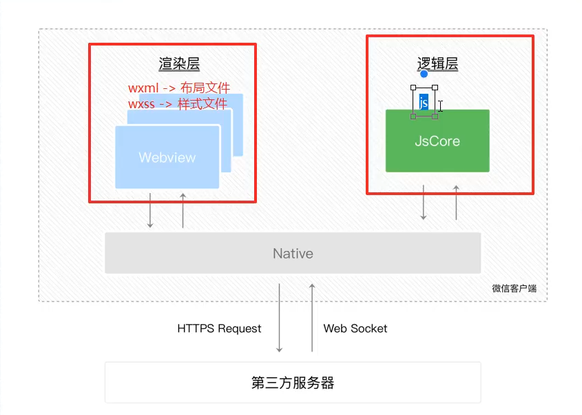
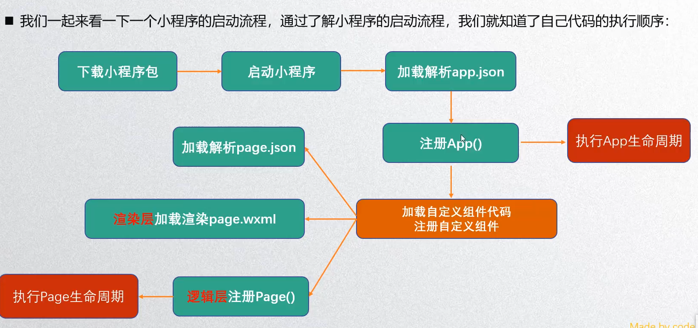
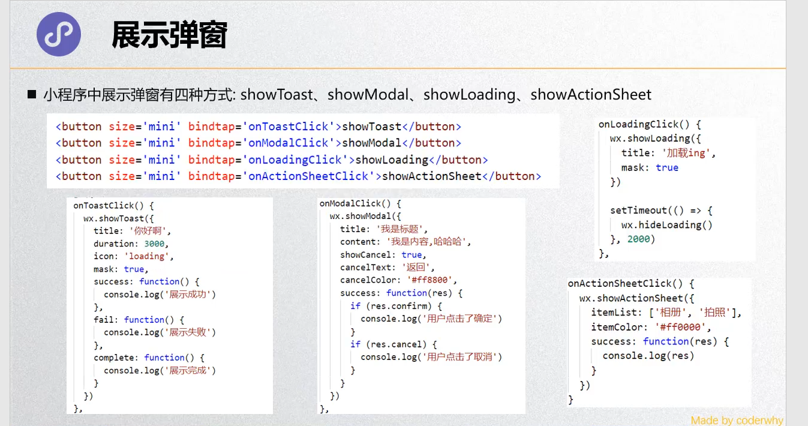
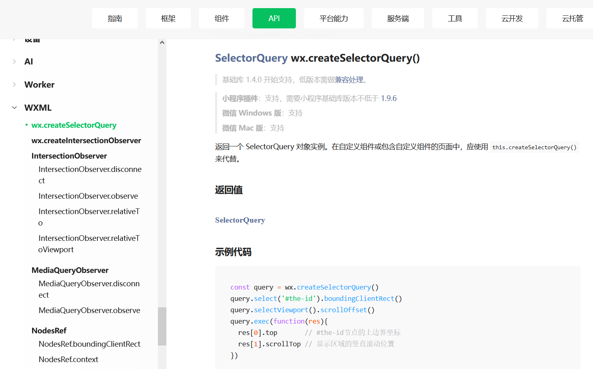

#####  第一章：基础概念

###### 1.基础语法

- 列表展示：wx:for

    - <view wx:for="{{ listData }}">{{ item, index }}</view>
    - 绑定的数据源需要使用插值表达式
    - item，index是小程序内部已定义好的关键字
    - 可给item起别名：
        - 使用wx:for-item给item起别名
        - <view wx:for="{{ listData }}" wx:for-item="itemName">{{ itemName }}</view> 
    - 给index起别名：wx:for-index="imdexName"

- 事件监听：

    - `<button bindtap="handleClick">按钮</button>`
    - `<button bind:tap="handleClick">按钮</button>`

- 数据修改：

    - 使用this.setData({})进行数据修改

    - 如：

        ```javascript
        handleClick() {
        	this.setData({
        		count: this.data.count + 1 // 注：this.data.count++无效，但可++this.data.count
        	})
        }
        ```

###### 2.配置文件

- 配置文件
    - 小程序的很多开发需求被定义在了配置文件中，目的：有利于开发效率、保证开发出的小程序某些风格一致，比如导航栏、tabbar以及页面路由等
    - project.config.json：项目配置文件，比如项目名称、appid等（一般不动此文件，在详情->调试基础库中修改版本，配置文件直接会随之更改）
    - sitemap.json：小程序搜索相关的 即在微信内可否搜到 小程序及其内部页面数据等
    - app.json：全局配置（配置较多，只展示常用的）
        - pages：页面路径配置
        - window：全局默认窗口展示
        - tabBar：底部tab栏的展示
    - page.json：页面配置

###### 3.双线程模型

- 微信客户端是小程序的宿主环境，宿主环境为执行小程序提供了各种文件：wxml、wxss、js等
- wxml和wxss运行于渲染层，使用webView线程渲染（一个页面使用一个webView，一个程序有多个页面，会使用多个webView线程)，JS脚本运行于逻辑层，使用JsCore运行JS脚本，这两个线程都会经由微信客户端（Native）进行中转交互
- 


- 渲染过程
    - 渲染层和逻辑层结合创建出一个JS对象，JS对象会转变成一个真正的DOM，DOM对象被webView渲染出来，两个线程（webView和JsCore）互相配合
    - 数据变化时，产生的JS对象对应的节点会发生变化，此时通过diff算法对比两个JS对象得到变化的部分，将差异应用到原来的DOM树上，从而达到更新UI，这就是“数据驱动”的原理
- 整体渲染流程：在渲染层，宿主环境将wxml转化成对应的JS对象；JS对象再次转变成真实的DOM树交由渲染层线程渲染；数据变化时逻辑层提供最新的变化数据，JS对象发生变化比较进行diff算法对比；将最新变化的内容反映到真实DOM树中，更新UI

###### 4.启动流程

- 
- APP.js文件中常用的四个函数
    - onLaunch：初始化完成时执行，可在此请求接口
    - onShow：界面显示出来之后执行
        - 可接受参数option，其中option中的scene状态码用来判断小程序的打开场景`onshow(option){console.log(option)}`
        - 也可在onLaunch中进行场景判断 
    - onhide：界面隐藏（被关闭时执行）（注：当关闭后5分钟内再次打开时，不会重新执行onLaunch，即小程序关闭后还可存活5分钟）
    - onError：发生错误时执行
- APP.js其他参数设置
    - globalData: { key: value } 供全局使用，相当于vuex
        - 用法：使用内置函数getApp()获得全局对象，然后拿取数据
        - 如：const app = getApp() const age = app.globalData.key

###### 5.page单个页面

- onLoad：页面被加载出来，可在其中发送网络请求
- onShow：页面显示出来
- onReady：页面初次渲染完成
- onHide：页面隐藏起来
- onPageScroll：监听页面滚动
- ......其他方法，比如下拉刷新，点击按钮触发事件等

###### 6.image图片

- 路径地址可使用相对和绝对，使用绝对路径时，只需要用“/”即代表了根路径(与app.js同级的路径)

- wx.chooseImage可唤起打开相册或拍照，

- ```javascript
    wx.chooseImage({
    	success: res => {
    		const path = res.tempFilePaths[0]
    		this.setData({
          imgPath: path
    		})
    	}
    })
    // 注：回调函数使用箭头函数，否则this.setData将找不到this
    ```


###### 7. block标签

- 作用：类似于template
- 仅是一个包装元素，不会做任何渲染，性能更好
- 且只接受控制属性，即只能写wx:if之类的操作，不可对其加class之类的操作

###### 8. template

- 作用：类似于vue值的插槽

- ```html
    <!-- 定义模板 -->
    <template name="slotName">
      <button>{{btnText}}</button>
      <view>{{viewText}}</view>
    </template>
     <!-- 使用模板 -->
    <template is="slotName" data={{ btnText: '按钮', viewText: '自定义插入内容'}} />
    ```

    

###### 9. 文件引入

- wxml引入的两种方式：import引入和include引入
- import引入：
    - 概述：将定义好的template文件抽离成一个单独的文件，在别的文件中引入
    - 引入方式：在wxml文件中使用“import“标签引入，即<import src="/.template.wxml" />
    - 使用方式： `<template is="slotName" data={{ btnText: '按钮', viewText: '自定义插入内容'}} />`
    - 注：不可嵌套引用，即A中引用了B，而C又引用了A，但C使用不了B
- include引入：
    - 作用：相当于将页面头部/尾部之类的公共部分引入
    - 引入方式：在wxml文件中使用“include“标签引入，即<include src="/.template.wxml" />
    - 使用方式：引入即可，无需更改
    - 但它不能导入模板，include是将目标文件中除<template />和<wxs />之外的文件拷贝到include的位置，即文件中若有`<template name="slotName"></template>`，会将其排除掉
    - 可嵌套引用

###### 10. 事件传参

- 点击事件时传入需要的参数，写法不同vue，不是如“@click=clickItem(item)”
- 写法：`<button bindtap=“clickItem”data-dataList="{{obj}}">按钮</button>`
- 即在点击的事件内跟上“data”加个自定义的后缀名(如：data-list)，然后绑定要传的参数
- 接受数据：在事件内部通过“e.currentTarget.dataset.[自定义后缀名]”获取
    - 如：`const target = e.currentTarget.dataset.dataList`

###### 11. 组件

- 引用时需在json文件中使用“usingComponents: { 组件名: 路径 }”

- 也可在app.json中进行全局组件注册，多个页面用到的话推荐全局注册，否则局部注册更好，不易混乱

- 不推荐组件内使用id、标签和属性选择器；外部使用了属性、id选择器不会影响组件内，但使用标签则会

- 组件内的class样式只对组件内的节点有效，对引用的组件page页面无效；外部使用的class样式会组件内无效

- 样式互相影响：
    - 在组件JS文件component对象中设置options属性：`options: {styleIsolation:[属性]}`
    - isolated：默认值，互不影响
    - apply-shared：页面内样式将影响到自定义组件，但组件不会影响页面
    - shared：页面和引用的组件互相影响
    
- 组件传值：

    - ```javascript
        component: { 
        	properties: {
        		params: {
              type: String,
              value: '',,
              observe: function(newVal, oldVal) {}
        		}
        	},
          externalClasses: ['变量']
        }
        // properties等同于vue中的props，value设置默认值，observe为可选项，监听传值的改变
        // 外部改变组件样式：1、组件样式文件中定义好样式类名 2、组件结构文件中类名为变量 3、 在externalClasses中定义变量
        ```

        

    - 子组件触发父组件

        - 用法同vue，不过子组件的关键字由“$emit”变为“triggerEvent”

    - 修改组件数据：

        - 给当前组件增加id，类似于vue中的ref，通过关键字“selectComponent('idName')”获取当前组件，类似于$refs.refName
        - 获取到当前组件，即可调用组件的方法或修改组件的值，注：若直接改值则“this.setData”中的this应改为当前组件

- 监听生命周期

    - 组件所在页面
        - 在“pageLifetimes”对象中写生命周期函数
        - show/hide/resize 分别为页面显示/隐藏/尺寸改变时触发
    - 组件本身生命周期
        - 在“lifetimes”对象中写生命周期函数
        - created/attached/ready/moved/detached 分别为组件被创建/添加到页面/被渲染/被移动到另一个节点/被移除时触发

###### 12. 插槽

- 具名插槽和匿名插槽，使用方式都和vue一样
- 但一个组件中插多个槽时，需在JS文件中Components配置“options:{multipleSlots: true}”

###### 13. 监听

- 作用等同于watch，关键字为observes
- 但参数只有一个newVal,无oldVal

###### 14. 封装网络请求

- ```javascript
    // 封装工具函数
    export default function request(options) {
    	return new Promise((resolve, reject) => {
        wx.request({
          url: options.url,
          method: options.method || 'get',
          data: options.data || {},
          success: function (res) {
            resolve(res) // 这一步会跳到使用“.then”方法那
          },
          // success: resolve 也可直接resolve 因为success后需为回调函数而resolve本身就是回调
          fail: function (err) {
            reject(err)  // 这一步会跳到使用“.catch”方法那
          }
          // fail: reject 同resolve
        })
      })
    }
    // 使用工具函数
    request({
      url: 'http://ahao.work'
    }).then(res => {}).catch(err => {})
    ```


###### 15. 弹窗展示

- 

###### 16. 分享

- 独立的函数“onShareAppMessage”

- ```javascript
    onShareAppMessage: function(options) {
    	return {
        title: '',
        path: '/...', // 点进来跳到的页面
        imageUrl: '' // 预览图片,地址可为线上也可为本地
    	}
    }
    ```

- 分享方式
    - 通过内置的右上角的三个点
    - 通过button的属性“open-type='share'”

###### 17. 路由传参

- `<navigator url="/pages/message/message?id=80&name=kobe" open-type="switchTab">跳转</navigator>`

- message页面通过钩子“onLoad”接收本页面传递的参数

- ```javascript
    onLoad(options) {
    	console.log(options) //{id:80,name:'kobe'}
    }
    ```

    

##### 第二章：组件注意事项

###### 1. 轮播图

- 轮播图默认会有150px的高度，机型改变时高度不变，但图片应该随机型改变，因此会造成图片高度和轮播图容器高度不一致

- 解决办法：通过获取图片缩放后的高度，然后在行内样式中动态设置轮播图容器高度

    - 获取图片高度，通过wx.createSelectorQuery()

    - ```javascript
        const query = wx.createSelectorQuery()
        query.select('className').boundingClientRect() // select选择器可通过id或className
        // query.selectViewport().scrollOffset() // 此行为第二次query，对应下面的res[1]
        query.exec(res => { // 此处写成箭头函数，否则this会有问题
          const rect = res[0]
          // const scroll = res[1]
          this.setData({imgHight: rect.height})
        })
        ```

    - 

