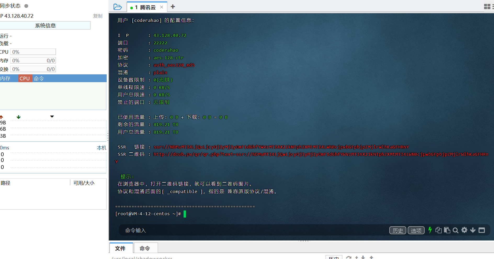

###### 用户 [coderahao] 的配置信息：

 I  P       : 43.128.40.72
 端口       : 22222
 密码       : coderahao
 加密       : aes-128-ctr
 协议       : auth_aes128_md5
 混淆       : plain
 设备数限制 : 0(无限)
 单线程限速 : 0 KB/S
 用户总限速 : 0 KB/S
 禁止的端口 : 无限制 

 已使用流量 : 上传: 0 B + 下载: 0 B = 0 B
 剩余的流量 : 819.21 TB 
 用户总流量 : 819.21 TB 

 SSR   链接 : ssr://NDMuMTI4LjQwLjcyOjIyMjIyOmF1dGhfYWVzMTI4X21kNTphZXMtMTI4LWN0cjpwbGFpbjpZMjlrWlhKaGFHRnY 
 SSR 二维码 : http://doub.pw/qr/qr.php?text=ssr://NDMuMTI4LjQwLjcyOjIyMjIyOmF1dGhfYWVzMTI4X21kNTphZXMtMTI4LWN0cjpwbGFpbjpZMjlrWlhKaGFHRnY 

  提示: 
 在浏览器中，打开二维码链接，就可以看到二维码图片。
 协议和混淆后面的[ _compatible ]，指的是 兼容原版协议/混淆。

###### 上个应该挂了，又新建了一个

- 所有配置信息都和上一个一样，只是将端口号改为了23456